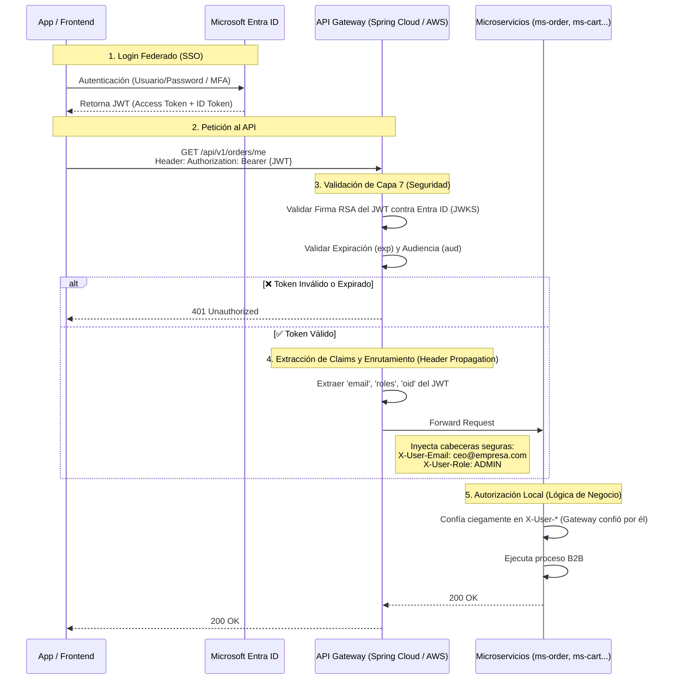

# Extra — Seguridad Centralizada: API Gateway + Entra ID (Federated Identities)

## Resumen

En una arquitectura de microservicios moderna (como ARKA B2B), delegar la responsabilidad de "Autenticación" (saber quién es el usuario) a cada microservicio individual es un anti-patrón. Genera código duplicado, fugas de seguridad y acoplamiento con el proveedor de identidad.

Para resolver esto, ARKA utiliza un **API Gateway** como único punto de entrada a la red, trabajando de la mano con **Microsoft Entra ID** (anteriormente Azure AD) mediante el patrón de **Federated Identities (OIDC / OAuth 2.0)**.

---

## Flujo de Autenticación y Autorización Global

Ningún microservicio de backend (ej. `ms-order`, `ms-inventory`) tiene conexión a internet directa ni sabe cómo validar firmas criptográficas complejas. **El API Gateway es el escudo.**



---

## Ventajas del Patrón (Federated Identities)

1. **Zero Trust Network:** El frontend solo se autentica con Entra ID. No existen "usuarios de base de datos" ni contraseñas almacenadas en los repositorios de ARKA.
2. **Microservicios Agnésicos (Stateless):** `ms-order` no tiene que integrar SDKs de Microsoft ni de Google. Todo lo que sabe es leer una cabecera HTTP estándar (`X-User-Email`) inyectada por el Gateway. Si en el futuro Arka cambia Entra ID por Okta o Auth0, el código de los microservicios no sufre **ninguna modificación**.
3. **SSO B2B (Federación):** ARKA puede permitir que sus clientes corporativos hagan login usando sus propios directorios activos (Ej. "Log in with Microsoft" o "SAML" de la empresa proveedora). Entra ID actúa como puente de federación.

### 4. Filtrado de Dominios Exclusivos (B2B)
Dado que ARKA es una plataforma **Business-to-Business (B2B)**, el sistema no debe permitir que cualquier persona con un correo `@gmail.com` o `@hotmail.com` inicie sesión, incluso si logran pasar por el portal de Microsoft.
Para lograr esto, se configura **Domain Filtering** (Restricciones de Inquilinos/Dominios) directamente en la configuración de *Entra ID External Identities (B2B Collaboration)*:
- **Allowlist (Lista Blanca):** Se configuran explícitamente los dominios corporativos autorizados (Ej. `empresa-cliente1.com`, `proveedor-global.com`).
- **Bloqueo en el Borde:** Si un usuario intenta hacer SSO con `juan@gmail.com`, Entra ID rechaza el intento de login en la pantalla de Microsoft, **antes de que se emita el JWT**. El API Gateway nunca recibe tráfico basura de dominios no autorizados, ahorrando cómputo.

---

## Autorización: ¿Dónde viven los Roles?

Existen dos estrategias. Para ARKA (B2B Corporativo), se utiliza la **Estrategia A (Roles en el IDP)**:

1. El Administrador Global de ARKA crea Grupos/Roles de la aplicación en **Entra ID** (Ej. `ARKA_ADMIN`, `ARKA_WAREHOUSE_MANAGER`, `ARKA_CUSTOMER`).
2. Al iniciar sesión, Entra ID incluye el "Claim" de roles en el JWT:
   ```json
   {
     "aud": "api://arka-backend",
     "iss": "https://sts.windows.net/TENANT-ID/",
     "oid": "user-uuid-1234",
     "preferred_username": "bodega@arkab2b.com",
     "roles": ["ARKA_WAREHOUSE_MANAGER"]
   }
   ```
3. El API Gateway lee ese array y si la ruta es `POST /api/v1/inventory/adjust` (HU2), el Gateway verifica si dentro del arreglo `roles` existe `ARKA_WAREHOUSE_MANAGER` o `ARKA_ADMIN`. Si no, corta la petición con un `403 Forbidden` antes de que siquiera toque al microservicio.

---

## Seguridad Transversal de la Arquitectura (Gateway y M2M)

### Comunicación Cliente -> Gateway
- Asegurada con **TLS 1.3 (HTTPS obligatoria)**.
- Protegida contra DDoS y Rate Limiting a nivel de Gateway.
- Requiere un JWT Bearer Token válido firmado por Entra ID.

### Comunicación Gateway -> Microservicios
- Los microservicios operan en una red privada (VPC o Red Docker Interna).
- **El acceso directo de internet a `ms-inventory` u otros es físicamente imposible.** Su único puerto expuesto mira hacia el API Gateway interno.

### Comunicación Microservicio -> Microservicio (M2M)
- En ARKA, la mayoría de la comunicación M2M ya se resolvió mediante arquitecturas asíncronas **basadas en eventos (Kafka)**, que no pasan por el Gateway.
- Si por alguna razón un microservicio necesita llamar a otro de forma síncrona HTTP (Ej. `ms-cart` llamando a `ms-catalog` para verificar el precio en la HU8), esta comunicación dentro de la misma red privada **debería estar exenta de JWT**. Validar JWTs intra-cluster crea latencia de ida y vuelta al proveedor de identidad. Se utiliza confianza de red interna y Service Mesh.
