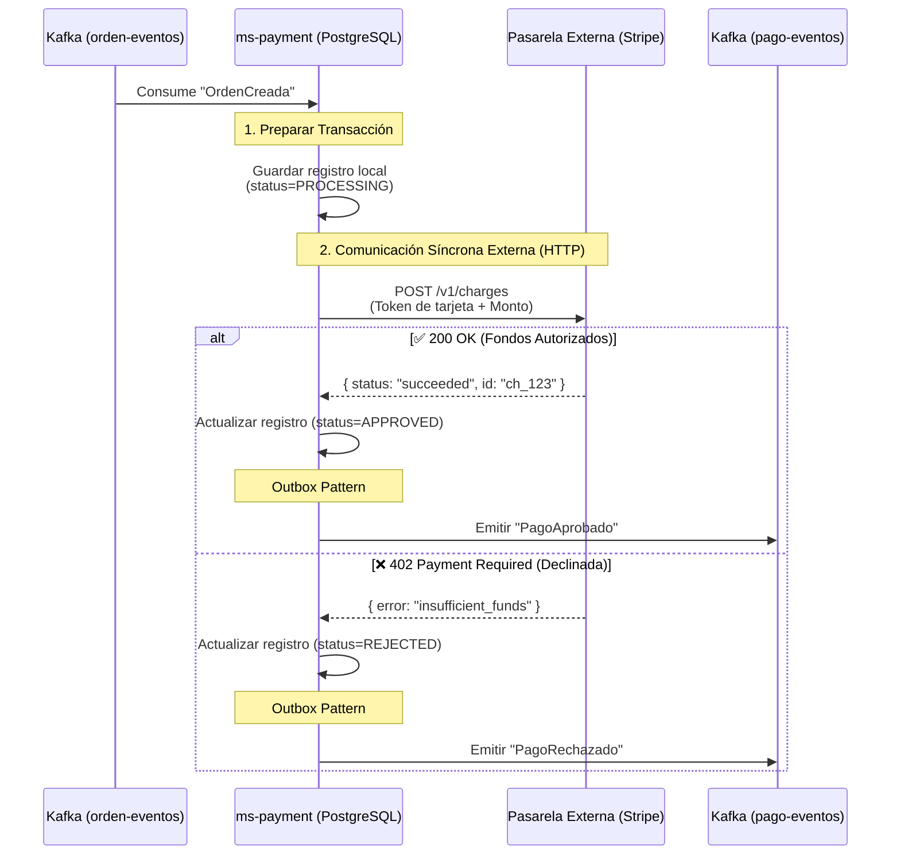
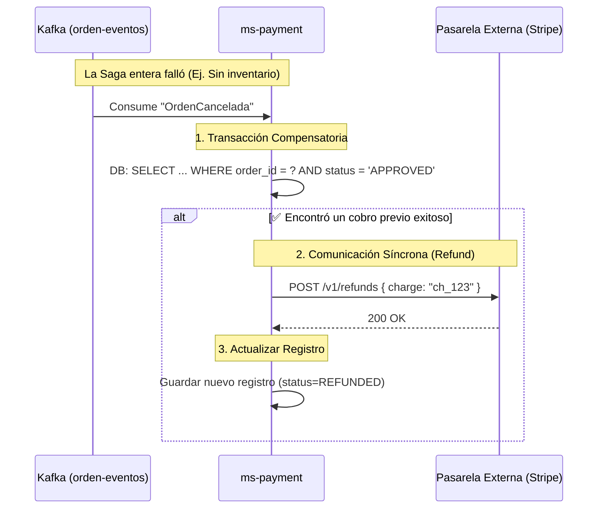

# Extra — Integración de Pagos (ms-payment): Diseño Arquitectónico

## Resumen

Para completar una experiencia de E-commerce realista en ARKA, se introduce el microservicio `ms-payment`. Su función es actuar como un **Adaptador Anticorrupción (ACL)** entre el sistema impulsado por eventos de ARKA (Kafka) y un API externa síncrona de un procesador de pagos (Gateway como Stripe, MercadoPago, o ePayco).

Participa en la **Saga** de creación de órdenes para garantizar que una orden jamás se confirme ni se despache si los fondos no fueron autorizados.

---

## Flujo de Autorización de Captura (Saga Coreográfica)

`ms-payment` no tiene endpoints REST abiertos al cliente para procesar pagos (por seguridad). Todo ocurre reaccionando a la creación de una orden en Kafka.



---

## Modelos de Dominio (PostgreSQL)

`ms-payment` requiere consistencia transaccional absoluta. Cada intento de cobro debe registrarse, sin importar si tuvo éxito o falló, para control de fraudes y cuadratura financiera.

**Tabla `transactions`:**
```sql
CREATE TABLE transactions (
    transaction_id UUID PRIMARY KEY DEFAULT gen_random_uuid(),
    order_id VARCHAR(150) NOT NULL,          -- Relación con la HU4
    amount DECIMAL(12,2) NOT NULL,
    currency VARCHAR(3) DEFAULT 'USD',
    payment_method_token VARCHAR(255),       -- (PCI-DSS) Token proxy, NUNCA la tarjeta real
    gateway_reference VARCHAR(255),          -- Ej. 'ch_123' de Stripe
    status VARCHAR(30) NOT NULL,             -- 'PROCESSING', 'APPROVED', 'REJECTED'
    failure_reason VARCHAR(255),             -- Ej. 'insufficient_funds'
    created_at TIMESTAMP DEFAULT NOW()
);

CREATE INDEX idx_transactions_order ON transactions(order_id);
```

---

## Retos Arquitectónicos y Soluciones

### 1. El Riesgo del Fallo Externo (Retries y Circuit Breaker)
Al depender de un tercero (la pasarela de pagos), el servidor de Stripe podría estar caído y devolver `503 Service Unavailable`.
- **Solución:** Implementar **Resilience4j** en `ms-payment`.
  - **@Retry:** Si el Gateway falla por red, se reintenta 3 veces con *Exponential Backoff*.
  - **Circuit Breaker:** Si el Gateway está colapsado y falla 10 veces seguidas, el circuito se "abre" y `ms-payment` emite inmediatamente `PagoRechazado` por *Servicio no disponible* para no atascar la Saga en Kafka indefinidamente.

### 2. Cumplimiento PCI-DSS (Seguridad)
`ms-payment` **jamás** debe ver ni guardar un PAN (número de tarjeta de crédito) de 16 dígitos.
- **Solución:** El frontend extrae un "Token" seguro (usando un iframe provisto por Stripe.js). El Frontend inyecta este Token (ej. `tok_visa_123`) dentro del carrito (HU8) y viaja en la Orden. `ms-payment` solo almacena este Token ofuscado.

### 3. La Cancelación Compensatoria (HU4 Rollback)
¿Qué pasa si la tarjeta pasa exitosamente (`ms-payment` aprueba y Stripe cobra $1000), pero la orden se CANCELA porque `ms-inventory` se quedó sin stock?

`ms-payment` **DEBE** escuchar el evento de cancelación global para devolverle la plata al cliente (Refund).


