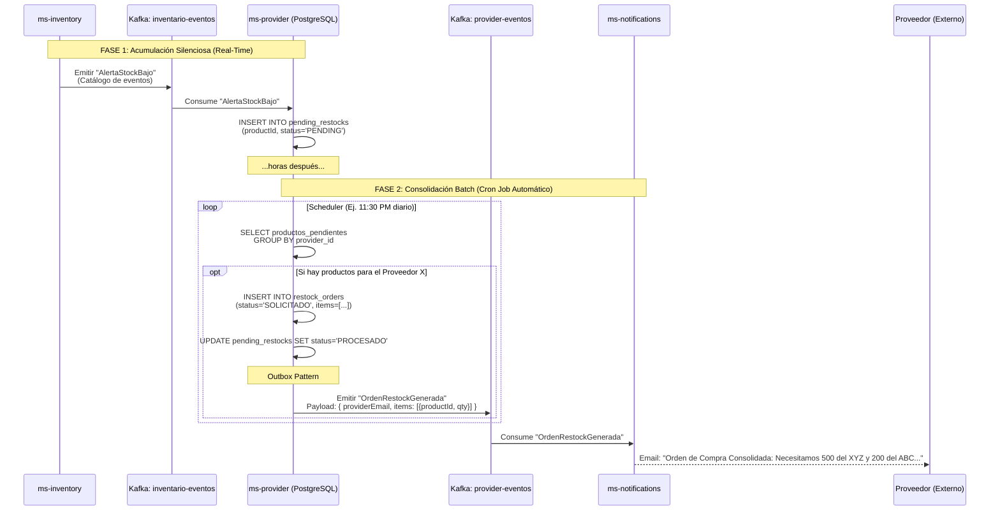
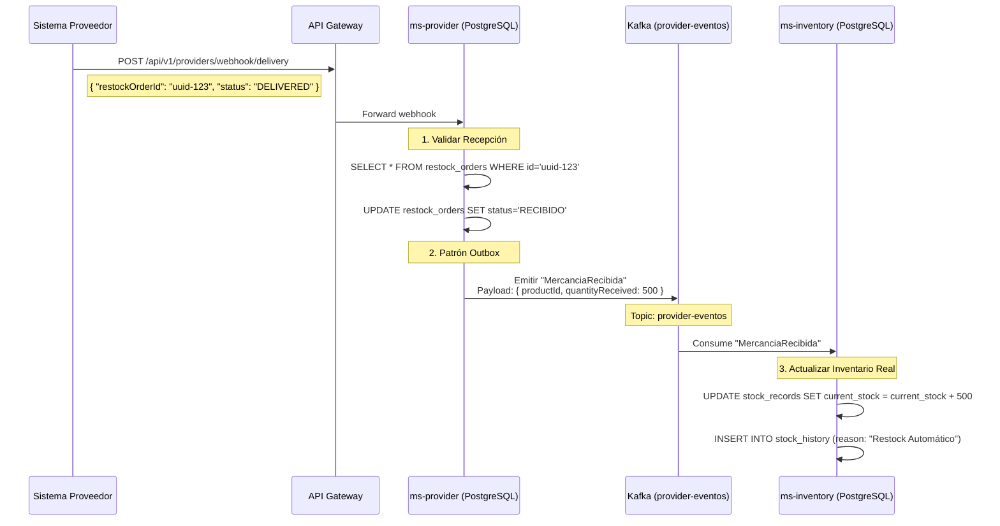

# Extra — Automatización de Reabastecimiento (ms-provider): Diseño Arquitectónico

## Resumen

Para llevar la plataforma B2B ARKA al siguiente nivel, introducimos `ms-provider`. En lugar de que la alerta de stock bajo (HU3) dependa de un operador humano para contactar al proveedor, este microservicio **automatiza las Órdenes de Compra a Proveedores**.

`ms-provider` administra el catálogo de proveedores, sabe qué proveedor vende qué producto, y reacciona a los quiebres de inventario **acumulando las alertas** y generando órdenes consolidadadas periódicamente (Batch/Cron) para no bombardear al proveedor con pedidos individuales.

---

## Flujo Automático de Restock (Acumulación + Cronjob)

Cuando el inventario de un producto crítico cae, `ms-provider` lo anota en su lista. Periódicamente (ej. una vez al día o cada 12 horas), consolida todos los faltantes por proveedor y emite una sola mega-orden de compra.



## Flujo de Recepción (Webhook del Proveedor)

Para cerrar el ciclo, necesitamos que cuando el camión del proveedor entregue la mercancía en la bodega, el sistema cargue automáticamente las existencias. Para esto, `ms-provider` expone un Endpoint que el sistema del proveedor (o un operario con una app en la puerta) puede consumir.



De esta manera, `ms-inventory` no necesita tener Endpoints abiertos al mundo exterior para recibir mercancía, protegiendo el núcleo del negocio. `ms-provider` actúa como un **Anti-Corruption Layer (ACL)** absorbiendo las peticiones externas y traduciéndolas al lenguaje de eventos interno (`MercanciaRecibida`).

---

## Modelos de Dominio (PostgreSQL)

`ms-provider` requiere dos entidades clave: los Proveedores y las Órdenes de Reabastecimiento generadas.

**1. Tabla `providers`:**
```sql
CREATE TABLE providers (
    id UUID PRIMARY KEY DEFAULT gen_random_uuid(),
    company_name VARCHAR(150) NOT NULL,
    contact_email VARCHAR(150) NOT NULL, -- Email a donde se envía la orden
    contact_phone VARCHAR(50),
    is_active BOOLEAN DEFAULT true,
    created_at TIMESTAMP DEFAULT NOW()
);
```

**2. Tabla `provider_products` (Asociación):**
```sql
CREATE TABLE provider_products (
    provider_id UUID REFERENCES providers(id),
    product_id VARCHAR(100) NOT NULL,    -- ID de ms-catalog
    replenishment_qty INTEGER NOT NULL,  -- Cuánto pedir automáticamente (lote mínimo)
    unit_cost DECIMAL(10,2) NOT NULL,    -- Costo para ARKA
    PRIMARY KEY (provider_id, product_id)
);
```

**3. Tabla `pending_restocks` (Acumulador Temporal):**
```sql
CREATE TABLE pending_restocks (
    id UUID PRIMARY KEY DEFAULT gen_random_uuid(),
    product_id VARCHAR(100) NOT NULL,
    provider_id UUID REFERENCES providers(id),
    status VARCHAR(50) DEFAULT 'PENDING', -- 'PENDING', 'PROCESSED'
    created_at TIMESTAMP DEFAULT NOW()
);
```

**4. Tablas `restock_orders` y `restock_order_items` (Consolidados):**
```sql
CREATE TABLE restock_orders (
    id UUID PRIMARY KEY DEFAULT gen_random_uuid(),
    provider_id UUID REFERENCES providers(id),
    status VARCHAR(50) DEFAULT 'SOLICITADO', -- 'SOLICITADO', 'EN_TRANSITO', 'RECIBIDO'
    created_at TIMESTAMP DEFAULT NOW()
);

CREATE TABLE restock_order_items (
    restock_order_id UUID REFERENCES restock_orders(id),
    product_id VARCHAR(100) NOT NULL,
    quantity_requested INTEGER NOT NULL,
    PRIMARY KEY (restock_order_id, product_id)
);
```

---

## Relevancia Específica para B2B
En plataformas corporativas, nadie quiere que un proveedor reciba 40 correos diferentes a lo largo del día porque 40 productos distintos cayeron por debajo de su stock. 
Con este diseño de **Acumulación y Batching**, `ms-provider` engaveta las peticiones y una vez al día empaca todas las necesidades de "Proveedor GlobalCorp" en un solo documento (PDF/Email) ordenado y formal, enviando así una sola mega-orden de abastecimiento, operando como lo haría un humano logístico pero a coste de cómputo cero.

---

## Modificaciones al Ecosistema

1. **`ms-notifications` (HU6):** Se le añade un "Listener" para el nuevo tópico `provider-eventos` que renderiza una plantilla HTML formal de "Orden de Reabastecimiento ARKA S.A" para el proveedor.
2. **`ms-inventory` (HU3):** Como ya estaba programado para emitir `AlertaStockBajo`, el inventario **no** requiere ni una sola línea de código nueva. Es ciego a `ms-provider`. Esta es la ventaja sagrada de una arquitectura orientada a eventos puros.
