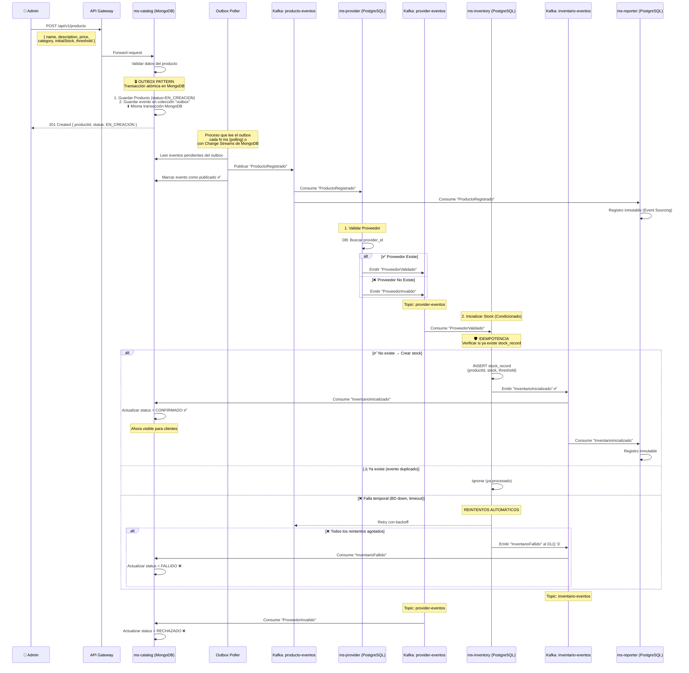
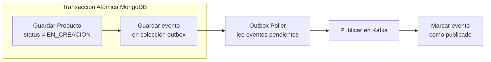
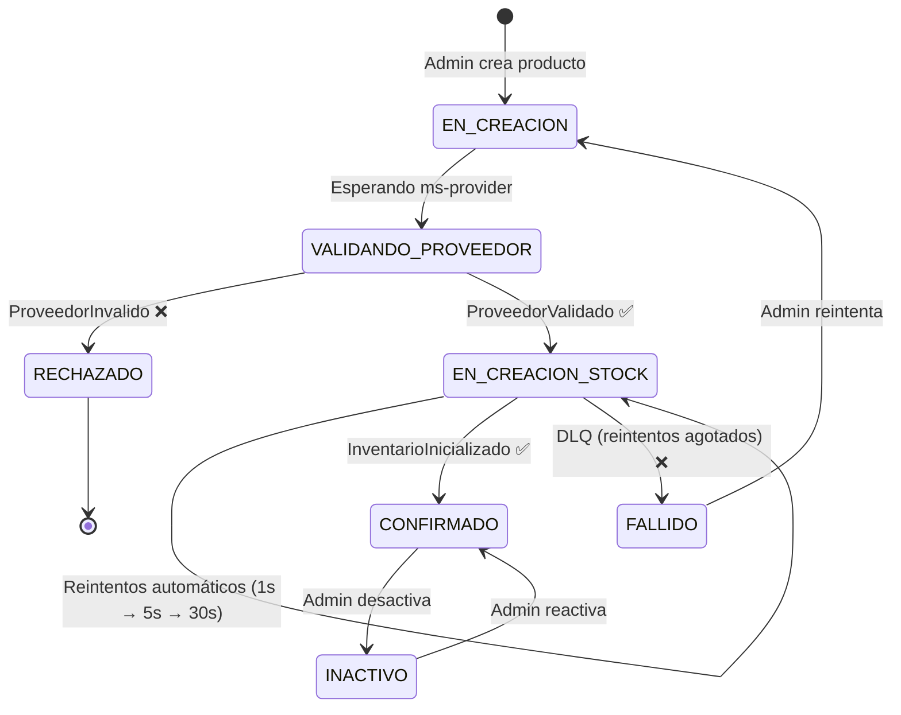
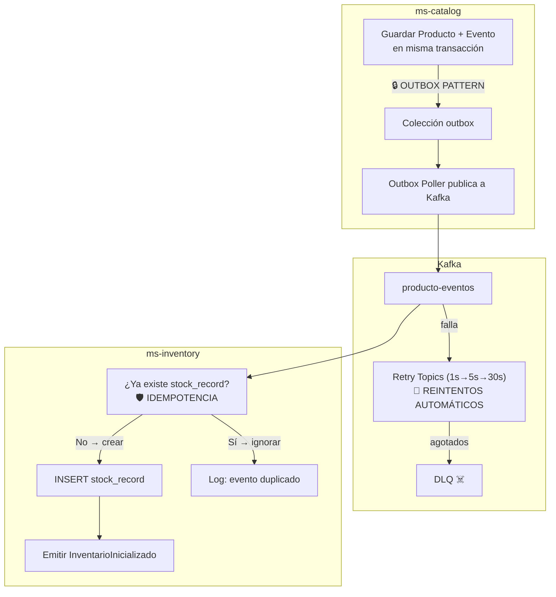

# HU1 — Registrar Producto: Diseño Arquitectónico

## Resumen

El registro de productos utiliza una **Saga por coreografía** entre `ms-catalog` y `ms-inventory`. El producto nace con estado `EN_CREACION` y solo se hace visible para los clientes cuando `ms-inventory` confirma la inicialización del stock, cambiando al estado `CONFIRMADO`. Los reintentos son **automáticos** con backoff exponencial; la intervención manual es solo un último recurso.

---

## Flujo de la Saga



---

## Outbox Pattern en Detalle

**Problema:** Si `ms-catalog` guarda el producto en MongoDB y luego publica a Kafka, puede fallar entre ambas operaciones (producto guardado pero evento nunca publicado = producto atrapado en `EN_CREACION` para siempre).

**Solución:** El Outbox Pattern garantiza que el producto y el evento se guardan en una **misma transacción atómica** en MongoDB.



### Colección `outbox` en MongoDB

```json
{
  "_id": "outbox-uuid",
  "aggregateId": "product-uuid",
  "aggregateType": "Producto",
  "eventType": "ProductoRegistrado",
  "payload": {
    "productId": "product-uuid",
    "name": "Teclado Mecánico RGB",
    "description": "Teclado mecánico con switches Cherry MX",
    "price": 89.99,
    "category": "PERIFERICOS",
    "providerId": "provider-uuid-5678",
    "initialStock": 100,
    "threshold": 20
  },
  "createdAt": "2026-03-11T08:49:00Z",
  "published": false
}
```

### ¿Cómo se publica?

Dos opciones para el Outbox Poller:

| Opción | Mecanismo | Pros | Contras |
|--------|-----------|------|---------|
| **Polling** | `@Scheduled` cada 500ms lee documentos con `published: false` | Simple, funciona con cualquier BD | Latencia mínima de polling |
| **Change Streams** | MongoDB Change Streams detecta inserciones en el outbox en tiempo real | Casi tiempo real, reactivo | Requiere replica set en MongoDB |

> [!NOTE]
> El Outbox Poller puede publicar el **mismo evento más de una vez** (at-least-once delivery). Por eso **la idempotencia en `ms-inventory` es esencial**.

---

## Idempotencia en Detalle

**Problema:** Con reintentos automáticos y Outbox Pattern, `ms-inventory` puede recibir el **mismo evento `ProductoRegistrado` múltiples veces**.

**Solución:** Antes de crear el `stock_record`, verificar si ya existe uno para ese `product_id`.

```java
public void inicializarStock(ProductoRegistradoEvent event) {
    // 🛡️ Verificación de idempotencia
    if (stockRepository.existsByProductId(event.getProductId())) {
        log.info("Stock ya inicializado para producto {}. Ignorando evento duplicado.",
                 event.getProductId());
        return; // No hacer nada, ya fue procesado
    }

    // Crear nuevo registro de stock
    StockRecord stock = StockRecord.builder()
        .productId(event.getProductId())
        .currentStock(event.getInitialStock())
        .threshold(event.getThreshold())
        .build();

    stockRepository.save(stock); // UNIQUE constraint en product_id como respaldo

    // Emitir evento de confirmación
    kafkaTemplate.send("inventario-eventos",
        new InventarioInicializadoEvent(event.getProductId(), stock));
}
```

**Doble protección:**
1. **Lógica de negocio:** `existsByProductId()` verifica antes de insertar
2. **Base de datos:** Constraint `UNIQUE` en `product_id` como respaldo — si por alguna race condition ambas verificaciones pasan, la BD rechaza el duplicado

---

## Máquina de Estados del Producto



| Estado | Visible al Cliente | Descripción |
|--------|-------------------|-------------|
| `EN_CREACION` / `VALIDANDO_PROVEEDOR` | ❌ No | Producto registrado, en proceso de verificación de Integridad (Saga) |
| `CONFIRMADO` | ✅ Sí | Stock inicializado y proveedor verificado. Producto disponible |
| `RECHAZADO` | ❌ No | Proveedor inexistente en la base de datos B2B. Proceso abortado |
| `FALLIDO` | ❌ No | Error técnico (BD caída). Reintentos automáticos agotados |
| `INACTIVO` | ❌ No | Desactivado manualmente por el admin |

---

## Estrategia de Reintentos Automáticos

```java
@RetryableTopic(
    attempts = "4",
    backoff = @Backoff(delay = 1000, multiplier = 5, maxDelay = 30000),
    dltStrategy = DltStrategy.FAIL_ON_ERROR
)
@KafkaListener(topics = "producto-eventos", groupId = "ms-inventory")
public void onProductoRegistrado(ProductoRegistradoEvent event) {
    stockService.inicializarStock(event);
}
```

| Intento | Delay | Acción |
|---------|-------|--------|
| 1 (original) | 0 | Procesamiento normal |
| 2 (retry) | 1s | Primer reintento automático |
| 3 (retry) | 5s | Segundo reintento |
| 4 (retry) | 30s | Último reintento |
| DLQ | — | Mensaje al Dead Letter Queue + alerta al admin |

---

## Modelos de Dominio

### ms-catalog (MongoDB)

**Colección `products`:**
```json
{
  "_id": "product-uuid",
  "name": "Teclado Mecánico RGB",
  "description": "Teclado mecánico con switches Cherry MX",
  "price": 89.99,
  "category": "PERIFERICOS",
  "providerId": "provider-uuid-5678",
  "status": "EN_CREACION",
  "createdAt": "2026-03-11T08:49:00Z",
  "updatedAt": "2026-03-11T08:49:00Z"
}
```

**Colección `outbox`:** (ver sección Outbox Pattern)

> [!IMPORTANT]
> `ms-catalog` **NO** almacena stock ni threshold. Esos datos viajan en el evento hacia `ms-inventory`.

### ms-inventory (PostgreSQL)

```sql
CREATE TABLE stock_records (
    id UUID PRIMARY KEY DEFAULT gen_random_uuid(),
    product_id UUID NOT NULL UNIQUE,  -- 🛡️ Garantía de idempotencia
    current_stock INTEGER NOT NULL DEFAULT 0,
    threshold INTEGER NOT NULL DEFAULT 0,
    created_at TIMESTAMP DEFAULT NOW(),
    updated_at TIMESTAMP DEFAULT NOW()
);
```

### ms-reporter (PostgreSQL) — Event Store

```sql
CREATE TABLE domain_events (
    id UUID PRIMARY KEY DEFAULT gen_random_uuid(),
    event_type VARCHAR(100) NOT NULL,
    aggregate_id UUID NOT NULL,
    aggregate_type VARCHAR(50) NOT NULL,
    payload JSONB NOT NULL,
    occurred_at TIMESTAMP NOT NULL,
    recorded_at TIMESTAMP DEFAULT NOW()
);
```

---

## Eventos de Dominio

### ProductoRegistrado

```json
{
  "eventId": "uuid",
  "eventType": "ProductoRegistrado",
  "timestamp": "2026-03-11T08:49:00Z",
  "aggregateId": "product-uuid",
  "aggregateType": "Producto",
  "payload": {
    "productId": "product-uuid",
    "name": "Teclado Mecánico RGB",
    "description": "Teclado mecánico con switches Cherry MX",
    "price": 89.99,
    "category": "PERIFERICOS",
    "providerId": "provider-uuid-5678",
    "initialStock": 100,
    "threshold": 20
  }
}
```

### InventarioInicializado

```json
{
  "eventId": "uuid",
  "eventType": "InventarioInicializado",
  "timestamp": "2026-03-11T08:49:01Z",
  "aggregateId": "product-uuid",
  "aggregateType": "StockRecord",
  "payload": {
    "productId": "product-uuid",
    "currentStock": 100,
    "threshold": 20
  }
}
```

### InventarioFallido (Compensación)

```json
{
  "eventId": "uuid",
  "eventType": "InventarioFallido",
  "timestamp": "2026-03-11T08:49:31Z",
  "aggregateId": "product-uuid",
  "aggregateType": "StockRecord",
  "payload": {
    "productId": "product-uuid",
    "reason": "Todos los reintentos automáticos agotados",
    "totalAttempts": 4
  }
}
```

---

## Tópicos de Kafka

| Tópico | Productor | Consumidores |
|--------|-----------|-------------|
| `producto-eventos` | Outbox Poller (`ms-catalog`) | `ms-inventory`, `ms-reporter` |
| `producto-eventos-retry-*` | Kafka (automático) | `ms-inventory` (reintentos) |
| `producto-eventos-dlt` | Kafka (automático) | Alertas / Admin |
| `inventario-eventos` | `ms-inventory` | `ms-catalog`, `ms-reporter` |

---

## Separación de Responsabilidades (DDD)

| Responsabilidad | Microservicio | Base de Datos |
|-----------------|---------------|---------------|
| Identidad del producto (qué es) | `ms-catalog` | MongoDB |
| Cantidad en stock (cuánto hay) | `ms-inventory` | PostgreSQL |
| Auditoría y trazabilidad | `ms-reporter` | PostgreSQL |

> [!IMPORTANT]
> **Regla de oro:** Cada microservicio es la **única fuente de verdad** para sus datos. Toda comunicación entre microservicios es vía **eventos en Kafka**.

---

## Resumen de Patrones de Resiliencia


