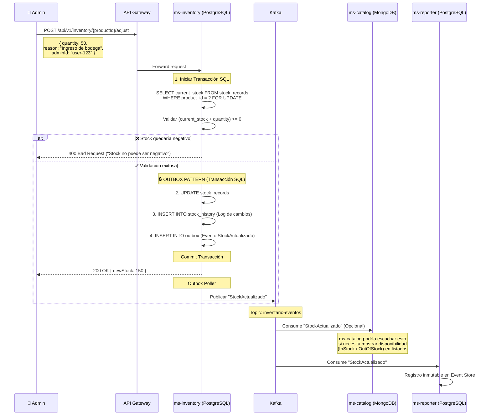

# HU2 — Actualizar Stock de Productos: Diseño Arquitectónico

## Resumen

El objetivo de la HU2 es permitir a un administrador actualizar (añadir o descontar manualmente) el stock de un producto existente. Debido a que el **stock es propiedad exclusiva de `ms-inventory`**, este flujo interactúa directamente con el API de `ms-inventory`, siendo este el encargado de validar la lógica de negocio (no permitir stock negativo) y persistir el historial inmutable de cambios.

---

## Flujo de Actualización Manual



---

## Modelos de Dominio

### ms-inventory (PostgreSQL)

Para cumplir con el criterio de aceptación: *"Historial de cambios en el stock"*, `ms-inventory` necesita dos tablas.

**1. Tabla Principal de Stock:**
```sql
CREATE TABLE stock_records (
    id UUID PRIMARY KEY DEFAULT gen_random_uuid(),
    product_id UUID NOT NULL UNIQUE,
    current_stock INTEGER NOT NULL DEFAULT 0,
    threshold INTEGER NOT NULL DEFAULT 0,
    created_at TIMESTAMP DEFAULT NOW(),
    updated_at TIMESTAMP DEFAULT NOW()
);
```

**2. Historial de Movimientos (Nueva Tabla):**
```sql
CREATE TABLE stock_history (
    id UUID PRIMARY KEY DEFAULT gen_random_uuid(),
    product_id UUID NOT NULL REFERENCES stock_records(product_id),
    operation_type VARCHAR(20) NOT NULL, -- 'ADD', 'SUBTRACT', 'SET'
    quantity INTEGER NOT NULL,           -- Cantidad del movimiento (ej: +50, -10)
    stock_before INTEGER NOT NULL,       -- Stock antes del movimiento
    stock_after INTEGER NOT NULL,        -- Stock después del movimiento
    reason VARCHAR(255),                 -- Justificación ("Compra", "Ajuste manual", "Dañado")
    reference_id UUID,                   -- ID de la orden o entrada de bodega (si aplica)
    performed_by VARCHAR(100) NOT NULL,  -- Usuario que hizo el ajuste
    created_at TIMESTAMP DEFAULT NOW()
);
```

### Cumplimiento del Criterio de Auditoría

El criterio de aceptación de la HU2 pide explícitamente un **"Historial de cambios en el stock"**. Esta arquitectura cumple tecnológicamente con ese requisito al almacenar una "Fila de Auditoría Financiera" por cada movimiento:

1. **Rastreabilidad Absoluta ("Extracto Bancario"):** Al guardar `stock_before` y `stock_after`, cualquier petición de auditoría puede consultar la tabla ordenando por fecha para reconstruir matemáticamente la vida de un producto. Si en la secuencia el `stock_after` de la fila 1 no coincide con el `stock_before` de la fila 2, evidencia manipulación directa en la BD o un bug crítico evadiendo la lógica de la aplicación.
2. **Atribución de Responsabilidad:** Las columnas `reason` y `performed_by` permiten responder exactamente *"quién descontó estas 50 unidades y por qué"*.
3. **Mecanismo Pasivo:** No se requiere construir un módulo de reportes complejo dentro de `ms-inventory`. La tabla está disponible para que herramientas de BI, o consultas SQL directas por parte de DBAs/Auditores, puedan verificar el registro histórico. A nivel global, el Event Sourcing en `ms-reporter` sirve como validación externa secundaria cruzando los eventos `StockActualizado`.
---

## Prevención de Condiciones de Carrera (Race Conditions)

Dado que ARKA sufre de problemas de **sobreventa por alta concurrencia**, la actualización del stock debe ser blindada.

**Mecanismo: Bloqueo Pesimista (Pessimistic Locking)**

```java
@Repository
public interface StockRecordRepository extends JpaRepository<StockRecord, UUID> {
    
    // El bloqueo PESSIMISTIC_WRITE se traduce a un "SELECT ... FOR UPDATE" en PostgreSQL.
    // Esto asegura que si 5 peticiones intentan actualizar el mismo producto al mismo tiempo,
    // PostgreSQL las encolará y las procesará una por una, previniendo sobreventas o cálculos erróneos.
    @Lock(LockModeType.PESSIMISTIC_WRITE)
    @Query("SELECT s FROM StockRecord s WHERE s.productId = :productId")
    Optional<StockRecord> findByProductIdForUpdate(@Param("productId") UUID productId);
}
```

**Flujo en el Servicio (Transaccional):**
```java
@Transactional
public StockResponse adjustStock(UUID productId, int quantity, String reason, String adminId) {
    // 1. SELECT FOR UPDATE (Bloquea la fila en PG)
    StockRecord stock = repository.findByProductIdForUpdate(productId)
        .orElseThrow(() -> new NotFoundException());

    // 2. Validación de negocio
    int newStock = stock.getCurrentStock() + quantity;
    if (newStock < 0) {
        throw new BusinessRuleException("El stock no puede ser negativo");
    }

    // 3. Crear registro histórico
    StockHistory history = new StockHistory(
        productId, quantity, stock.getCurrentStock(), newStock, reason, adminId
    );
    historyRepository.save(history);

    // 4. Actualizar tabla principal
    stock.setCurrentStock(newStock);
    repository.save(stock); // Acá también se hace el save al Outbox

    return new StockResponse(newStock);
}
// Commit: PostgreSQL libera el bloqueo de la fila aquí
```

---

## Evento de Dominio

### StockActualizado

Este evento se emite al tópico `inventario-eventos` cada vez que el stock cambia.

```json
{
  "eventId": "uuid",
  "eventType": "StockActualizado",
  "timestamp": "2026-03-11T11:45:00Z",
  "aggregateId": "product-uuid",
  "aggregateType": "StockRecord",
  "payload": {
    "productId": "product-uuid",
    "quantityAdjusted": 50,
    "newStock": 150,
    "reason": "Ingreso de bodega",
    "performedBy": "admin-123"
  }
}
```

---

## Consideraciones DDD y Patrones

1. **`ms-inventory` es el Dueño:** El endpoint pertenece a `ms-inventory` (`/api/v1/inventory/...`), NO a `ms-catalog`. El catálogo no gestiona inventario.
2. **CQS Analítico:** La HU pide un "Historial de cambios". Gracias a la tabla `stock_history` local, `ms-inventory` puede responder a consultas de historial inmediatamente, sin ir a `ms-reporter`.
3. **Outbox Pattern:** Al igual que en HU1, el evento `StockActualizado` se guarda en una tabla `outbox` en la misma transacción SQL que la actualización del stock, garantizando que Kafka reciba el evento de forma segura (At-least-once delivery).
