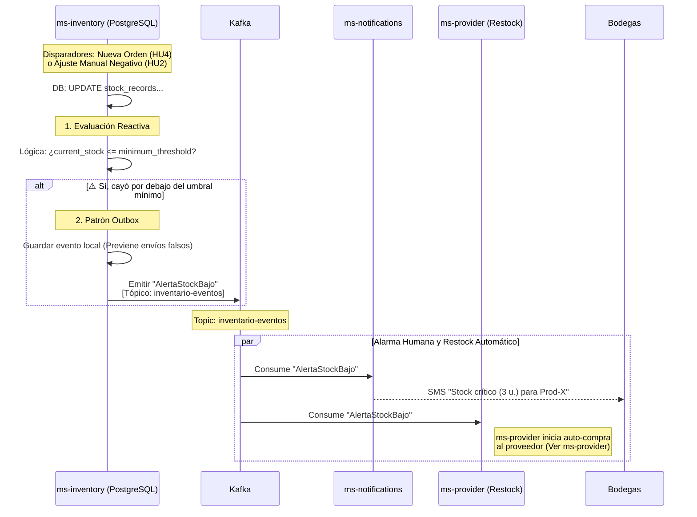

# HU3 — Generar Alertas de Stock Bajo: Diseño Arquitectónico

## Resumen

La HU3 establece que el sistema debe notificar al administrador (bodega) cuando las existencias de un producto específico caen por debajo de un umbral mínimo configurable, para que puedan iniciar el proceso de reabastecimiento con los proveedores.

Para mantener la cohesión, esta responsabilidad recae enteramente en **`ms-inventory`**, quien es el dueño transaccional de los niveles de stock.

---

## Flujo de Detección de Stock Bajo (Reactivo)

El cálculo del umbral no debe hacerse mediante un "Cronjob que revisa toda la base de datos cada hora" (ineficiente). Debe hacerse de forma **Reactiva** exactamente en el momento en que el stock disminuye.

¿Cuándo disminuye el stock en ARKA?
1. Durante la **HU4** (Cuando se aprueba una reserva de inventario para una Orden de Compra).
2. Durante la **HU2** (Cuando un operador hace un ajuste manual negativo por robo, merma, daños).



---

## Modelo de Dominio (PostgreSQL - ms-inventory)

Para que esto funcione dinámicamente, la tabla de inventarios que diseñamos en la HU2 debe incluir el umbral.

```sql
CREATE TABLE stock_records (
    product_id VARCHAR(100) PRIMARY KEY,
    provider_id UUID NOT NULL, -- Relación con el Proveedor (ms-provider)
    current_stock INTEGER NOT NULL CHECK (current_stock >= 0),
    
    -- Nuevo campo para la HU3:
    minimum_threshold INTEGER NOT NULL DEFAULT 10,
    
    updated_at TIMESTAMP DEFAULT NOW(),
    version INTEGER DEFAULT 0 -- Para Optimistic Locking (Ajustes manuales)
);
```

---

## Estructura del Evento

Cuando `ms-inventory` detecta la caída, emite un evento rico en contexto para que `ms-notifications` o `ms-reporter` puedan actuar sin tener que hacer _callbacks_ (preguntarle de vuelta al inventario).

### AlertaStockBajo
```json
{
  "eventId": "uuid-9999",
  "eventType": "AlertaStockBajo",
  "aggregateId": "prod-456",
  "aggregateType": "Inventory",
  "payload": {
    "productId": "prod-456",
    "providerId": "provider-uuid-5678",
    "currentStock": 8,
    "minimumThreshold": 10,
    "triggerReason": "ORDER_RESERVATION", // o 'MANUAL_ADJUSTMENT'
    "triggeredByOrderId": "order-123"     // (Opcional) La orden que causó el quiebre
  },
  "timestamp": "2026-03-11T16:30:00Z"
}
```

---

## Consideraciones Arquitectónicas Específicas

1. **Evitar Spam de Alertas (Debouncing/Throttling):** Si el umbral de un producto es 10, y el stock baja a 9 (emite evento), y luego llega otra orden y el stock baja a 8... ¿volteamos a enviar otro correo al administrador?
   - **Solución en `ms-inventory`:** Recomendamos agregar una bandera booleana `alert_sent BOOLEAN DEFAULT false` a la tabla `stock_records`.
   - Cuando cae por debajo de 10, se cambia a `true` y se emite la alerta.
   - Si sigue bajando (8, 7, 6...), como ya `alert_sent` es `true`, no se la vuelve a emitir.
   - Cuando la bodega hace un ingreso de mercancía (Ej. cargan +50 unidades), si el stock supera el `minimum_threshold` de nuevo, la bandera `alert_sent` se resetea a `false` automáticamente, dejando el sistema armado para la siguiente caída.
   
2. **Alta Urgencia:** Dado el modelo B2B, esta alerta debería categorizarse como urgente en `ms-notifications` y enviarse idealmente vía **SMS** al jefe de bodega para evitar que la empresa pierda ventas sustanciales.
