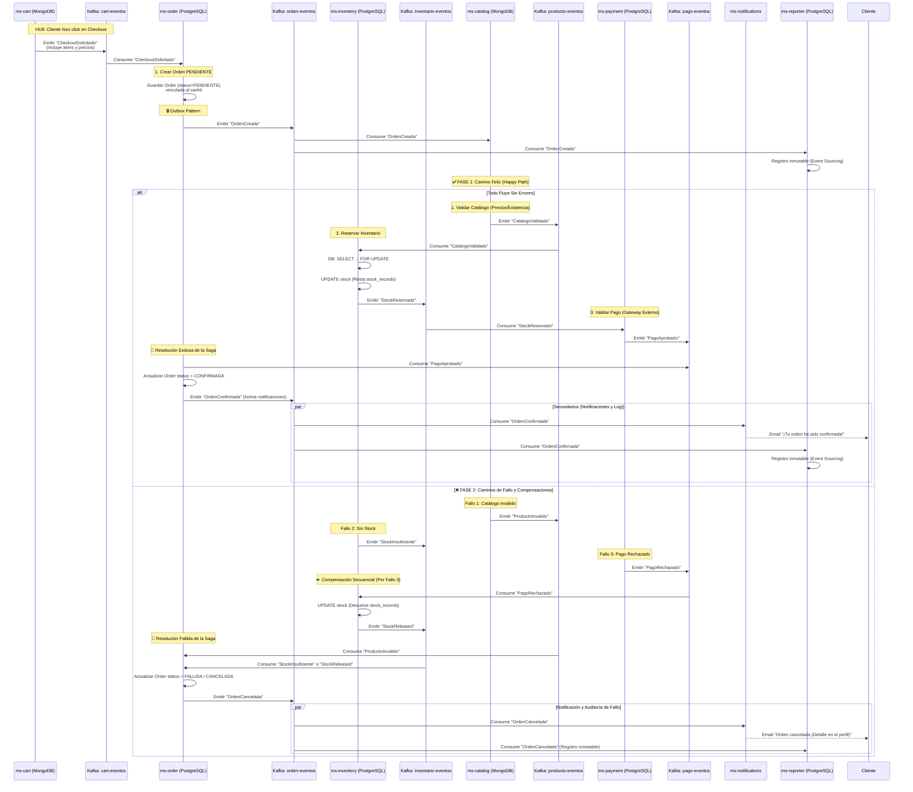
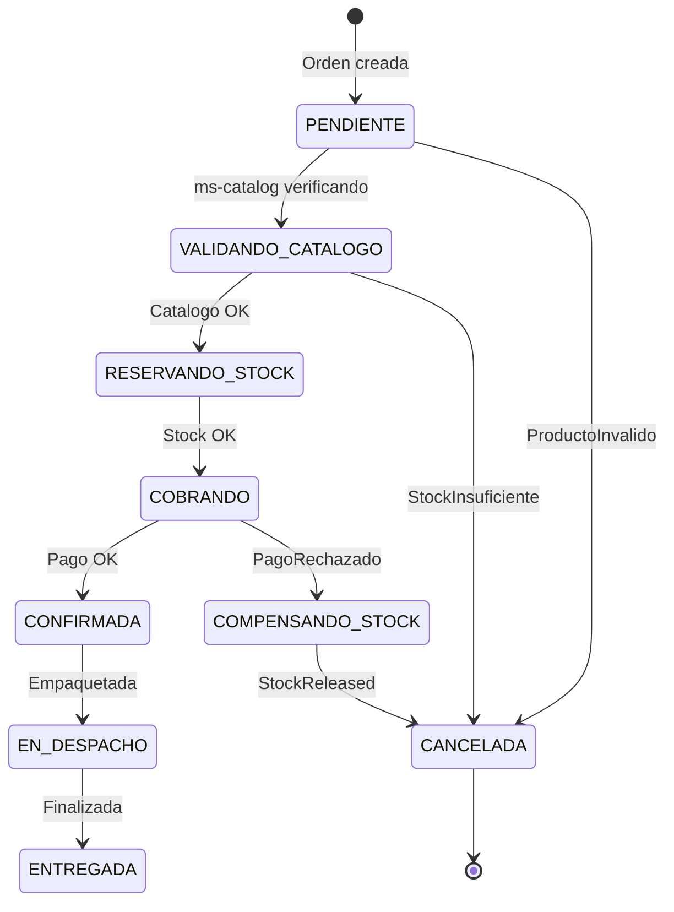
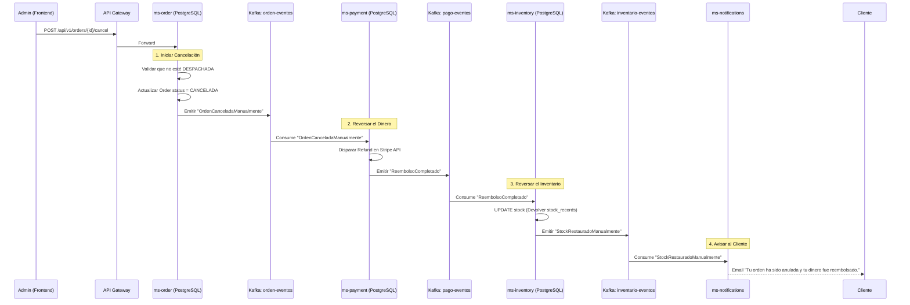

# HU4 — Registrar Orden de Compra: Diseño Arquitectónico (Core Transaccional)

## Resumen

La creación de una orden de compra es el proceso más complejo del sistema porque involucra múltiples contextos (Órdenes, Inventario y Catálogo). Para garantizar la integridad de los datos sin afectar el rendimiento ni bloquear la base de datos, se utiliza el **Patrón Saga por Coreografía** impulsado por Kafka.

---

## Flujo de la Saga (Creación de Orden)



---

## Máquina de Estados de la Orden



| Estado | Significado para el Negocio |
|--------|-----------------------------|
| `PENDIENTE` | Recibida, pero aún no se ha garantizado el inventario. |
| `CONFIRMADA` | Stock garantizado e inventario descontado. Lista para envío. |
| `CANCELADA` | No se pudo procesar (Ej: se intentó comprar más de lo que había). |
| `EN_DESPACHO`| Entregada al transportista. |
| `ENTREGADA` | Cliente recibió la mercancía. |

---

## Manejo de Concurrencia (El Problema de la Sobreventa)

El problema principal de ARKA se soluciona en la interacción entre Kafka y `ms-inventory`.

1. Cuando llegan 1000 órdenes al mismo tiempo, **Kafka actúa como un amortiguador (buffer)**. Las órdenes no tumban la base de datos, se encolan en el tópico `orden-eventos`.
2. `ms-inventory` consume estos eventos a su propio ritmo.
3. Para evaluar cada evento, usa **Pessimistic Locking** en PostgreSQL (`SELECT FOR UPDATE`).

```sql
-- Operación atómica en ms-inventory por cada item de la orden
UPDATE stock_records 
SET current_stock = current_stock - 5,
    updated_at = NOW()
WHERE product_id = '1234-uuid' 
  AND current_stock >= 5; -- 🛡️ Esta condición es vital
```
Si la actualización retorna `0 filas afectadas` (porque el stock era menor a 5), `ms-inventory` sabe que debe emitir `ReservaInventarioRechazada`, evitando la sobreventa.

---

## Flujo de Cancelación Manual (Compensación Post-Confirmación)

Cuando un administrador anula una orden que ya estaba **CONFIRMADA** (ej. cliente llamó para cancelar antes del despacho), debemos ejecutar una **Saga de Compensación Pura** para revertir todo lo asíncronamente hecho.

La cancelación manual opera como un efecto dominó en reversa.



### Explicación Dinámica (Coreografía del Rollback)

A diferencia de un fallo técnico silencioso, una Orden `CONFIRMADA` tiene implicaciones fiscales y financieras reales (Dinero en banco, mercancía separada). Por ello, cada microservicio ejecuta una compensación explícita:

1. **`ms-order` (Iniciador):** Actúa como la puerta de entrada para la intervención humana. Valida que la caja aún no haya salido en el camión (`!= EN_DESPACHO`). Al cancelar, emite la intención de reversa.
2. **`ms-payment` (Reembolso Financiero):** Escucha la cancelación y asume la responsabilidad más crítica: ejecutar un **Refund API Call** contra la pasarela (ej. Stripe/MercadoPago). Este paso asegura que el cliente reciba su dinero de vuelta, cuadrando la contabilidad B2B y evitando contracargos. Una vez aprobado por el banco, emite éxito.
3. **`ms-inventory` (Restauración de Activos):** Escucha que el dinero ya fue devuelto. Toma los ítems físicos apartados y los suma de nuevo al `current_stock` disponible para venta utilizando un `INSERT INTO stock_history` clasificado formalmente como "Devolución por Cancelación". No hay fuga de inventario.
4. **`ms-notifications` (Cierre del Ciclo):** Avisa al cliente final que el proceso burocrático de anulación ha concluido a su favor.

---

## Estructura de Eventos Core

### OrdenCreada
```json
{
  "eventId": "uuid",
  "eventType": "OrdenCreada",
  "aggregateId": "order-123",
  "aggregateType": "Order",
  "payload": {
    "orderId": "order-123",
    "customerId": "cust-888",
    "totalValue": 4499.50,
    "paymentToken": "tok_visa_123",
    "items": [
      { "productId": "prod-1", "quantity": 5 },
      { "productId": "prod-2", "quantity": 1 }
    ]
  }
}
```

### ReservaInventarioAprobada / Rechazada
```json
{
  "eventId": "uuid",
  "eventType": "ReservaInventarioAprobada", /* o ReservaInventarioRechazada */
  "aggregateId": "order-123", /* Se correlaciona con el ID de la orden */
  "aggregateType": "OrderProcess",
  "payload": {
    "orderId": "order-123",
    "reason": "Stock verificado exitosamente" /* O la razón del rechazo */
  }
}
```

---

## Consideraciones Adicionales

1. **API 100% Asíncrona (Event-Driven):** `ms-order` **no expone un endpoint POST** para crear órdenes. La creación es un proceso reactivo que inicia exclusivamente al consumir `CheckoutSolicitado` proveniente de `ms-cart`. Para que el frontend (cliente final) conozca si su orden pasó a `CONFIRMADA` o fue `CANCELADA`, debe hacer *Polling* (ej. `GET /api/v1/orders/by-cart/{cartId}`) o utilizar Server-Sent Events (SSE) / WebSockets desde un BFF.
2. **Máquina de Estados Secuencial:** En lugar de acumular respuestas en paralelo, la saga viaja a través de los servicios en un orden estricto de menor a mayor riesgo financiero (`Catálogo` -> `Inventario` -> `Pago`). Si uno de los microservicios se cae, un proceso `@Scheduled` (Cronjob) en `ms-order` busca órdenes atascadas en `PENDIENTE` por más de 5 minutos, las marca como `CANCELADA` (por timeout) y emite el evento de cancelación para obligar a los demás a hacer rollback funcional.
3. **Idempotencia en Inventario:** Qué pasa si Kafka entrega el evento `CatalogoValidado` dos veces a `ms-inventory`? `ms-inventory` debe llevar una tabla de `processed_orders` para garantizar que no descuenta el stock dos veces para la misma orden.
4. **Patrón Outbox:** Al igual que en todos los microservicios core, cualquier cambio de estado (ej. cambiar a `CONFIRMADA`) y la emisión de su evento respectivo (`OrdenConfirmada`) se persisten en la misma transacción SQL local antes de llegar a Kafka.
