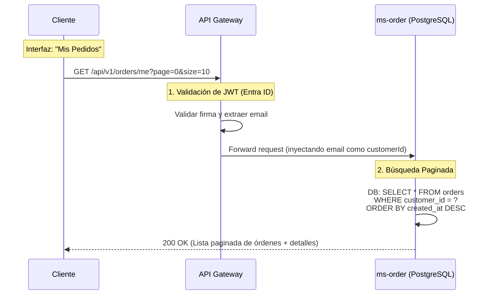

# HU5 — Ver Historial de Órdenes del Cliente: Diseño Arquitectónico

## Resumen

La HU5 permite a un cliente final (B2B, en este caso el correo del usuario) consultar todas las órdenes de compra que ha realizado en el pasado, ver el estado actual de las mismas (PENDIENTE, CONFIRMADA, CANCELADA, EN_DESPACHO, ENTREGADA) y revisar el detalle de los productos adquiridos.

A diferencia de los reportes pesados de Analítica (HU7), que recorren millones de eventos para el Administrador, esta consulta es una **operación transaccional rápida (OLTP)**, acotada exclusivamente al usuario autenticado, por lo que es atendida directamente por **`ms-order`**.

---

## Flujo de Consulta (Lectura Directa)

Este escenario no requiere el uso de Kafka ni Sagas, ya que es una operación de pura lectura (GET) síncrona, resguardada por el API Gateway y el token JWT (Entra ID).



---

## Estructura de Base de Datos `ms-order` (PostgreSQL)

Para que esta consulta sea ultra-rápida, `ms-order` debe tener una base de datos relacional (PostgreSQL) optimizada para buscar por el identificador del cliente.

**1. Tabla `orders` (Cabecera):**
```sql
CREATE TABLE orders (
    id UUID PRIMARY KEY DEFAULT gen_random_uuid(),
    customer_id VARCHAR(150) NOT NULL,       -- Email proveniente de Entra ID
    cart_id VARCHAR(150) NOT NULL,           -- Origen de la orden
    status VARCHAR(30) NOT NULL,             -- 'PENDIENTE', 'CONFIRMADA', 'CANCELADA', etc.
    total_amount DECIMAL(12,2) NOT NULL,
    created_at TIMESTAMP DEFAULT NOW(),
    updated_at TIMESTAMP DEFAULT NOW()
);

-- Índice Crítico para la HU5
CREATE INDEX idx_orders_customer ON orders(customer_id, created_at DESC);
```

**2. Tabla `order_items` (Detalles):**
```sql
CREATE TABLE order_items (
    id UUID PRIMARY KEY DEFAULT gen_random_uuid(),
    order_id UUID NOT NULL REFERENCES orders(id),
    product_id VARCHAR(100) NOT NULL,
    quantity INTEGER NOT NULL CHECK (quantity > 0),
    unit_price DECIMAL(10,2) NOT NULL
);

CREATE INDEX idx_order_items_order ON order_items(order_id);
```

---

## Patrones e Implementación en API

### Patrón API Composition (BFF) vs. Inclusión de Detalles
Una pregunta arquitectónica común aquí es: *¿El historial de órdenes debe devolver el nombre del producto, o solo su ID?* 
Si solo devuelve el `product_id`, el Frontend tendría que hacer N peticiones a `ms-catalog` para pintar los nombres ("Teclado Mecánico").

Para ARKA, recomendamos el enfoque de **Datos Congelados (Data Snapshot)**:
- Cuando la orden se crea (HU4), no solo guardamos el `product_id` y el `unit_price`, sino también una copia textual del nombre del producto (`product_name_snapshot`).
- **¿Por qué?** Porque en 3 años, el producto podría estar borrado del catálogo (`ms-catalog`), pero el "Historial de Órdenes" legalmente debe seguir mostrando que el usuario compró un "Teclado Mecánico X1".
- **Ventaja en lectura (HU5):** `ms-order` puede devolver el listado completo e historizado en 1 sola consulta a su propia base de datos, sin tener que consultar a `ms-catalog` de forma síncrona.

```json
// Respuesta a GET /api/v1/orders/me
{
  "totalItems": 45,
  "totalPages": 5,
  "currentPage": 0,
  "orders": [
    {
      "orderId": "uuid-1234",
      "status": "CONFIRMADA",
      "createdAt": "2026-03-11T16:00:00Z",
      "total": 450.99,
      "items": [
        {
          "quantity": 2,
          "priceSnapshot": 225.49,
          "nameSnapshot": "Teclado Mecánico B2B Serie X" // Dato histórico congelado
        }
      ]
    }
  ]
}
```

## Consideraciones de Seguridad
1. Al igual que en `ms-cart` (HU8), nunca confiaremos en un ID enviado por parámetro `?customerId=admin@b2b.com`. Utilizaremos el token JWT centralizado para forzar que el recurso pertenezca a quien llama (`/me`).
2. **Paginación obligatoria:** Un cliente corporativo (B2B) podría tener 15,000 órdenes en su histórico en 5 años. Se debe usar Spring Data `Pageable` para no saturar la memoria (Out Of Memory) de `ms-order` al responder la solicitud HTTP.
