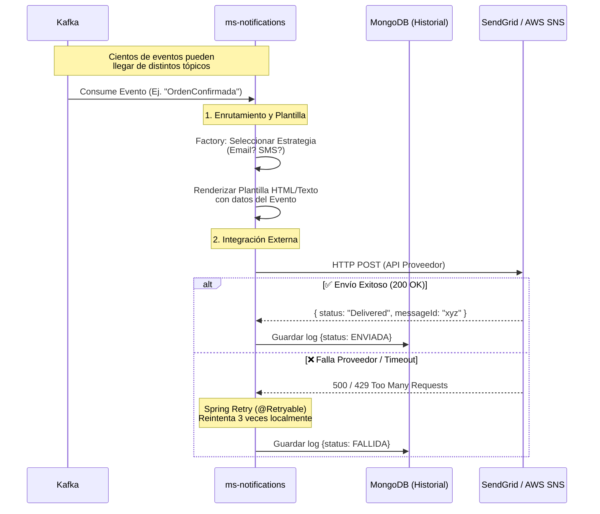

# HU6 — Sistema Centralizado de Notificaciones: Diseño Arquitectónico

## Resumen

`ms-notifications` es un microservicio puramente reactivo. No tiene APIs REST expuestas para los clientes. Su función es **escuchar eventos de dominio a través de Kafka**, transformarlos en mensajes amigables utilizando plantillas (Templates), y enviarlos a través de canales externos (Email, SMS) sin bloquear la operación de los otros microservicios.

---

## Flujo de Notificaciones (Event-Driven)



---

## Modelos de Dominio (MongoDB)

Para cumplir con el requerimiento de *"Registro de notificaciones"*, usamos **MongoDB**. MongoDB es ideal aquí porque cada notificación enviada tiene una estructura diferente (los SMS son puro texto, los emails son HTML, los datos de una OrdenCancelada son distintos a un CarritoAbandonado).

**Colección `notifications_log`:**
```json
{
  "_id": "f47ac10b-58cc-4372-a567-0e02b2c3d479",
  "recipientEmail": "admin@empresa-b2b.com",
  "channel": "EMAIL",               // 'EMAIL', 'SMS'
  "eventType": "OrdenConfirmada",
  "relatedEntityId": "order-123",   // ID de la orden o carrito asociado
  "status": "ENVIADA",              // 'ENVIADA', 'FALLIDA'
  "providerResponse": "250 Requested mail action okay, completed",
  "sentAt": "2026-03-11T16:00:00Z",
  "contentSnapshot": "<h1>¡Tu orden order-123 está confirmada!</h1>..." // Opcional: El cuerpo renderizado
}
```

---

## Patrones de Diseño Utilizados

### 1. Strategy Pattern (Para soportar diferentes canales)

Dado que la HU6 exige soporte para Email y SMS, el código debe ser extensible.

```java
// Interfaz base
public interface NotificationSender {
    boolean supports(NotificationType type);
    void send(NotificationRequest request);
}

// Implementación Email (Brevo / SendGrid)
@Service
public class EmailSenderStrategy implements NotificationSender {
    public boolean supports(NotificationType type) { return type == type.EMAIL; }
    public void send(NotificationRequest request) { /* HTTP POST a SendGrid */ }
}

// Implementación SMS (AWS SNS / Twilio)
@Service
public class SmsSenderStrategy implements NotificationSender {
    public boolean supports(NotificationType type) { return type == type.SMS; }
    public void send(NotificationRequest request) { /* HTTP POST a Twilio */ }
}

// Factory o Service Locator
@Service
public class NotificationService {
    private final List<NotificationSender> senders; // Inyecta todos

    public void dispatch(NotificationRequest req) {
        senders.stream()
               .filter(s -> s.supports(req.getChannel()))
               .findFirst()
               .ifPresent(s -> s.send(req));
    }
}
```

### 2. Motor de Plantillas (Thymeleaf o FreeMarker)

El microservicio no hardcodea strings como `"Hola " + usuario + " tu orden es " + id`. Utiliza motores de plantillas HTML para separar el diseño visual de la lógica Java.

*   Las variables provenientes del `payload` del evento de Kafka se inyectan en una plantilla HTML.
*   Esto facilita que otro equipo (marketing/diseño) edite los correos sin tocar código Java.

---

## Eventos Suscritos (Casos de Uso)

`ms-notifications` es un consumidor global. Sus Listeners están mapeados a varios tópicos según la necesidad del negocio:

| Tópico | Evento | Acción de `ms-notifications` | Canal Frecuente |
|--------|--------|------------------------------|-----------------|
| `orden-eventos` | `OrdenConfirmada` | Envía el recibo final y aviso de despacho. | Email |
| `orden-eventos` | `OrdenCancelada` | Avisa que no hubo stock suficiente o cambió el precio. | Email / SMS |
| `cart-eventos` | `CarritoAbandonadoDetectado` | Envía email recordatorio con link de recuperación (HU8). | Email |
| `producto-eventos` | `ProductoRegistrado` | *(B2B interno)* Podría avisar a Bodega que se registró un nuevo SKU. | Email |
| `inventario-eventos` | `AlertaStockBajo` | (HU2/HU3) Avisa al administrador que debe reabastecer. | **SMS** (Urgente) / Email |
| `reporte-eventos` | `ReporteAprobado` | (HU7) Envía al administrador el link de S3 para descargar un reporte pesado. | Email |
| `provider-eventos`| `OrdenRestockGenerada` | (Auto Restock) Envía un correo con la Orden de Compra formal al Proveedor. | Email |

> [!TIP]
> **FinOps (Costo Cero):** 
> - **Email**: Utilizar la API REST de **Brevo (Sendinblue)** o **SendGrid**. Ambas tienen tiers gratuitos excelentes de ~300 correos diarios, lo cual es de sobra para el laboratorio e instancias locales.
> - **SMS**: Twilio tiene una capa gratuita para números verificados, o AWS SNS usando el free tier.
