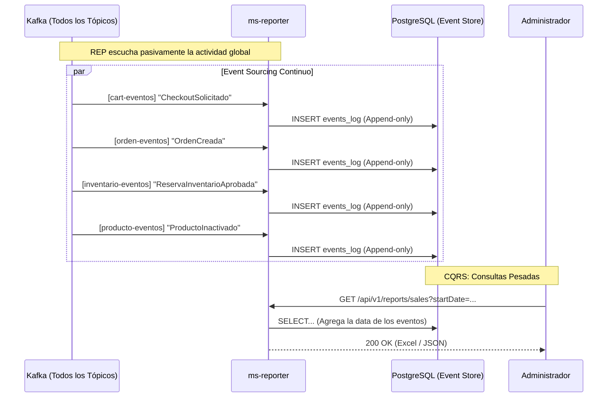
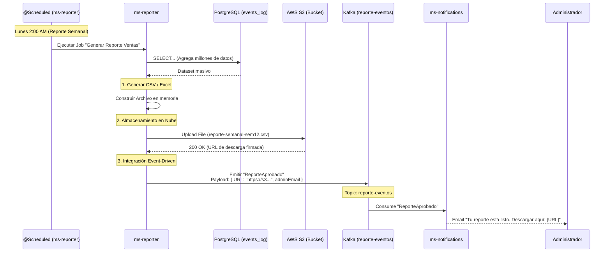

# HU7 — Generación de Reportes e Historial (Event Sourcing): Diseño Arquitectónico

## Resumen

`ms-reporter` es el cerebro analítico y de auditoría de ARKA. Mientras que los otros microservicios (Catalog, Inventory, Order) solo conocen su "estado actual" (ej. "Tengo 5 laptops en inventario"), `ms-reporter` almacena **cómo llegamos a ese estado**. Funciona como un inmenso libro mayor (Ledger) inmutable que registra cada evento de negocio que ocurre en la red de Kafka.

Esto implementa un modelo cercano a **CQRS** (Command Query Responsibility Segregation), donde los comandos ocurren en el Core (HU1, 2, 4) y las consultas analíticas pesadas se delegan 100% a `ms-reporter` para no ralentizar la operación transaccional.

---

## Flujo de Ingesta (El Gran Consumidor)



---

## Modelos de Dominio (PostgreSQL)

Usamos PostgreSQL para tener el poder de hacer agrupaciones (`GROUP BY`), funciones de ventana, sumarizaciones y analítica básica mediante vistas (`VIEWS`).

### 1. La Tabla Universal de Eventos (Event Store)

Esta tabla es **Append-Only**. Nunca se hace un `UPDATE` ni un `DELETE` sobre ella. Es inmutable.

```sql
CREATE TABLE events_log (
    event_id UUID PRIMARY KEY,
    event_type VARCHAR(100) NOT NULL,    -- Ej. 'OrdenConfirmada', 'ProductoCreado', 'CheckoutSolicitado'
    aggregate_type VARCHAR(50) NOT NULL, -- Ej. 'Order', 'Product', 'Cart', 'Inventory'
    aggregate_id VARCHAR(100) NOT NULL,  -- El ID de la entidad afectada
    payload JSONB NOT NULL,              -- Toda la data cruda del evento. Fundamental usar JSONB.
    emitted_by VARCHAR(50) NOT NULL,     -- Quién emitió 'ms-order', 'ms-cart', etc.
    timestamp TIMESTAMP DEFAULT NOW()
);

-- Índices cruciales para los Reportes
CREATE INDEX idx_events_log_type ON events_log(event_type);
CREATE INDEX idx_events_log_time ON events_log(timestamp);
CREATE INDEX idx_events_log_agg ON events_log(aggregate_type, aggregate_id);
-- Índice GIN para búsquedas veloces dentro del JSON (Ej: Buscar un productId dentro de una orden)
CREATE INDEX idx_events_log_payload ON events_log USING GIN (payload);
```

---

## Solución a los Requerimientos de HU7

### 1. Historial de un Pedido (Trazabilidad 360)
Si el Administrador quiere saber por qué la orden `X` fue cancelada, le pregunta a `ms-reporter`:

*Endpoint:* `GET /api/v1/reports/orders/{orderId}/timeline`

***Cómo lo resuelve `ms-reporter`:***
Busca en el `events_log` ordenando por tiempo:
```sql
SELECT event_type, timestamp, payload 
FROM events_log 
WHERE aggregate_id = 'order-123' 
ORDER BY timestamp ASC;
```
*Resultado (Construye la línea de tiempo real):*
1. `08:00` -> `CheckoutSolicitado`
2. `08:01` -> `OrdenCreada` (Pendiente)
3. `08:01` -> `ReservaInventarioAprobada`
4. `08:01` -> `ValidacionProductosRechazada` (Motivo "Precio cambiado")
5. `08:01` -> `OrdenCancelada`
6. `08:01` -> `OrdenCanceladaEmailEnviado` (Si también conectamos notificaciones aquí)

### 2. Reporte de Inventario (Productos sin Salida)
El negocio necesita saber qué productos en el catálogo **no** se han vendido en los últimos 3 meses, o cuáles se cancelan mucho por falta de stock.

***Cómo lo resuelve `ms-reporter`:***
Extrae datos del JSONB (solo posible en DBs modernas como PostgreSQL o MongoDB):
```sql
-- Cuántas veces un producto ha generado rechazo de inventario (Sobreventa evitada)
SELECT payload->>'productId' AS p_id, COUNT(*)
FROM events_log
WHERE event_type = 'ReservaInventarioRechazada'
GROUP BY p_id
ORDER BY count DESC;
```

### 3. Reportes Pesados Asíncronos (S3 + Notificaciones)

Generar un reporte semanal de ventas e inventario que procese millones de eventos tomaría minutos. En lugar de hacer que un usuario espere mirando una pantalla de carga, usamos un flujo asíncrono apoyado en almacenamiento en la nube e integración de eventos.



Este diseño garantiza que el sistema nunca sufra de *Timeouts* HTTP y que los archivos pesados no saturen la red interna, delegando la capa de entrega estática a **AWS S3** y la de aviso a **ms-notifications**.

---

## Consideraciones de Diseño

1. **Retención de Datos (Data Tiering):** Con miles de pedidos al día, esta tabla crecerá masivamente. PostgreSQL soporta "Particionamiento de Tablas" (Table Partitioning) por rangos de fecha (ej. una tabla física distinta por cada mes). Eventos de hace un año se pueden mover a AWS S3 (Cold Storage) si la base de datos se encarece.
2. **Desacoplamiento Analítico:** Si ARKA necesita integrar una herramienta de BI poderosa (PowerBI, Tableau) en el futuro, se conecta directamente a la réplica de lectura de este PostgreSQL de `ms-reporter`, sacando el peso de análisis 100% fuera de la operación en vivo.
3. **Replicación (Event Sourcing Replay):** Si, catastróficamente, `ms-order` pierde su base de datos, teóricamente es posible reconstruir el estado actual de todas las órdenes leyendo los `OrdenCreada`, `OrdenConfirmada`, `OrdenCancelada` guardados en el `events_log` de `ms-reporter`.
