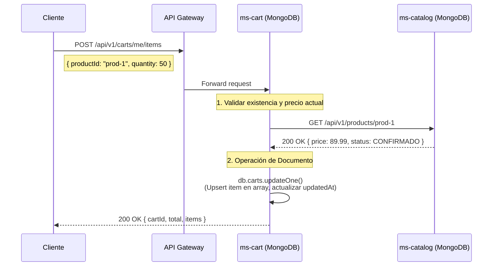
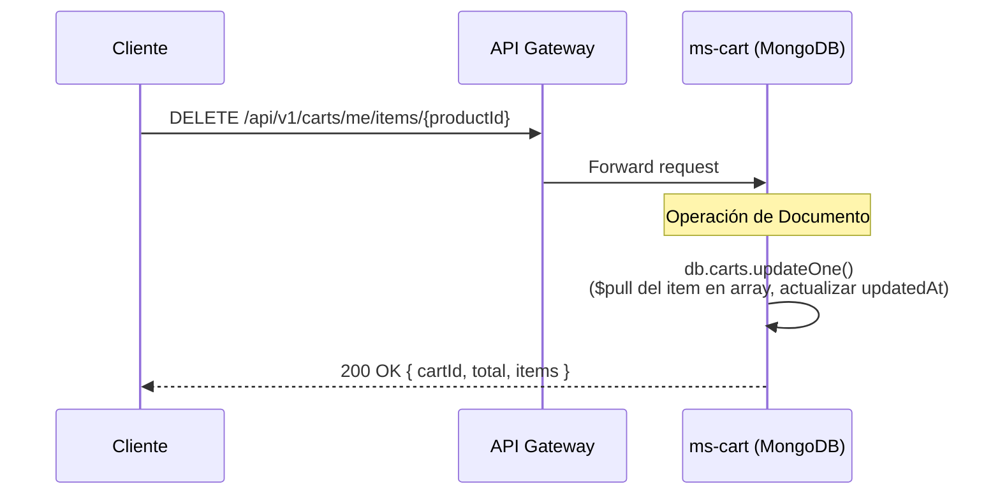
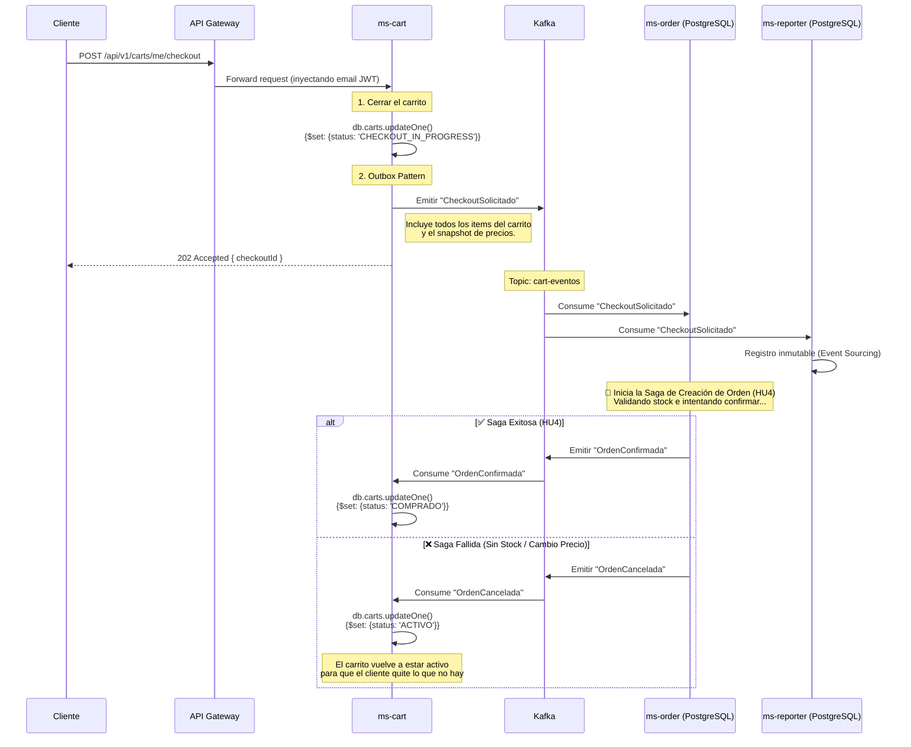
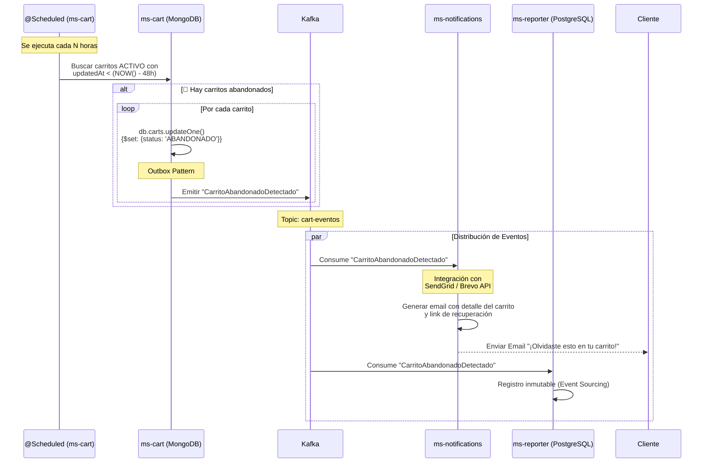

# HU8 — Gestión del Carrito de Compras: Diseño Arquitectónico

## Resumen

El microservicio `ms-cart` es responsable de la gestión del carrito de compras de los clientes B2B. A diferencia de e-commerces tradicionales que usan Redis o almacenamiento en sesión, Arka requiere que el carrito sea **persistente en una base de datos relacional** para poder cumplir con la **HU8 (Identificar y notificar carritos abandonados)**.

El ciclo de vida del carrito termina cuando el cliente hace "Checkout", momento en el cual se transfiere la responsabilidad a `ms-order` (HU4).

---

## Flujo de Gestión del Carrito

### 1. Agregar Producto al Carrito



> [!CAUTION]
> **Validación Fuerte vs Débil:** `ms-cart` valida el *precio* y la *existencia* básica con `ms-catalog` para mostrar un total aproximado. Sin embargo, **NO valida el stock contra `ms-inventory`** en este punto. En B2B, un carrito puede estar abierto días; reservar stock al meter items al carrito congelaría inventario falsamente. La reserva real ocurre hasta el Checkout (Saga HU4).

### 2. Remover Producto del Carrito

Si el cliente corporativo decide eliminar un item antes del Checkout, `ms-cart` ejecuta una eliminación local.



> [!NOTE]
> Al igual que al agregar items, remover items del carrito **no dispara eventos a Kafka ni interactúa con inventario**. El carrito flota aisladamente hasta que se intenta comprar.

### 3. Transición al Checkout (Conexión con HU4)

Cuando el cliente decide comprar, el carrito se "cierra" y se dispara la creación de la Orden.



### 4. Detección y Notificación de Carrito Abandonado

Este es el proceso asíncrono que corre en background para recuperar ventas perdidas.



---

## Modelos de Dominio

### ms-cart (DocumentDB - MongoDB)

Se utiliza una base de datos orientada a documentos (MongoDB) porque el carrito es un *agregado natural* que se lee y actualiza como una unidad completa. No requiere JOINs relacionales.

**Estrategia de Llave Primaria (Entra ID JWT):**
El `_id` del documento es directamente el **correo electrónico del usuario** (extraído del token JWT validado de Entra ID). Esto permite búsquedas instantáneas O(1) sin necesidad de tablas intermedias.

**Colección `carts`:**
```json
{
  "_id": "admin@empresa-b2b.com",     // 🔑 Email extraído del JWT de Entra ID
  "status": "ACTIVO",                 // 'ACTIVO', 'CHECKOUT_IN_PROGRESS', 'ABANDONADO'
  "createdAt": "2026-03-09T08:00:00Z",
  "updatedAt": "2026-03-11T14:30:00Z", // Clave para la HU8 (Carritos Abandonados)
  
  // El detalle va anidado dentro del mismo documento
  "items": [
    {
      "productId": "prod-1",
      "quantity": 50,
      "unitPriceSnapshot": 89.99,
      "addedAt": "2026-03-09T08:00:00Z"
    },
    {
      "productId": "prod-4",
      "quantity": 2,
      "unitPriceSnapshot": 1200.00,
      "addedAt": "2026-03-11T14:30:00Z"
    }
  ]
}
```

---

## HU8: Identificador de Carritos Abandonados

El verdadero valor de negocio de tener esto persistente en MongoDB es poder ejecutar el análisis de carritos abandonados.

### Lógica del Cronjob (@Scheduled)

Un proceso en `ms-cart` corre diariamente (o cada N horas) buscando documentos en MongoDB:

```javascript
// Buscar carritos que no han sido modificados en las últimas 48 horas
// y que siguen activos (no han pasado a checkout)
const fechaLimite = new Date(Date.now() - 48 * 60 * 60 * 1000); // Hace 48h

db.carts.find({
  status: "ACTIVO",
  updatedAt: { $lt: fechaLimite }
});
```

### Flujo de Notificación de Abandono

1. El cronjob en `ms-cart` encuentra los carritos expirados.
2. Por cada uno:
   - Hace `UPDATE carts SET status = 'ABANDONADO'`
   - Extrae el detalle del carrito.
   - Publica un evento `CarritoAbandonadoDetectado` en el tópico `cart-eventos`.
3. El microservicio de notificaciones (`ms-notifications`) consume este evento y dispara la integración con SendGrid/Brevo para enviar el correo de recuperación al cliente, idealmente con un link mágico que restaura el carrito a `ACTIVO`.

---

## Eventos de Dominio (Topic: `cart-eventos`)

### CheckoutSolicitado
```json
{
  "eventId": "uuid",
  "eventType": "CheckoutSolicitado",
  "aggregateId": "cart-123",
  "payload": {
    "cartId": "cart-123",
    "customerId": "cust-888",
    "items": [
      { "productId": "prod-1", "quantity": 50, "unitPriceSnapshot": 89.99 }
    ]
  }
}
```

### CarritoAbandonadoDetectado
```json
{
  "eventId": "uuid",
  "eventType": "CarritoAbandonadoDetectado",
  "aggregateId": "cart-123",
  "payload": {
    "cartId": "cart-123",
    "customerId": "cust-888",
    "lastUpdateAt": "2026-03-09T10:00:00Z",
    "totalValue": 4499.50,
    "itemsCount": 1
  }
}
```

---

## Consideraciones Adicionales

1. **Gestión de Precios Obsoletos:** Los precios en el catálogo (`ms-catalog`) pueden cambiar mientras el producto está en el carrito. Por eso se guarda `unit_price_snapshot`. Durante el proceso de Checkout, la Saga de `ms-order` (HU4) se encargará de validar si el precio actual del catálogo sigue coincidiendo con el snapshot. Si difieren significativamente, la saga rechaza la orden y devuelve el carrito a `ACTIVO` para que el cliente decida.
2. **Independencia Analítica:** Como en los flujos anteriores, el Event Store global (`ms-reporter`) consume el tópico `cart-eventos` permitiendo construir reportes como "Tasa de Recuperación de Carritos Abandonados" o "Valor promedio de carritos vs Órdenes finales".
