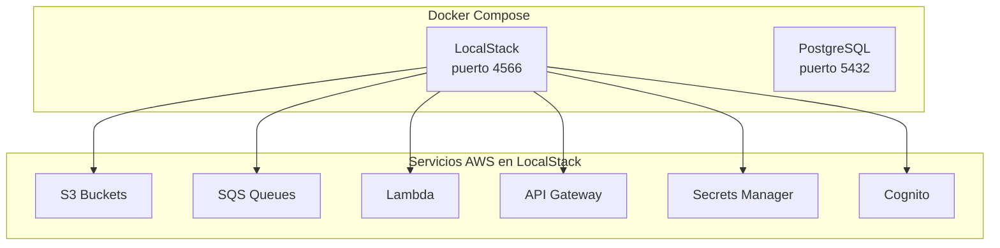

# Lab: Infraestructura AWS con LocalStack

:::tip Tiempo estimado
**Tiempo total:** 3 horas
:::

En este laboratorio aprenderás a:

- Configurar **LocalStack** con Docker Compose
- Desplegar servicios AWS localmente usando **CloudFormation**
- Trabajar con S3, SQS, Lambda, API Gateway, Secrets Manager y Cognito

## Prerrequisitos

- Docker y Docker Compose instalados
- AWS CLI instalado
- Editor de código (VS Code recomendado)

## Arquitectura del Lab

## Servicios que Usaremos

| Servicio | Propósito |
|----------|-----------|
| **S3** | Almacenamiento de archivos (imágenes, reportes) |
| **SQS** | Colas de mensajes para procesamiento asíncrono |
| **Secrets Manager** | Almacenar credenciales de forma segura |
| **Lambda** | Funciones serverless |
| **API Gateway** | Exponer endpoints REST |
| **Cognito** | Autenticación de usuarios |

## ¿Por qué LocalStack?

LocalStack permite ejecutar servicios AWS **localmente**, lo que significa:

- **Sin costos** - No gastas dinero en recursos AWS
- **Sin conexión** - Desarrolla offline
- **Rápido** - Sin latencia de red
- **Reproducible** - Misma configuración para todo el equipo

¡Comencemos con el [Módulo 1: Configuración Inicial](./modulos/configuracion-inicial)!
