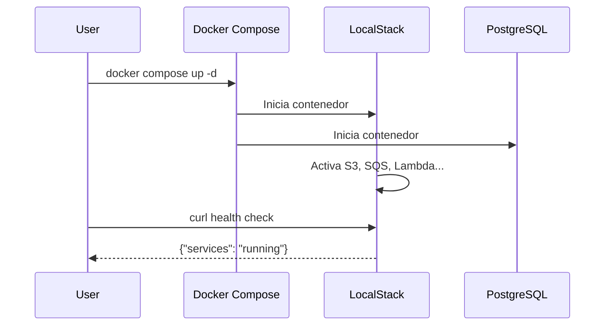

# Módulo 1: Configuración Inicial

:::tip Tiempo estimado
20 minutos
:::

## 1.1 Crear estructura del proyecto

```bash
mkdir -p localstack-lab/cloudformation
cd localstack-lab
```

## 1.2 Crear docker-compose.yml

:::note Archivo a crear
`docker-compose.yml`
:::

```yaml
version: "3.9"

services:
  localstack:
    image: localstack/localstack:latest
    container_name: localstack
    ports:
      - "4566:4566"           # Gateway unificado
      - "4510-4559:4510-4559" # Rango de servicios externos
    environment:
      - DEBUG=1
      - DOCKER_HOST=unix:///var/run/docker.sock
      - SERVICES=s3,sqs,lambda,apigateway,secretsmanager,cognito-idp
      - DEFAULT_REGION=us-east-1
      - CFN_IGNORE_UNSUPPORTED_RESOURCE_TYPES=1
    volumes:
      - "./localstack-data:/var/lib/localstack"
      - "/var/run/docker.sock:/var/run/docker.sock"
      - "./cloudformation:/etc/localstack/init/ready.d"
    healthcheck:
      test: ["CMD", "curl", "-f", "http://localhost:4566/_localstack/health"]
      interval: 10s
      timeout: 5s
      retries: 5
    networks:
      - lab-network

  postgres:
    image: postgres:16
    container_name: lab-postgres
    environment:
      POSTGRES_USER: labuser
      POSTGRES_PASSWORD: labpassword
      POSTGRES_DB: labdb
    ports:
      - "5432:5432"
    volumes:
      - postgres-data:/var/lib/postgresql/data
    healthcheck:
      test: ["CMD-SHELL", "pg_isready -U labuser"]
      interval: 10s
      timeout: 5s
      retries: 5
    networks:
      - lab-network

networks:
  lab-network:
    driver: bridge

volumes:
  postgres-data:
```

## 1.3 Instalar awslocal

`awslocal` es un wrapper del AWS CLI que automáticamente apunta a LocalStack:

```bash
pip install awscli-local
```

## 1.4 Iniciar servicios

```bash
docker compose up -d
```

Verifica que los contenedores están corriendo:

```bash
docker compose ps
```

:::info Checkpoint
Verificar que LocalStack está corriendo:
```bash
curl http://localhost:4566/_localstack/health
```
Deberías ver un JSON con el estado de los servicios.
:::

## ¿Qué acabamos de hacer?



---

**Siguiente:** [Módulo 2: S3 - Almacenamiento](./s3-almacenamiento)
