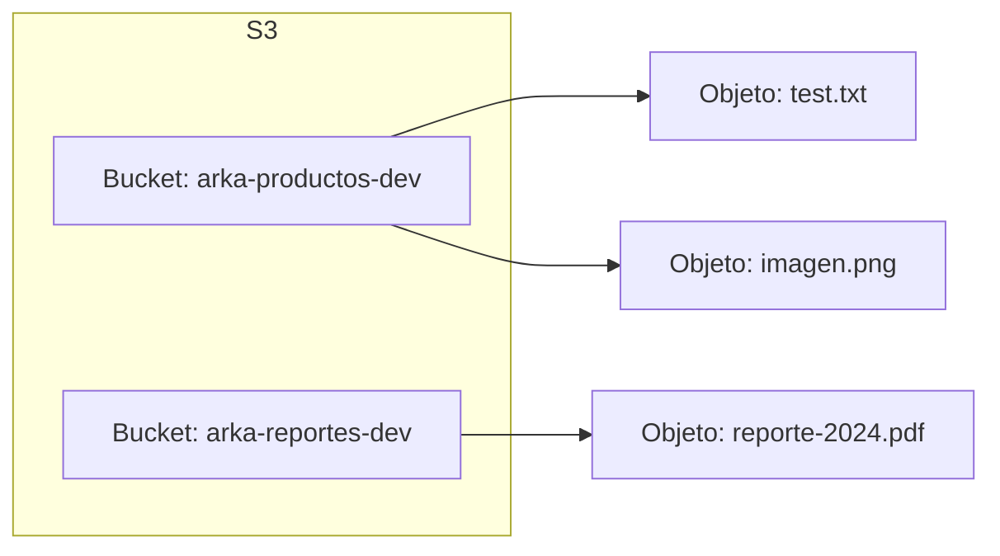

# Módulo 2: S3 - Almacenamiento

:::tip Tiempo estimado
20 minutos
:::

## 2.1 CloudFormation para S3

:::note Archivo a crear
`cloudformation/s3-buckets.yml`
:::

```yaml
# CloudFormation template para buckets S3
AWSTemplateFormatVersion: '2010-09-09'
Description: 'Buckets S3 para el proyecto'

Parameters:
  Environment:
    Type: String
    Default: dev
    AllowedValues: [dev, staging, prod]

Resources:
  # Bucket para archivos de productos
  ProductosBucket:
    Type: AWS::S3::Bucket
    Properties:
      BucketName: !Sub "arka-productos-${Environment}"
      VersioningConfiguration:
        Status: Enabled
      CorsConfiguration:
        CorsRules:
          - AllowedHeaders: ['*']
            AllowedMethods: [GET, PUT, POST, DELETE]
            AllowedOrigins: ['*']
            MaxAge: 3000

  # Bucket para reportes
  ReportesBucket:
    Type: AWS::S3::Bucket
    Properties:
      BucketName: !Sub "arka-reportes-${Environment}"
      LifecycleConfiguration:
        Rules:
          - Id: DeleteOldReports
            Status: Enabled
            ExpirationInDays: 90

Outputs:
  ProductosBucketName:
    Value: !Ref ProductosBucket
    Export:
      Name: !Sub "${Environment}-ProductosBucket"
  ReportesBucketName:
    Value: !Ref ReportesBucket
```

## 2.2 Desplegar stack S3

```bash
awslocal cloudformation deploy \
  --stack-name s3-stack \
  --template-file cloudformation/s3-buckets.yml \
  --parameter-overrides Environment=dev
```

## 2.3 Verificar buckets

```bash
# Listar buckets
awslocal s3 ls

# Subir archivo de prueba
echo "Hola S3!" > test.txt
awslocal s3 cp test.txt s3://arka-productos-dev/

# Listar contenido
awslocal s3 ls s3://arka-productos-dev/

# Descargar archivo
awslocal s3 cp s3://arka-productos-dev/test.txt downloaded.txt
cat downloaded.txt
```

:::info Checkpoint
Debes ver los buckets `arka-productos-dev` y `arka-reportes-dev`
:::

## Conceptos Clave de S3



| Concepto | Descripción |
|----------|-------------|
| **Bucket** | Contenedor de objetos (como una carpeta raíz) |
| **Objeto** | Archivo almacenado + metadata |
| **Versionado** | Mantiene historial de versiones |
| **CORS** | Permite acceso desde el navegador |

---

**Siguiente:** [Módulo 3: SQS - Mensajería](./sqs-mensajeria)
