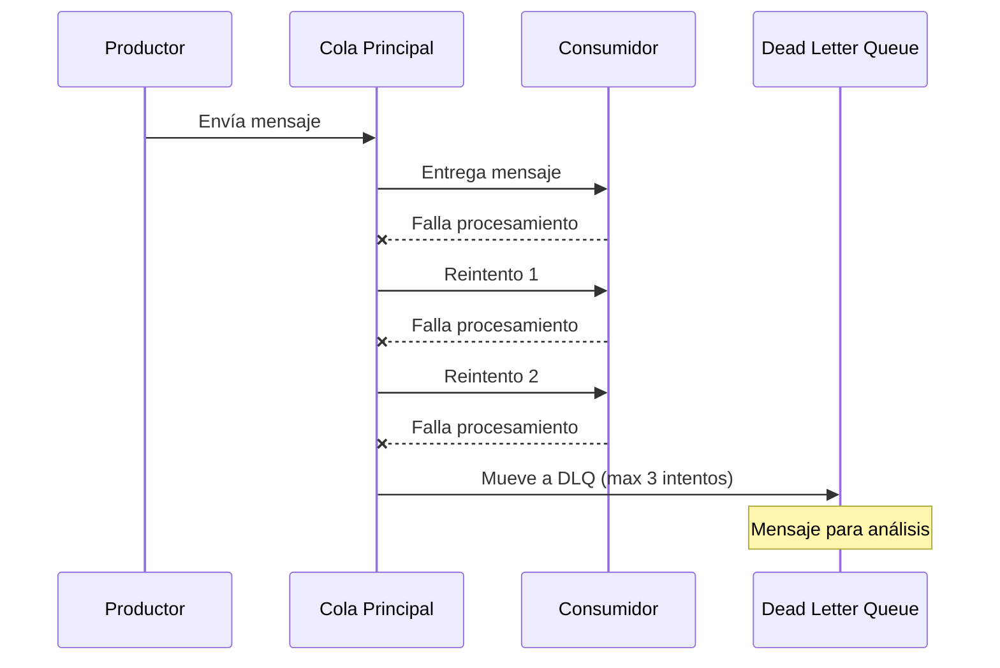

# Módulo 3: SQS - Mensajería

:::tip Tiempo estimado
20 minutos
:::

## 3.1 CloudFormation para SQS

:::note Archivo a crear
`cloudformation/sqs-queues.yaml`
:::

```yaml
AWSTemplateFormatVersion: '2010-09-09'
Description: 'Colas SQS para procesamiento asíncrono'

Resources:
  # Cola principal de órdenes
  OrdenesQueue:
    Type: AWS::SQS::Queue
    Properties:
      QueueName: arka-ordenes-queue
      VisibilityTimeout: 60
      MessageRetentionPeriod: 1209600  # 14 días
      RedrivePolicy:
        deadLetterTargetArn: !GetAtt OrdenesDeadLetterQueue.Arn
        maxReceiveCount: 3

  # Cola de dead letter para órdenes fallidas
  OrdenesDeadLetterQueue:
    Type: AWS::SQS::Queue
    Properties:
      QueueName: arka-ordenes-dlq
      MessageRetentionPeriod: 1209600

  # Cola para notificaciones
  NotificacionesQueue:
    Type: AWS::SQS::Queue
    Properties:
      QueueName: arka-notificaciones-queue
      VisibilityTimeout: 30

Outputs:
  OrdenesQueueUrl:
    Value: !Ref OrdenesQueue
  OrdenesQueueArn:
    Value: !GetAtt OrdenesQueue.Arn
```

## 3.2 Desplegar y probar SQS

```bash
# Desplegar
awslocal cloudformation deploy \
  --stack-name sqs-stack \
  --template-file cloudformation/sqs-queues.yaml

# Listar colas
awslocal sqs list-queues
```

## 3.3 Enviar y recibir mensajes

```bash
# Enviar mensaje
awslocal sqs send-message \
  --queue-url http://sqs.us-east-1.localhost.localstack.cloud:4566/000000000000/arka-ordenes-queue \
  --message-body '{"ordenId": "123", "accion": "confirmar"}'

# Recibir mensaje
awslocal sqs receive-message \
  --queue-url http://sqs.us-east-1.localhost.localstack.cloud:4566/000000000000/arka-ordenes-queue
```

:::info Checkpoint
El mensaje enviado debe aparecer al ejecutar receive-message
:::

## Flujo de Dead Letter Queue



## Conceptos Clave de SQS

| Concepto | Descripción |
|----------|-------------|
| **Queue** | Cola de mensajes FIFO o estándar |
| **VisibilityTimeout** | Tiempo que el mensaje es invisible después de recibirse |
| **Dead Letter Queue** | Cola para mensajes que fallan múltiples veces |
| **MessageRetentionPeriod** | Tiempo que se retiene el mensaje (máx 14 días) |

---

**Siguiente:** [Módulo 4: Secrets Manager](./secrets-manager)
