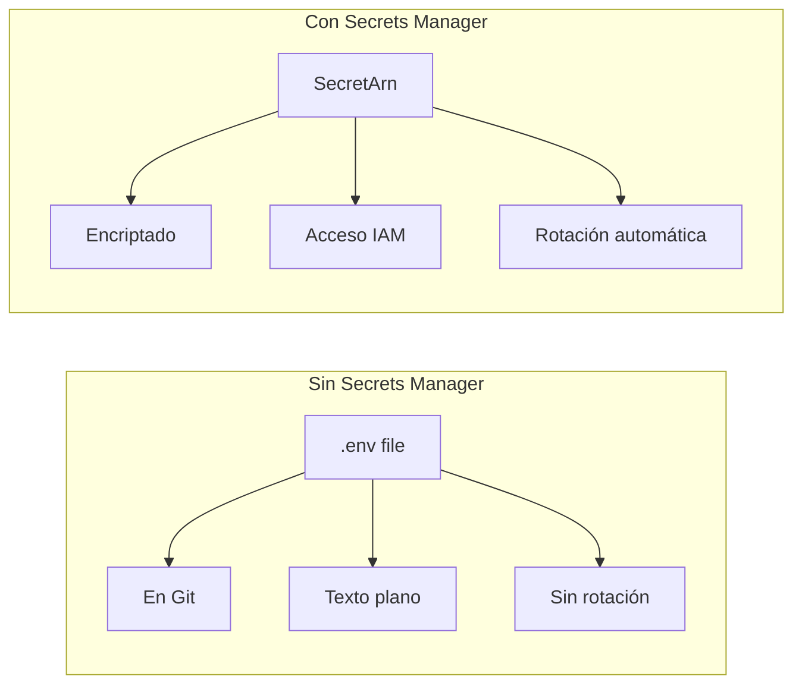

# Módulo 4: Secrets Manager

:::tip Tiempo estimado
15 minutos
:::

## 4.1 CloudFormation para Secrets

:::note Archivo a crear
`cloudformation/secrets-manager.yaml`
:::

```yaml
AWSTemplateFormatVersion: '2010-09-09'
Description: 'Secretos para la aplicación'

Resources:
  DatabaseSecret:
    Type: AWS::SecretsManager::Secret
    Properties:
      Name: arka/database/credentials
      Description: Credenciales de base de datos
      SecretString: !Sub |
        {
          "username": "arka_app",
          "password": "SuperSecretPassword123!",
          "host": "postgres",
          "port": "5432",
          "database": "labdb"
        }

  ApiKeysSecret:
    Type: AWS::SecretsManager::Secret
    Properties:
      Name: arka/api/keys
      SecretString: |
        {
          "stripe_key": "sk_test_xxx",
          "sendgrid_key": "SG.xxx"
        }

Outputs:
  DatabaseSecretArn:
    Value: !Ref DatabaseSecret
```

## 4.2 Desplegar y obtener secretos

```bash
# Desplegar
awslocal cloudformation deploy \
  --stack-name secrets-stack \
  --template-file cloudformation/secrets-manager.yaml

# Listar secretos
awslocal secretsmanager list-secrets

# Obtener valor del secreto
awslocal secretsmanager get-secret-value \
  --secret-id arka/database/credentials \
  --query SecretString --output text | jq
```

:::info Checkpoint
Debes ver las credenciales de la base de datos en formato JSON
:::

## Uso en Spring Boot

```yaml
# application.yaml
spring:
  datasource:
    url: jdbc:postgresql://${DB_HOST}:${DB_PORT}/${DB_NAME}
    username: ${DB_USERNAME}
    password: ${DB_PASSWORD}
```

```java
// Obtener secreto con AWS SDK
public class SecretsManagerService {
    
    private final SecretsManagerClient secretsClient;
    
    public DatabaseCredentials getDatabaseCredentials() {
        GetSecretValueRequest request = GetSecretValueRequest.builder()
            .secretId("arka/database/credentials")
            .build();
            
        GetSecretValueResponse response = secretsClient.getSecretValue(request);
        String secret = response.secretString();
        
        return objectMapper.readValue(secret, DatabaseCredentials.class);
    }
}
```

## ¿Por qué Secrets Manager?



---

**Siguiente:** [Módulo 5: Lambda + API Gateway](./lambda-api-gateway)
