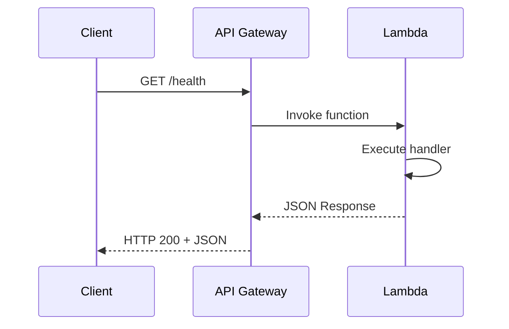

# Módulo 5: Lambda + API Gateway

:::tip Tiempo estimado
30 minutos
:::

## 5.1 Crear función Lambda

:::note Archivo a crear
`lambda/healthcheck.py`
:::

```bash
mkdir -p lambda
```

```python
# lambda/healthcheck.py
import json
from datetime import datetime

def handler(event, context):
    return {
        "statusCode": 200,
        "headers": {
            "Content-Type": "application/json"
        },
        "body": json.dumps({
            "status": "healthy",
            "timestamp": datetime.now().isoformat(),
            "service": "arka-api"
        })
    }
```

## 5.2 Empaquetar Lambda

```bash
cd lambda
zip healthcheck.zip healthcheck.py
cd ..
```

## 5.3 CloudFormation para Lambda + API Gateway

:::note Archivo a crear
`cloudformation/lambda-api.yml`
:::

```yaml
AWSTemplateFormatVersion: '2010-09-09'
Description: 'Lambda + API Gateway para healthcheck'

Resources:
  # Rol IAM para Lambda
  LambdaExecutionRole:
    Type: AWS::IAM::Role
    Properties:
      RoleName: lambda-execution-role
      AssumeRolePolicyDocument:
        Version: '2012-10-17'
        Statement:
          - Effect: Allow
            Principal:
              Service: lambda.amazonaws.com
            Action: sts:AssumeRole
      ManagedPolicyArns:
        - arn:aws:iam::aws:policy/service-role/AWSLambdaBasicExecutionRole

  # Función Lambda
  HealthcheckFunction:
    Type: AWS::Lambda::Function
    Properties:
      FunctionName: healthcheck
      Runtime: python3.11
      Handler: healthcheck.handler
      Role: !GetAtt LambdaExecutionRole.Arn
      Code:
        ZipFile: |
          import json
          from datetime import datetime
          
          def handler(event, context):
              return {
                  "statusCode": 200,
                  "headers": {"Content-Type": "application/json"},
                  "body": json.dumps({
                      "status": "healthy",
                      "timestamp": datetime.now().isoformat(),
                      "service": "arka-api"
                  })
              }
      Timeout: 30
      MemorySize: 128

  # API Gateway REST API
  ArkaApi:
    Type: AWS::ApiGateway::RestApi
    Properties:
      Name: Arka API
      Description: API para servicios Arka

  # Resource /health
  HealthResource:
    Type: AWS::ApiGateway::Resource
    Properties:
      RestApiId: !Ref ArkaApi
      ParentId: !GetAtt ArkaApi.RootResourceId
      PathPart: health

  # Método GET
  HealthGetMethod:
    Type: AWS::ApiGateway::Method
    Properties:
      RestApiId: !Ref ArkaApi
      ResourceId: !Ref HealthResource
      HttpMethod: GET
      AuthorizationType: NONE
      Integration:
        Type: AWS_PROXY
        IntegrationHttpMethod: POST
        Uri: !Sub 
          - arn:aws:apigateway:${AWS::Region}:lambda:path/2015-03-31/functions/${LambdaArn}/invocations
          - LambdaArn: !GetAtt HealthcheckFunction.Arn

  # Permiso para que API Gateway invoque Lambda
  LambdaPermission:
    Type: AWS::Lambda::Permission
    Properties:
      FunctionName: !Ref HealthcheckFunction
      Action: lambda:InvokeFunction
      Principal: apigateway.amazonaws.com
      SourceArn: !Sub arn:aws:execute-api:${AWS::Region}:${AWS::AccountId}:${ArkaApi}/*

  # Deployment
  ApiDeployment:
    Type: AWS::ApiGateway::Deployment
    DependsOn: HealthGetMethod
    Properties:
      RestApiId: !Ref ArkaApi

  # Stage dev
  DevStage:
    Type: AWS::ApiGateway::Stage
    Properties:
      RestApiId: !Ref ArkaApi
      DeploymentId: !Ref ApiDeployment
      StageName: dev

Outputs:
  LambdaFunctionArn:
    Value: !GetAtt HealthcheckFunction.Arn
  ApiGatewayUrl:
    Value: !Sub https://${ArkaApi}.execute-api.${AWS::Region}.amazonaws.com/dev/health
  LocalStackUrl:
    Value: !Sub http://localhost:4566/restapis/${ArkaApi}/dev/_user_request_/health
```

## 5.4 Desplegar stack

```bash
awslocal cloudformation deploy \
  --stack-name lambda-api-stack \
  --template-file cloudformation/lambda-api.yml \
  --capabilities CAPABILITY_NAMED_IAM
```

## 5.5 Obtener URL y probar

```bash
# Obtener API ID
API_ID=$(awslocal apigateway get-rest-apis \
  --query 'items[?name==`Arka API`].id' --output text)

echo "API URL: http://localhost:4566/restapis/$API_ID/dev/_user_request_/health"

# Probar endpoint
curl http://localhost:4566/restapis/$API_ID/dev/_user_request_/health | jq
```

:::info Checkpoint
El endpoint debe retornar `{"status": "healthy", ...}`
:::

## Arquitectura Lambda + API Gateway



## Conceptos Clave

| Componente | Propósito |
|------------|-----------|
| **Lambda Function** | Código que se ejecuta sin servidor |
| **API Gateway** | Proxy HTTP para exponer APIs |
| **Stage** | Ambiente de despliegue (dev, prod) |
| **Integration** | Conexión entre API Gateway y Lambda |

---

**Siguiente:** [Módulo 6: Cognito](./cognito)
