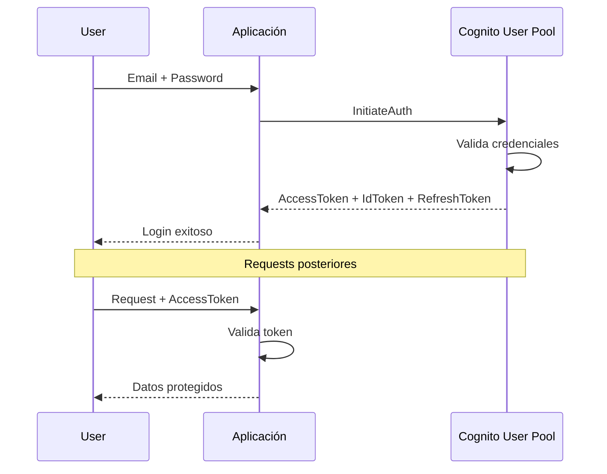

# Módulo 6: Cognito

:::tip Tiempo estimado
25 minutos
:::

## 6.1 CloudFormation para Cognito

:::note Archivo a crear
`cloudformation/cognito-userpool.yml`
:::

```yaml
AWSTemplateFormatVersion: '2010-09-09'
Description: 'Cognito User Pool para autenticación'

Resources:
  UserPool:
    Type: AWS::Cognito::UserPool
    Properties:
      UserPoolName: arka-users
      UsernameAttributes:
        - email
      AutoVerifiedAttributes:
        - email
      Policies:
        PasswordPolicy:
          MinimumLength: 8
          RequireLowercase: true
          RequireNumbers: true
          RequireSymbols: false
          RequireUppercase: true
      Schema:
        - Name: email
          Required: true
          Mutable: true
        - Name: name
          Required: true
          Mutable: true

  UserPoolClient:
    Type: AWS::Cognito::UserPoolClient
    Properties:
      ClientName: arka-web-client
      UserPoolId: !Ref UserPool
      ExplicitAuthFlows:
        - ALLOW_USER_PASSWORD_AUTH
        - ALLOW_REFRESH_TOKEN_AUTH
      GenerateSecret: false

Outputs:
  UserPoolId:
    Value: !Ref UserPool
  UserPoolClientId:
    Value: !Ref UserPoolClient
```

## 6.2 Desplegar y configurar Cognito

```bash
# Desplegar
awslocal cloudformation deploy \
  --stack-name cognito-stack \
  --template-file cloudformation/cognito-userpool.yml

# Obtener IDs
USER_POOL_ID=$(awslocal cognito-idp list-user-pools \
  --max-results 10 \
  --query 'UserPools[0].Id' --output text)

CLIENT_ID=$(awslocal cognito-idp list-user-pool-clients \
  --user-pool-id $USER_POOL_ID \
  --query 'UserPoolClients[0].ClientId' --output text)

echo "User Pool ID: $USER_POOL_ID"
echo "Client ID: $CLIENT_ID"
```

## 6.3 Crear y autenticar usuario

```bash
# Crear usuario
awslocal cognito-idp admin-create-user \
  --user-pool-id $USER_POOL_ID \
  --username test@example.com \
  --user-attributes Name=email,Value=test@example.com Name=name,Value="Test User" \
  --temporary-password "TempPass123!"

# Establecer contraseña permanente
awslocal cognito-idp admin-set-user-password \
  --user-pool-id $USER_POOL_ID \
  --username test@example.com \
  --password "MyPassword123!" \
  --permanent

# Autenticar
awslocal cognito-idp initiate-auth \
  --client-id $CLIENT_ID \
  --auth-flow USER_PASSWORD_AUTH \
  --auth-parameters USERNAME=test@example.com,PASSWORD=MyPassword123!
```

:::info Checkpoint
Debes recibir tokens de autenticación (AccessToken, IdToken, RefreshToken)
:::

## Flujo de Autenticación



## Tokens JWT

| Token | Propósito | Duración |
|-------|-----------|----------|
| **AccessToken** | Autorización de APIs | 1 hora |
| **IdToken** | Información del usuario | 1 hora |
| **RefreshToken** | Renovar tokens | 30 días |

---

**Siguiente:** [Módulo 7: Stack Completo](./stack-completo)
