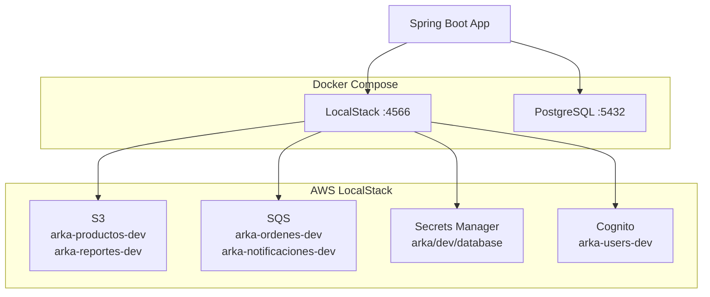

# Módulo 7: Stack Completo

:::tip Tiempo estimado
20 minutos
:::

En este módulo consolidamos toda la infraestructura en un solo template de CloudFormation.

## 7.1 Template consolidado

:::note Archivo a crear
`cloudformation/full-stack.yml`
:::

```yaml
AWSTemplateFormatVersion: '2010-09-09'
Description: 'Stack completo de infraestructura Arka'

Parameters:
  Environment:
    Type: String
    Default: dev

Resources:
  # ==================
  # S3 Buckets
  # ==================
  ProductosBucket:
    Type: AWS::S3::Bucket
    Properties:
      BucketName: !Sub "arka-productos-${Environment}"

  ReportesBucket:
    Type: AWS::S3::Bucket
    Properties:
      BucketName: !Sub "arka-reportes-${Environment}"

  # ==================
  # SQS Queues
  # ==================
  OrdenesQueue:
    Type: AWS::SQS::Queue
    Properties:
      QueueName: !Sub "arka-ordenes-${Environment}"

  NotificacionesQueue:
    Type: AWS::SQS::Queue
    Properties:
      QueueName: !Sub "arka-notificaciones-${Environment}"

  # ==================
  # Secrets Manager
  # ==================
  DatabaseSecret:
    Type: AWS::SecretsManager::Secret
    Properties:
      Name: !Sub "arka/${Environment}/database"
      SecretString: '{"username":"arka","password":"secret"}'

  # ==================
  # Cognito
  # ==================
  UserPool:
    Type: AWS::Cognito::UserPool
    Properties:
      UserPoolName: !Sub "arka-users-${Environment}"

  UserPoolClient:
    Type: AWS::Cognito::UserPoolClient
    Properties:
      UserPoolId: !Ref UserPool

Outputs:
  ProductosBucket:
    Value: !Ref ProductosBucket
  OrdenesQueueUrl:
    Value: !Ref OrdenesQueue
  UserPoolId:
    Value: !Ref UserPool
```

## 7.2 Limpiar stacks anteriores

```bash
# Eliminar stacks individuales
awslocal cloudformation delete-stack --stack-name s3-stack
awslocal cloudformation delete-stack --stack-name sqs-stack
awslocal cloudformation delete-stack --stack-name secrets-stack
awslocal cloudformation delete-stack --stack-name cognito-stack
```

## 7.3 Desplegar stack completo

```bash
# Desplegar todo
awslocal cloudformation deploy \
  --stack-name arka-infrastructure \
  --template-file cloudformation/full-stack.yml \
  --parameter-overrides Environment=dev

# Verificar outputs
awslocal cloudformation describe-stacks \
  --stack-name arka-infrastructure \
  --query 'Stacks[0].Outputs' | jq
```

:::info Checkpoint
Todos los recursos deben estar creados - verifica con los comandos de cada servicio
:::

## Verificación Final

```bash
# S3
awslocal s3 ls

# SQS
awslocal sqs list-queues

# Secrets
awslocal secretsmanager list-secrets

# Cognito
awslocal cognito-idp list-user-pools --max-results 10
```

## Arquitectura Final



---

**Siguiente:** [Limpieza](../limpieza)
