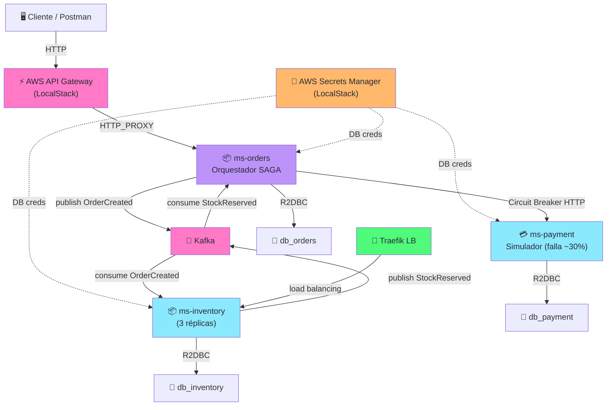
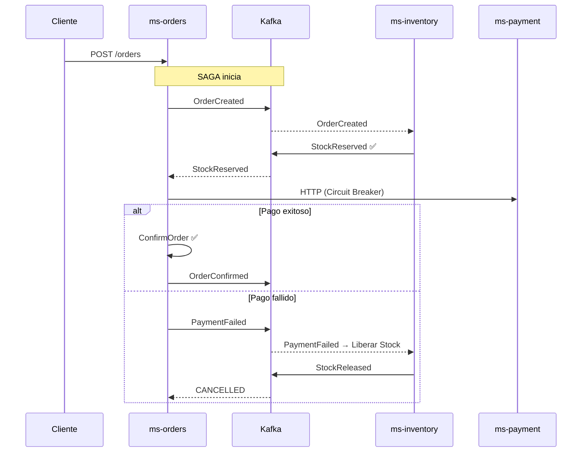

import Tabs from '@theme/Tabs';
import TabItem from '@theme/TabItem';

# Lab Avanzado: Microservicios Reactivos con Arka

:::tip Desafío Técnico — Tiempo estimado
**Tiempo total:** 12+ horas (9 módulos). Este lab no es un tutorial guiado punto a punto — es una **simulación real** de un ecosistema distribuido en producción.
:::

## El Problema de Arka

**Arka** es una distribuidora de accesorios para PC (GPUs, periféricos, hardware) con operaciones en LATAM. Su sistema monolítico actual sufre dos problemas críticos:

:::danger Problema Crítico
1. **Sobreventa (Race Condition):** El sistema permite vender stock que ya no existe debido a transacciones concurrentes sin coordinación.
2. **Consistencia distribuida:** Al migrar a microservicios, una transacción que abarca `Órdenes → Inventario → Pagos` ya no puede usar `@Transactional`. ¿Cómo garantizamos consistencia sin una base de datos central?
:::

La solución que implementaremos: **Arquitectura dirigida por eventos + Patrón SAGA** protegida por Circuit Breakers y gestionada vía IaC.

## Arquitectura General



## Stack Tecnológico

| Tecnología | Rol | ¿Por qué? |
|------------|-----|-----------|
| **Java 17 + Spring WebFlux** | Framework Reactivo | Non-blocking, backpressure, `Mono`/`Flux` |
| **R2DBC** | Driver de BD Reactivo | Prohibido JPA/Hibernate |
| **PostgreSQL × 3** | Base de Datos | Database per Service pattern |
| **Apache Kafka + KafkaUI** | Message Broker | SAGA Coreografiada entre servicios |
| **AWS Secrets Manager** | Seguridad | Credenciales de BD inyectadas en runtime |
| **AWS API Gateway** | Punto de entrada | HTTP_PROXY a ms-orders |
| **AWS CloudFormation** | IaC | Aprovisionar todos los recursos de LocalStack |
| **LocalStack** | Simulación AWS | Cloud local sin costos |
| **Traefik** | Load Balancer | Balanceo dinámico y dashboard visual |
| **Resilience4j** | Circuit Breaker | Proteger llamadas HTTP a ms-payment |

:::warning Stack Reactivo Estricto
Este lab usa exclusivamente el **Reactive Stack**. Está **prohibido** usar JDBC, JPA o Hibernate. Todo es `Mono<T>` y `Flux<T>`.
:::

## El Patrón SAGA que Implementaremos



## Prerrequisitos

Antes de comenzar, asegúrate de tener instalado:

<Tabs>
  <TabItem value="mac" label="macOS/Linux" default>
  ```bash
    java --version        # Java 17+
  docker compose version # Docker Compose v2+
  python3 --version     # Python 3.7+
  pip install awscli-local  # awslocal CLI
  aws --version         # AWS CLI v2
  ```
  </TabItem>
  <TabItem value="windows" label="Windows (WSL2)">
  ```bash
  # Instalar WSL2 primero, luego dentro de WSL:
  java --version
  docker compose version
  python3 --version
  pip3 install awscli-local
  aws --version
  ```
  </TabItem>
</Tabs>

- ☑️ **Java 17** o superior
- ☑️ **Docker** y **Docker Compose v2** (`docker compose version`)
- ☑️ **Gradle** 8+ o usar el wrapper (`./gradlew --version`)
- ☑️ **awslocal** (`pip install awscli-local`)
- ☑️ **Postman** o **cURL** para pruebas

## Módulos del Lab

| Módulo | Tema | Duración |
|--------|------|----------|
| 1 | [Setup: Docker Compose Avanzado](./modulos/01-setup-docker-compose.md) | ~1 hora |
| 2 | [Kafka: Prueba de Concepto](./modulos/02-kafka-prueba-concepto.md) | ~1 hora |
| 3 | [IaC: CloudFormation + LocalStack](./modulos/03-iac-cloudformation.md) | ~1 hora |
| 4 | [Seguridad: AWS Secrets Manager](./modulos/04-seguridad-secrets.md) | ~1 hora |
| 5 | [Microservicio Orders — Scaffold, Docker & API Gateway](./modulos/05-microservicio-orders.md) | ~1 hora |
| 6 | [ms-orders — Implementación Completa](./modulos/06-ms-orders-implementacion.md) | ~2 horas |
| 7 | [ms-inventory — Reserva de Stock & Compensación](./modulos/07-ms-inventory-implementacion.md) | ~2 horas |
| 8 | [ms-payment — Simulador HTTP](./modulos/08-ms-payment-implementacion.md) | ~1.5 horas |
| 9 | [Pruebas E2E, Escalado y Demo Final](./modulos/09-pruebas-e2e.md) | ~1 hora |

---

¡Comencemos con el [Módulo 1: Setup Docker Compose](./modulos/01-setup-docker-compose.md)!

