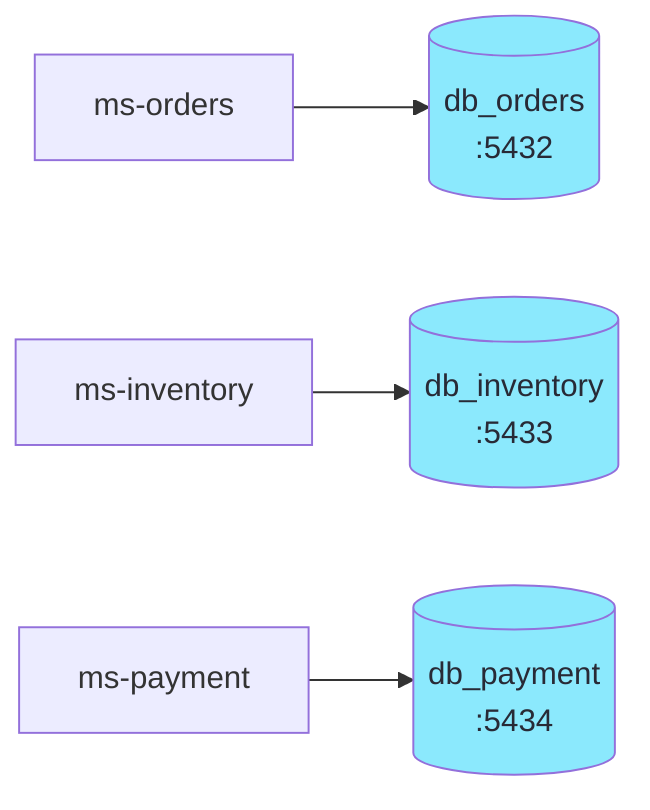
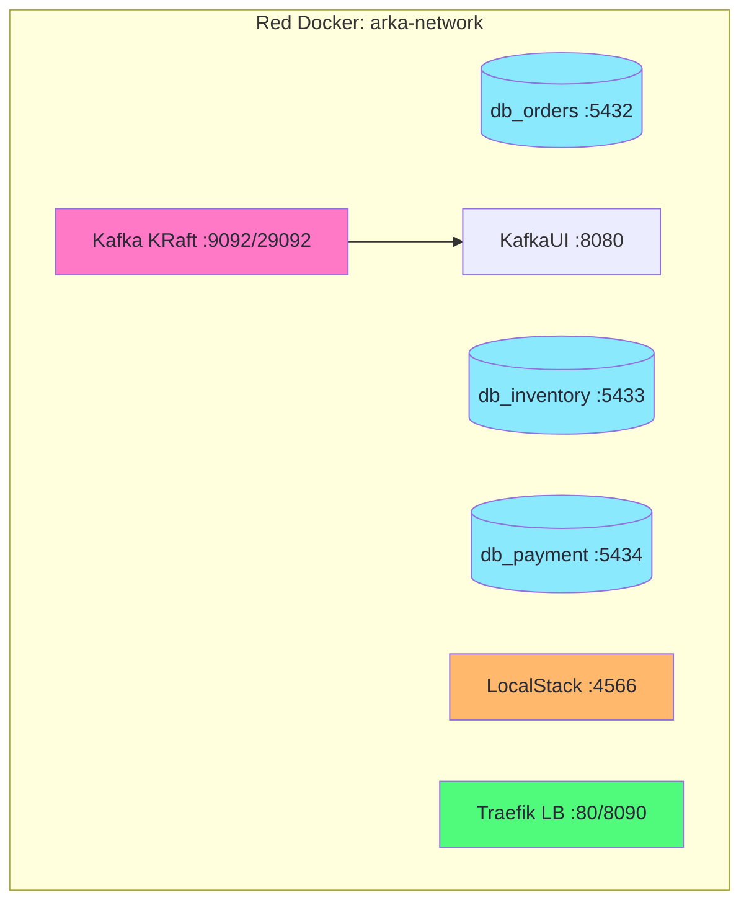

import Tabs from '@theme/Tabs';
import TabItem from '@theme/TabItem';

# Módulo 1: Setup — Docker Compose Avanzado

:::tip Tiempo estimado
~1 hora
:::

En este módulo levantaremos **toda la infraestructura local** que soporta los 3 microservicios. El objetivo es tener un entorno funcional antes de escribir una sola línea de Java.

:::note ¿Por qué empezar por la infraestructura?
En un ecosistema distribuido real, la infraestructura (bases de datos, brokers, gateways) vive **independientemente** de los servicios. Definirla primero como código (IaC) es la práctica profesional estándar.
:::

## 1.1 Crear la estructura del proyecto

```bash
mkdir -p arka-lab/localstack arka-lab/postgresql-scripts
cd arka-lab
```

## 1.2 El patrón: Database per Service

Cada microservicio tiene **su propia base de datos**, aislada del resto:



Esto es el patrón **Database per Service**: **ningún servicio puede leer directamente la BD de otro**. La coordinación entre servicios ocurre solo a través de eventos Kafka.

## 1.3 Variables de entorno

Antes de crear el compose, definimos las variables de entorno en un archivo `.env` en la raíz del proyecto:

:::note Archivo a crear
`arka-lab/.env`
:::

```bash title=".env"
POSTGRES_USER=arka
POSTGRES_PASSWORD=arkaSecret2025
POSTGRES_ORDERS_PORT=5432
POSTGRES_ORDERS_DB=db_orders
POSTGRES_INVENTORY_PORT=5433
POSTGRES_INVENTORY_DB=db_inventory
POSTGRES_PAYMENT_PORT=5434
POSTGRES_PAYMENT_DB=db_payment
KAFKA_PORT=9092
KAFKA_BOOTSTRAP_SERVERS=kafka:29092
LOCALSTACK_PORT=4566
LOCALSTACK_HOST=arka-localstack
MS_ORDERS_PORT=8081
MS_ORDERS_HOST=arka-ms-orders
```

:::tip ¿Por qué usar `.env`?
Centralizar la configuración en un `.env` permite cambiar puertos, credenciales y nombres de BD **sin tocar el compose**. Docker Compose lee automáticamente este archivo si existe en el mismo directorio.
:::

## 1.4 Scripts de inicialización SQL

Cada base de datos necesita sus tablas creadas al arrancar. Docker ejecuta automáticamente los archivos `.sql` montados en `/docker-entrypoint-initdb.d/` la primera vez que el contenedor se inicia.

:::note Archivos a crear
`arka-lab/postgresql-scripts/init_orders.sql`
`arka-lab/postgresql-scripts/init_inventory.sql`
`arka-lab/postgresql-scripts/init_payment.sql`
:::

```sql title="postgresql-scripts/init_orders.sql"
-- ═══════════════════════════════════════════════════
-- Arka · db_orders · Initialization Script
-- Microservice: ms-orders (Orquestador / Iniciador SAGA)
-- ═══════════════════════════════════════════════════

CREATE TABLE IF NOT EXISTS orders (
    id            VARCHAR(36)    PRIMARY KEY DEFAULT gen_random_uuid()::text,
    customer_id   VARCHAR(100)   NOT NULL,
    sku           VARCHAR(50)    NOT NULL,
    quantity      INTEGER        NOT NULL CHECK (quantity > 0),
    total_amount  NUMERIC(15,2)  NOT NULL CHECK (total_amount >= 0),
    status        VARCHAR(30)    NOT NULL DEFAULT 'PENDING',
    created_at    TIMESTAMP      NOT NULL DEFAULT now()
);

-- Index for frequent queries by customer and status
CREATE INDEX IF NOT EXISTS idx_orders_customer_id ON orders (customer_id);
CREATE INDEX IF NOT EXISTS idx_orders_status      ON orders (status);
CREATE INDEX IF NOT EXISTS idx_orders_sku         ON orders (sku);
```

```sql title="postgresql-scripts/init_inventory.sql"
-- ═══════════════════════════════════════════════════
-- Arka · db_inventory · Initialization Script
-- Microservice: ms-inventory (Participante SAGA)
-- ═══════════════════════════════════════════════════

CREATE TABLE IF NOT EXISTS products (
    id        VARCHAR(36)    PRIMARY KEY DEFAULT gen_random_uuid()::text,
    sku       VARCHAR(50)    NOT NULL UNIQUE,
    name      VARCHAR(200)   NOT NULL,
    price     NUMERIC(15,2)  NOT NULL CHECK (price >= 0),
    stock     INTEGER        NOT NULL DEFAULT 0 CHECK (stock >= 0),
    category  VARCHAR(100)
);

-- Index for lookups by category
CREATE INDEX IF NOT EXISTS idx_products_category ON products (category);

-- ═══════════════════════════════════════════════════
-- Seed data: sample products for testing
-- ═══════════════════════════════════════════════════
INSERT INTO products (id, sku, name, price, stock, category) VALUES
    (gen_random_uuid()::text, 'KB-MECH-001', 'Teclado Mecánico RGB',        189000.00, 50, 'Periféricos'),
    (gen_random_uuid()::text, 'MS-WIRE-002', 'Mouse Inalámbrico Pro',        95000.00, 120, 'Periféricos'),
    (gen_random_uuid()::text, 'MN-UW-003',  'Monitor Ultrawide 34"',       1450000.00, 15, 'Monitores'),
    (gen_random_uuid()::text, 'GPU-RTX-004', 'GPU RTX 4070 Ti',            3200000.00, 8,  'Hardware'),
    (gen_random_uuid()::text, 'RAM-DDR5-005','Memoria RAM DDR5 32GB',       420000.00, 60, 'Hardware')
ON CONFLICT (sku) DO NOTHING;
```

```sql title="postgresql-scripts/init_payment.sql"
-- ═══════════════════════════════════════════════════
-- Arka · db_payment · Initialization Script
-- Microservice: ms-payment (Simulador de Pagos)
-- ═══════════════════════════════════════════════════

CREATE TABLE IF NOT EXISTS payments (
    id              VARCHAR(36)    PRIMARY KEY DEFAULT gen_random_uuid()::text,
    order_id        VARCHAR(36)    NOT NULL,
    amount          NUMERIC(15,2)  NOT NULL CHECK (amount >= 0),
    status          VARCHAR(30)    NOT NULL DEFAULT 'PENDING',
    payment_method  VARCHAR(50),
    processed_at    TIMESTAMP      NOT NULL DEFAULT now()
);

-- Index for lookups by order
CREATE INDEX IF NOT EXISTS idx_payments_order_id ON payments (order_id);
CREATE INDEX IF NOT EXISTS idx_payments_status   ON payments (status);
```

:::tip ¿Por qué `ON CONFLICT DO NOTHING`?
En `init_inventory.sql` insertamos datos de prueba (productos de ejemplo). La cláusula `ON CONFLICT (sku) DO NOTHING` evita errores si Docker reinicia el contenedor y el script se ejecuta de nuevo cuando los datos ya existen.
:::

## 1.5 Docker Compose — Infraestructura completa

:::note Archivo a crear
`arka-lab/compose.yaml`
:::

```yaml title="compose.yaml"
services:
  # ═══════════════════════════════════════════════════
  # PostgreSQL — Database per Service (3 instancias)
  # ═══════════════════════════════════════════════════
  postgres-orders:
    image: postgres:16-alpine
    container_name: arka-db-orders
    environment:
      POSTGRES_USER: ${POSTGRES_USER}
      POSTGRES_PASSWORD: ${POSTGRES_PASSWORD}
      POSTGRES_DB: ${POSTGRES_ORDERS_DB}
    ports:
      - "${POSTGRES_ORDERS_PORT}:5432"
    volumes:
      - postgres-orders-data:/var/lib/postgresql/data
      - ./postgresql-scripts/init_orders.sql:/docker-entrypoint-initdb.d/init.sql
    healthcheck:
      test: ["CMD-SHELL", "pg_isready -U arka -d db_orders"]
      interval: 10s
      timeout: 5s
      retries: 5
    networks:
      - arka-network

  postgres-inventory:
    image: postgres:16-alpine
    container_name: arka-db-inventory
    environment:
      POSTGRES_USER: ${POSTGRES_USER}
      POSTGRES_PASSWORD: ${POSTGRES_PASSWORD}
      POSTGRES_DB: ${POSTGRES_INVENTORY_DB}
    ports:
      - "${POSTGRES_INVENTORY_PORT}:5432"
    volumes:
      - postgres-inventory-data:/var/lib/postgresql/data
      - ./postgresql-scripts/init_inventory.sql:/docker-entrypoint-initdb.d/init.sql
    healthcheck:
      test: ["CMD-SHELL", "pg_isready -U arka -d db_inventory"]
      interval: 10s
      timeout: 5s
      retries: 5
    networks:
      - arka-network

  postgres-payment:
    image: postgres:16-alpine
    container_name: arka-db-payment
    environment:
      POSTGRES_USER: ${POSTGRES_USER}
      POSTGRES_PASSWORD: ${POSTGRES_PASSWORD}
      POSTGRES_DB: ${POSTGRES_PAYMENT_DB}
    ports:
      - "${POSTGRES_PAYMENT_PORT}:5432"
    volumes:
      - postgres-payment-data:/var/lib/postgresql/data
      - ./postgresql-scripts/init_payment.sql:/docker-entrypoint-initdb.d/init.sql
    healthcheck:
      test: ["CMD-SHELL", "pg_isready -U arka -d db_payment"]
      interval: 10s
      timeout: 5s
      retries: 5
    networks:
      - arka-network

  # ═══════════════════════════════════════════════════
  # Kafka — Message Broker (KRaft Mode)
  # ═══════════════════════════════════════════════════
  kafka:
    image: confluentinc/cp-kafka:8.0.4
    container_name: arka-kafka
    ports:
      - "${KAFKA_PORT}:${KAFKA_PORT}"
      - "29092:29092"
    environment:
      KAFKA_NODE_ID: 1
      KAFKA_PROCESS_ROLES: broker,controller
      KAFKA_LISTENERS: PLAINTEXT://0.0.0.0:29092,CONTROLLER://0.0.0.0:29093,PLAINTEXT_HOST://0.0.0.0:${KAFKA_PORT}
      KAFKA_ADVERTISED_LISTENERS: PLAINTEXT://kafka:29092,PLAINTEXT_HOST://localhost:${KAFKA_PORT}
      KAFKA_CONTROLLER_LISTENER_NAMES: CONTROLLER
      KAFKA_LISTENER_SECURITY_PROTOCOL_MAP: CONTROLLER:PLAINTEXT,PLAINTEXT:PLAINTEXT,PLAINTEXT_HOST:PLAINTEXT
      KAFKA_CONTROLLER_QUORUM_VOTERS: 1@kafka:29093
      KAFKA_INTER_BROKER_LISTENER_NAME: PLAINTEXT
      KAFKA_OFFSETS_TOPIC_REPLICATION_FACTOR: 1
      KAFKA_AUTO_CREATE_TOPICS_ENABLE: "true"
      CLUSTER_ID: mkU3OEVBNTcwNTJENDM2Qk
    healthcheck:
      test: ["CMD", "kafka-topics", "--bootstrap-server", "localhost:29092", "--list"]
      interval: 10s
      timeout: 5s
      retries: 10
      start_period: 60s
    networks:
      - arka-network

  # ═══════════════════════════════════════════════════
  # KafkaUI — Visualización de mensajes en Kafka
  # ═══════════════════════════════════════════════════
  kafka-ui:
    image: provectuslabs/kafka-ui:latest
    container_name: arka-kafka-ui
    depends_on:
      - kafka
    ports:
      - "8080:8080"
    environment:
      KAFKA_CLUSTERS_0_NAME: arka-local
      KAFKA_CLUSTERS_0_BOOTSTRAPSERVERS: kafka:29092
    networks:
      - arka-network

  # ═══════════════════════════════════════════════════
  # LocalStack — AWS Simulado (Secrets Manager + API Gateway)
  # ═══════════════════════════════════════════════════
  localstack:
    image: localstack/localstack:latest
    container_name: arka-localstack
    ports:
      - "${LOCALSTACK_PORT}:${LOCALSTACK_PORT}"
    environment:
      - DEBUG=0
      - SERVICES=secretsmanager,apigateway,cloudformation
    env_file:
      - .env
    volumes:
      - localstack-data:/var/lib/localstack
      # - ./localstack/infra.yaml:/etc/localstack/init/ready.d/infra.yaml
      # - ./localstack/bootstrap.sh:/etc/localstack/init/ready.d/bootstrap.sh
      - "/var/run/docker.sock:/var/run/docker.sock"
    healthcheck:
      test: ["CMD", "curl", "-f", "http://localhost:${LOCALSTACK_PORT}/_localstack/health"]
      interval: 10s
      timeout: 5s
      retries: 10
    networks:
      - arka-network

  # ═══════════════════════════════════════════════════
  # Traefik — Load Balancer Dinámico
  # ═══════════════════════════════════════════════════
  traefik:
    image: traefik:v3.6.9
    container_name: arka-traefik
    command:
      - "--api.insecure=true"
      - "--providers.docker=true"
      - "--providers.docker.exposedbydefault=false"
      - "--entrypoints.web.address=:80"
    ports:
      - "80:80"      # Tráfico Web
      - "8090:8080"  # Dashboard
    volumes:
      - "/var/run/docker.sock:/var/run/docker.sock:ro"
    networks:
      - arka-network

networks:
  arka-network:
    driver: bridge

volumes:
  postgres-orders-data:
  postgres-inventory-data:
  postgres-payment-data:
  localstack-data:
```

:::info Kafka en modo KRaft — Adiós Zookeeper 👋
A partir de **Kafka 3.3+**, el modo **KRaft** (Kafka Raft) reemplaza por completo a Zookeeper como coordinador del clúster. Esto significa:
- **Menos contenedores**: No necesitamos un servicio separado de Zookeeper.
- **Menor latencia**: El consenso es interno al broker.
- **Kafka 4.0** ha eliminado oficialmente el soporte para Zookeeper.

Las propiedades clave de KRaft son:
- `KAFKA_PROCESS_ROLES: broker,controller` — El nodo actúa como broker **y** controlador.
- `KAFKA_CONTROLLER_QUORUM_VOTERS` — Define los votantes del quórum (en nuestro caso, un solo nodo).
- `CLUSTER_ID` — Identificador único del clúster, requerido en modo KRaft.
:::

:::tip Traefik — Load Balancer
[**Traefik**](https://doc.traefik.io/traefik/) es un reverse proxy y load balancer moderno diseñado para entornos de contenedores. Detecta automáticamente los servicios Docker y distribuye el tráfico sin necesidad de archivos de configuración manuales. Lo configuraremos en detalle en el **Módulo 7 (Escalado)** cuando escalemos `ms-inventory` a múltiples réplicas.
:::

## 1.6 Levantar la infraestructura

<Tabs>
  <TabItem value="mac" label="macOS/Linux" default>
  ```bash
  cd arka-lab
  docker compose up -d
  ```
  </TabItem>
  <TabItem value="windows" label="Windows (WSL2)">
  ```bash
  # Dentro de WSL2:
  cd arka-lab
  docker compose up -d
  ```
  </TabItem>
</Tabs>

## 1.7 Verificar el estado

```bash
docker compose ps
```

Deberías ver todos los servicios en estado `Up` o `healthy`:

```
NAME                  STATUS
arka-db-orders        Up (healthy)
arka-db-inventory     Up (healthy)
arka-db-payment       Up (healthy)
arka-kafka            Up
arka-kafka-ui         Up
arka-localstack       Up (healthy)
arka-traefik          Up
```

:::info Checkpoint — Verificar cada servicio

```bash
# PostgreSQL Orders
docker exec arka-db-orders pg_isready -U arka -d db_orders

# PostgreSQL Inventory
docker exec arka-db-inventory pg_isready -U arka -d db_inventory

# Kafka — listar topics (vacío por ahora)
docker exec arka-kafka kafka-topics --bootstrap-server localhost:29092 --list

# LocalStack
curl http://localhost:4566/_localstack/health | python3 -m json.tool

# KafkaUI (UI visual)
# → Abre http://localhost:8080 en tu navegador

# Traefik Dashboard
# → Abre http://localhost:8090 en tu navegador
```
:::

:::warning Puertos de Kafka — Regla de Oro

| Listener | Dirección | Usado por |
|----------|-----------|-----------|
| `kafka:29092` | Interna (Docker) | Microservicios que corren **dentro** de Docker |
| `localhost:9092` | Externa (Host) | Microservicios que corren en **tu máquina local** |

Si tu app Java corre fuera de Docker (ej. desde IntelliJ), usa `localhost:9092`. Si corre dentro de Docker, usa `kafka:29092`.
:::

## ¿Qué acabamos de construir?



Los microservicios Java **aún no existen** — pero toda la infraestructura que necesitan ya está corriendo y lista.

---

**Siguiente:** [Módulo 2: Kafka — Prueba de Concepto](./kafka-prueba-concepto)
