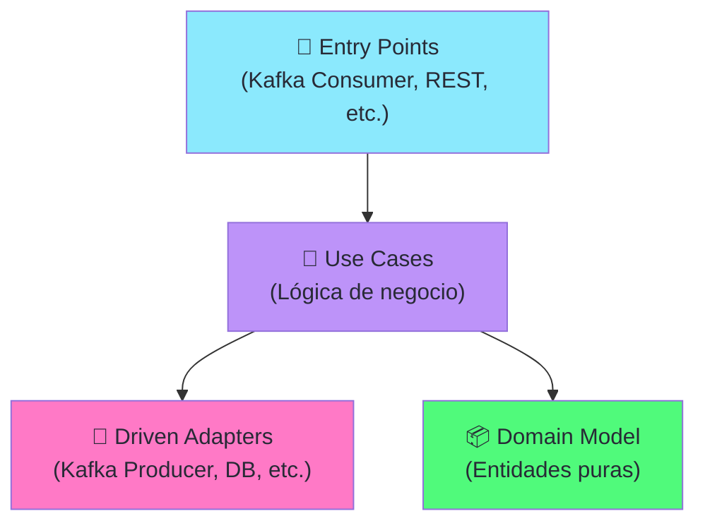
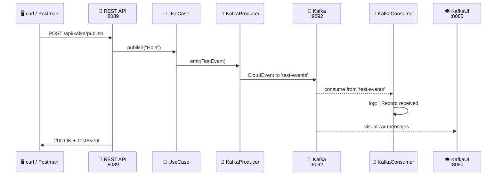

import Tabs from '@theme/Tabs';
import TabItem from '@theme/TabItem';

# Módulo 2: Kafka — Prueba de Concepto con Scaffold Bancolombia

:::tip Tiempo estimado
~1 hora
:::

En este módulo crearemos un **productor y consumidor Kafka dummy** usando el [Scaffold Clean Architecture de Bancolombia](https://bancolombia.github.io/scaffold-clean-architecture/). El objetivo es **validar que la infraestructura Kafka del Módulo 1 funciona** antes de construir los microservicios reales.

:::note ¿Por qué esta prueba de concepto?
En un proyecto real, **nunca** deberías avanzar con el desarrollo sin validar que la infraestructura funciona. Este módulo te da un "quick win": en minutos estarás produciendo y consumiendo mensajes en Kafka. Eso genera confianza para el resto del lab.
:::

## 2.1 ¿Qué es el Scaffold de Bancolombia?

El [Scaffold Clean Architecture](https://github.com/bancolombia/scaffold-clean-architecture) es un **plugin de Gradle** open source creado por el equipo de ingeniería de Bancolombia. Genera proyectos Spring Boot con estructura de **Arquitectura Limpia** (Clean Architecture), separando automáticamente las capas:



En este módulo usaremos:
- **Entry Point** tipo `kafkastrimzi` → Consumidor reactivo de Kafka
- **Driven Adapter** tipo `asynceventbus` con `--eda true --tech kafka` → Productor reactivo de Kafka
- **Entry Point** tipo `webflux` → Endpoint REST para disparar mensajes

## 2.2 Prerequisitos

Antes de continuar, asegúrate de que:

1. ✅ La infraestructura del **Módulo 1** está corriendo (`docker compose ps`)
2. ✅ Tienes **Java 17+** instalado
3. ✅ Tienes **Gradle 9.2+** instalado (o usaremos el wrapper)

```bash
# Verificar Java
java --version

# Verificar Gradle
gradle --version

# Verificar que Kafka está corriendo
docker exec arka-kafka kafka-topics --bootstrap-server localhost:29092 --list
```

## 2.3 Crear el proyecto con el Scaffold

Desde la raíz de `arka-lab`, vamos a crear un proyecto de prueba:

```bash
# Dentro de arka-lab/
mkdir kafka-poc
cd kafka-poc
```

### Paso 1: Configurar el plugin

Crea el archivo `build.gradle` con el plugin de Bancolombia:

```groovy title="kafka-poc/build.gradle"
plugins {
    id 'co.com.bancolombia.cleanArchitecture' version '4.1.0'
}
```

### Paso 2: Generar el wrapper de Gradle

```bash
gradle wrapper
```

### Paso 3: Generar la estructura del proyecto

```bash
./gradlew ca \
  --package=co.com.arka.kafkapoc \
  --type=reactive \
  --name=KafkaPoc \
  --lombok=true \
  --java-version=17
```

:::info ¿Qué acaba de pasar?
El comando `ca` (cleanArchitecture) generó toda la estructura de Clean Architecture:
- `applications/app-service/` → Aplicación Spring Boot
- `domain/model/` → Entidades de dominio
- `domain/usecase/` → Casos de uso
- `infrastructure/` → Adaptadores (vacío por ahora)
:::

### Paso 4: Generar el Entry Point WebFlux (REST API)

Necesitamos un endpoint REST para **disparar mensajes** al productor de Kafka:

```bash
./gradlew gep --type webflux
```

### Paso 5: Generar el Driven Adapter (Productor Kafka)

```bash
./gradlew gda --type asynceventbus --eda true --tech kafka
```

Esto genera el módulo productor asíncrono usando Reactive Commons para la comunicación con Kafka.

### Paso 6: Generar el Entry Point (Consumidor Kafka)

```bash
./gradlew gep --type kafkastrimzi --topic-consumer test-events
```

Esto genera un consumidor Kafka reactivo usando las primitivas de `reactor-kafka`.

## 2.4 Estructura generada

Después de ejecutar todos los comandos, la estructura debería verse así:

```
📦 kafka-poc/
┣ 📂 applications/
┃ ┗ 📂 app-service/          ← Spring Boot main
┣ 📂 domain/
┃ ┣ 📂 model/                ← Entidades de dominio
┃ ┗ 📂 usecase/              ← Casos de uso
┣ 📂 infrastructure/
┃ ┣ 📂 driven-adapters/
┃ ┃ ┗ 📂 async-event-bus/    ← Productor Kafka
┃ ┗ 📂 entry-points/
┃   ┣ 📂 reactive-web/       ← REST API (WebFlux)
┃   ┗ 📂 kafka-consumer/← Consumidor Kafka
┣ 📜 build.gradle
┗ 📜 settings.gradle
```

## 2.5 Configurar el Productor (Driven Adapter)

### 2.5.1 Crear el modelo de evento

Crea la clase que representa el mensaje que enviaremos por Kafka:

```java title="domain/model/src/main/java/co/com/arka/kafkapoc/model/events/TestEvent.java"
package co.com.arka.kafkapoc.model.events;

import lombok.AllArgsConstructor;
import lombok.Builder;
import lombok.Data;
import lombok.NoArgsConstructor;

@Data
@Builder
@NoArgsConstructor
@AllArgsConstructor
public class TestEvent {
    private String id;
    private String message;
    private long timestamp;
}
```

### 2.5.2 Crear el gateway (interfaz de dominio)

El gateway define **qué** hace el dominio, sin saber **cómo** (Kafka, RabbitMQ, etc.):

```java title="domain/model/src/main/java/co/com/arka/kafkapoc/model/events/gateways/EventsGateway.java"
package co.com.arka.kafkapoc.model.events.gateways;

import co.com.arka.kafkapoc.model.events.TestEvent;
import reactor.core.publisher.Mono;

public interface EventsGateway {
    Mono<Void> emit(TestEvent event);
}
```

### 2.5.3 Implementar el adaptador Kafka

En el driven adapter, implementa el gateway usando AsyncEventBus (Reactive Commons) que publica mensajes como CloudEvents en Kafka:

```java title="infrastructure/driven-adapters/async-event-bus/src/main/java/co/com/arka/kafkapoc/events/ReactiveEventsGateway.java"
package co.com.arka.kafkapoc.events;

import co.com.arka.kafkapoc.model.events.TestEvent;
import co.com.arka.kafkapoc.model.events.gateways.EventsGateway;
import lombok.RequiredArgsConstructor;
import lombok.extern.java.Log;
import org.reactivecommons.api.domain.DomainEventBus;
import org.reactivecommons.async.impl.config.annotations.EnableDomainEventBus;
import org.springframework.beans.factory.annotation.Value;
import org.springframework.context.annotation.Configuration;
import reactor.core.publisher.Mono;
import io.cloudevents.CloudEvent;
import io.cloudevents.core.builder.CloudEventBuilder;
import io.cloudevents.jackson.JsonCloudEventData;
import tools.jackson.databind.ObjectMapper;

import java.util.UUID;
import java.net.URI;
import java.time.OffsetDateTime;
import java.util.logging.Level;

import static reactor.core.publisher.Mono.from;

@Configuration
@Log
@RequiredArgsConstructor
@EnableDomainEventBus
public class ReactiveEventsGateway implements EventsGateway {
    @Value("${adapters.kafka.producer.topic}")
    public String topicName;
    private final DomainEventBus domainEventBus;
    private final ObjectMapper om;

    @Override
    public Mono<Void> emit(TestEvent event) {
        log.log(Level.INFO, "Sending domain event: {0}: {1}", new String[]{topicName, event.toString()});
        CloudEvent eventCloudEvent = CloudEventBuilder.v1()
                .withId(UUID.randomUUID().toString())
                .withSource(URI.create("https://reactive-commons.org/foos"))
                .withType(topicName)
                .withTime(OffsetDateTime.now())
                .withData("application/json", JsonCloudEventData.wrap(om.valueToTree(event)))
                .build();

         return from(domainEventBus.emit(eventCloudEvent));
    }
}
```

## 2.6 Crear el Caso de Uso

El caso de uso orquesta la lógica de negocio. En este caso simplemente publica el evento:

```java title="domain/usecase/src/main/java/co/com/arka/kafkapoc/usecase/publishevent/PublishEventUseCase.java"
package co.com.arka.kafkapoc.usecase.publishevent;

import co.com.arka.kafkapoc.model.events.TestEvent;
import co.com.arka.kafkapoc.model.events.gateways.EventsGateway;
import lombok.RequiredArgsConstructor;
import reactor.core.publisher.Mono;

import java.util.UUID;

@RequiredArgsConstructor
public class PublishEventUseCase {
    private final EventsGateway eventsGateway;

    public Mono<TestEvent> publish(String message) {
        TestEvent event = TestEvent.builder()
                .id(UUID.randomUUID().toString())
                .message(message)
                .timestamp(System.currentTimeMillis())
                .build();
        return eventsGateway.emit(event)
                .thenReturn(event);
    }
}
```

## 2.7 Configurar el Entry Point REST (Productor)

Crea un endpoint REST que reciba un mensaje y lo envíe a Kafka:

```java title="infrastructure/entry-points/reactive-web/src/main/java/co/com/arka/kafkapoc/api/KafkaTestHandler.java"
package co.com.arka.kafkapoc.api;

import co.com.arka.kafkapoc.usecase.publishevent.PublishEventUseCase;
import lombok.RequiredArgsConstructor;
import org.springframework.http.MediaType;
import org.springframework.stereotype.Component;
import org.springframework.web.reactive.function.server.ServerRequest;
import org.springframework.web.reactive.function.server.ServerResponse;
import reactor.core.publisher.Mono;

@Component
@RequiredArgsConstructor
public class KafkaTestHandler {
    private final PublishEventUseCase publishEventUseCase;

    public Mono<ServerResponse> publishMessage(ServerRequest serverRequest) {
        return serverRequest.bodyToMono(PublishRequest.class)
                .flatMap(req -> publishEventUseCase.publish(req.message()))
                .flatMap(event -> ServerResponse.ok()
                        .contentType(MediaType.APPLICATION_JSON)
                        .bodyValue(event)
                );
    }

    public record PublishRequest(String message) { }
}
```

Registra la ruta en el Router:

```java title="infrastructure/entry-points/reactive-web/src/main/java/co/com/arka/kafkapoc/api/RouterRest.java"
package co.com.arka.kafkapoc.api;

import org.springframework.context.annotation.Bean;
import org.springframework.context.annotation.Configuration;
import org.springframework.web.reactive.function.server.RouterFunction;
import org.springframework.web.reactive.function.server.ServerResponse;

import static org.springframework.web.reactive.function.server.RequestPredicates.GET;
import static org.springframework.web.reactive.function.server.RequestPredicates.POST;
import static org.springframework.web.reactive.function.server.RouterFunctions.route;

@Configuration
public class RouterRest {
    @Bean
    public RouterFunction<ServerResponse> routerFunction(KafkaTestHandler handler) {
        return route(POST("/api/kafka/publish"), handler::publishMessage);
    }
}
```

## 2.8 Configurar el Consumidor Kafka

El consumidor requiere dos clases: la configuración de conexión y el consumidor que procesará los mensajes reactivamente usando `@EventListener(ApplicationStartedEvent.class)`.

### 2.8.1 Configurar el Receiver

```java title="infrastructure/entry-points/kafka-consumer/src/main/java/co/com/arka/kafkapoc/kafka/consumer/config/KafkaConfig.java"
package co.com.arka.kafkapoc.kafka.consumer.config;

import org.apache.kafka.clients.CommonClientConfigs;
import org.apache.kafka.clients.consumer.ConsumerConfig;
import org.apache.kafka.common.serialization.StringDeserializer;
import org.springframework.beans.factory.annotation.Value;
import org.springframework.context.annotation.Bean;
import org.springframework.context.annotation.Configuration;

import lombok.RequiredArgsConstructor;
import lombok.extern.log4j.Log4j2;
import reactor.kafka.receiver.KafkaReceiver;
import reactor.kafka.receiver.ReceiverOptions;

import java.util.Collections;
import java.util.HashMap;
import java.util.Map;

@Configuration
@RequiredArgsConstructor
@Log4j2
public class KafkaConfig {
    @Value("${spring.kafka.bootstrap-servers}")
    private String bootstrapServers;

    @Value("${spring.kafka.consumer.group-id}")
    private String groupId;

    @Bean
    ReceiverOptions<String, String> kafkaReceiverOptions(
            @Value(value = "${adapters.kafka.consumer.topic}") String topic) {

        ReceiverOptions<String, String> basicReceiverOptions =
                ReceiverOptions.create(buildJaasConfig());

        return basicReceiverOptions.subscription(Collections.singletonList(topic));
    }

    @Bean
    KafkaReceiver<String, String> reactiveKafkaConsumer(
            ReceiverOptions<String, String> kafkaReceiverOptions) {
        return KafkaReceiver.create(kafkaReceiverOptions);
    }

    public Map<String, Object> buildJaasConfig() {
        Map<String, Object> props = new HashMap<>();
        props.put(CommonClientConfigs.SECURITY_PROTOCOL_CONFIG, "PLAINTEXT");
        props.put(CommonClientConfigs.BOOTSTRAP_SERVERS_CONFIG, bootstrapServers);
        props.put(ConsumerConfig.GROUP_ID_CONFIG, groupId);
        props.put(ConsumerConfig.KEY_DESERIALIZER_CLASS_CONFIG, StringDeserializer.class);
        props.put(ConsumerConfig.VALUE_DESERIALIZER_CLASS_CONFIG, StringDeserializer.class);
        return props;
    }
}
```

### 2.8.2 Crear el consumidor

```java title="infrastructure/entry-points/kafka-consumer/src/main/java/co/com/arka/kafkapoc/kafka/consumer/KafkaConsumer.java"
package co.com.arka.kafkapoc.kafka.consumer;

import lombok.RequiredArgsConstructor;
import lombok.extern.log4j.Log4j2;

import org.springframework.boot.context.event.ApplicationStartedEvent;
import org.springframework.context.event.EventListener;
import org.springframework.stereotype.Component;
import reactor.core.publisher.Flux;
import reactor.core.publisher.Mono;
import reactor.core.scheduler.Schedulers;
import reactor.kafka.receiver.KafkaReceiver;

@Component
@Log4j2
@RequiredArgsConstructor
public class KafkaConsumer {
    private final KafkaReceiver<String, String> kafkaReceiver;

    @EventListener(ApplicationStartedEvent.class)
    public Flux<Object> listenMessages() {
        return kafkaReceiver
                .receive()
                .publishOn(Schedulers.newBoundedElastic(
                        Schedulers.DEFAULT_BOUNDED_ELASTIC_SIZE,
                        Schedulers.DEFAULT_BOUNDED_ELASTIC_QUEUESIZE,
                        "kafka"))
                .flatMap(receiverRecord -> {
                    log.info("Record received {}", receiverRecord.value());
                    receiverRecord.receiverOffset().acknowledge();
                    return Mono.empty();
                })
                .doOnError(error -> log.error("Error processing kafka record", error))
                .retry()
                .repeat();
    }
}
```

## 2.9 Configurar `application.yaml`

Actualiza el `application.yaml` del módulo `app-service` para apuntar a Kafka local:

```yaml title="applications/app-service/src/main/resources/application.yaml"
server:
  port: 8089
spring:
  application:
    name: "KafkaPoc"
  devtools:
    add-properties: false
  profiles:
    include: null
  kafka:
    bootstrap-servers: "localhost:9092"
    consumer:
      group-id: "KafkaPoc"
management:
  endpoints:
    web:
      exposure:
        include: "health,prometheus"
  endpoint:
    health:
      probes:
        enabled: true
cors:
  allowed-origins: "http://localhost:4200,http://localhost:8080"
adapters:
  kafka:
    consumer:
      topic: "test-events"
    producer:
      topic: "test-events"
reactive:
  commons:
    kafka:
      app:
        connectionProperties:
          bootstrap-servers: "localhost:9092"
```

:::warning Importante — `localhost:9092`
Estamos ejecutando la aplicación **en local** (fuera de Docker), por lo que usamos `localhost:9092`. Si la ejecutaras dentro de Docker, usarías `kafka:29092`.
:::

## 2.10 Ejecutar y Probar

### Paso 1: Compilar el proyecto

```bash
cd kafka-poc
./gradlew build
```

### Paso 2: Ejecutar la aplicación

:::note Ignorar tests que fallen
Los comandos de scaffolding generan algunos archivos de test automáticos que podrían fallar inicialmente por los cambios hechos en las clases al configurar la prueba de concepto. Si el comando `./gradlew build` falla por los tests y te impide compilar, **simplemente elimínalos o ignóralos** ejecutando `./gradlew build -x test`.
:::

```bash
./gradlew bootRun
```

Deberías ver en los logs:

```
  .   ____          _
 /\\ / ___'_ __ _ _(_)_ __  __ _
( ( )\___ | '_ | '_| | '_ \/ _` |
 \\/  ___)| |_)| | | | | || (_| |
  '  |____| .__|_| |_|_| |_\__, |
 |_|                 |___/

Started MainApplication in 3.2 seconds
Kafka consumer subscribed to topic: test-events
```

### Paso 3: Enviar un mensaje de prueba

Abre otra terminal y usa `curl` para enviar un mensaje:

```bash
curl -X POST http://localhost:8089/api/kafka/publish \
  -H "Content-Type: application/json" \
  -d '{"message": "Hola desde Arka Lab!"}'
```

**Respuesta esperada:**

```json
{
  "id": "a1b2c3d4-e5f6-7890-abcd-ef1234567890",
  "message": "Hola desde Arka Lab!",
  "timestamp": 1740764000000
}
```

### Paso 4: Verificar en los logs

En la terminal donde corre la app, deberías ver **ambos logs**:

```
ℹ️ Sending domain event: test-events: TestEvent(id=a1b2..., message=Hola desde Arka Lab!, timestamp=1740764000000)
ℹ️ Record received {"specversion":"1.0","id":"a1b2...","source":"https://reactive-commons.org/foos","type":"test-events","datacontenttype":"application/json","time":"2025-02-28T19:50:00Z","data":{"id":"a1b2...","message":"Hola desde Arka Lab!","timestamp":1740764000000}}
```

### Paso 5: Enviar múltiples mensajes

```bash
# Enviar 5 mensajes de prueba
for i in {1..5}; do
  curl -s -X POST http://localhost:8089/api/kafka/publish \
    -H "Content-Type: application/json" \
    -d "{\"message\": \"Mensaje de prueba #$i\"}"
  echo ""
done
```

## 2.11 Verificar en KafkaUI

Abre [http://localhost:8080](http://localhost:8080) en tu navegador y navega a:

1. **Topics** → `test-events`
2. Haz clic en el tópico → pestaña **Messages**
3. Deberías ver todos los mensajes que enviaste 🎉



## 2.12 Verificar desde la CLI de Kafka

También puedes verificar directamente con las herramientas de Kafka:

```bash
# Listar los tópicos creados
docker exec arka-kafka kafka-topics \
  --bootstrap-server localhost:29092 --list

# Consumir mensajes del tópico (desde el inicio)
docker exec arka-kafka kafka-console-consumer \
  --bootstrap-server localhost:29092 \
  --topic test-events \
  --from-beginning
```

:::info Checkpoint — ¿Todo funciona?

Verifica que puedas responder **SÍ** a todo:

- [ ] ¿El proyecto compila sin errores? (`./gradlew build`)
- [ ] ¿La app arranca y se suscribe al tópico `test-events`?
- [ ] ¿`curl` devuelve un JSON con `id`, `message` y `timestamp`?
- [ ] ¿Los logs muestran el `✅ enviado` y `📨 recibido`?
- [ ] ¿KafkaUI muestra los mensajes en el tópico `test-events`?
- [ ] ¿`kafka-console-consumer` muestra los mensajes?

Si todas las respuestas son SÍ, **tu infraestructura Kafka está validada** y lista para los microservicios reales. 🚀
:::

## 2.13 Limpieza (Opcional)

Este proyecto de prueba **no se necesita para los siguientes módulos**. Puedes detenerlo con `Ctrl+C` y dejarlo como referencia, o eliminarlo:

```bash
# Detener la app con Ctrl+C
# Opcional: eliminar el proyecto de prueba
cd ..
rm -rf kafka-poc
```

## ¿Qué aprendimos?

| Concepto | Lo que hicimos |
|----------|---------------|
| **Scaffold Bancolombia** | Generamos un proyecto reactivo con Clean Architecture en minutos |
| **Productor Kafka (Reactive Commons)** | Publicamos eventos como CloudEvents al tópico `test-events` vía `DomainEventBus` y `@EnableDomainEventBus` |
| **Consumidor Kafka (Reactor Kafka)** | Escuchamos mensajes con `KafkaReceiver` y `@EventListener(ApplicationStartedEvent.class)` |
| **CloudEvents** | Los mensajes viajan en formato estándar CloudEvent v1.0 (con `specversion`, `source`, `type`, `data`) |
| **KRaft Mode** | Kafka funciona sin Zookeeper — un solo contenedor |
| **KafkaUI** | Visualizamos los mensajes en el broker |
| **Reactive Stack** | Todo es `Mono` y `Flux` — sin blocking |

:::tip ¿Qué sigue?
Ahora que validamos que Kafka funciona, pasamos a definir la **infraestructura AWS** con CloudFormation y LocalStack. En el siguiente módulo crearemos los **secrets de base de datos** y el **API Gateway** que necesitarán los microservicios reales.
:::

---

**Siguiente:** [Módulo 3: IaC con CloudFormation](./iac-cloudformation)
