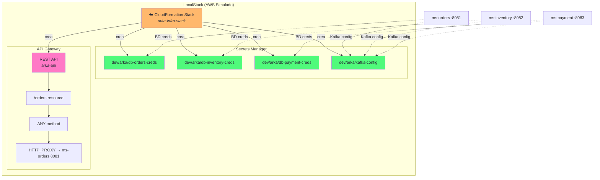
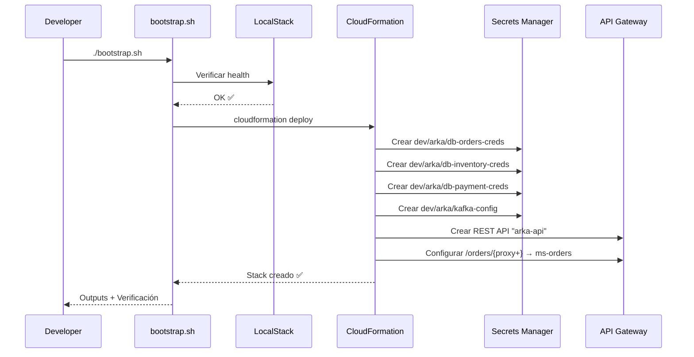

import Tabs from '@theme/Tabs';
import TabItem from '@theme/TabItem';

# Módulo 3: IaC — CloudFormation + LocalStack

:::tip Tiempo estimado
~1 hora
:::

En este módulo aprovisionaremos toda la infraestructura de **AWS Cloud** usando **Infrastructure as Code (IaC)** con CloudFormation, corriendo sobre LocalStack.

:::note ¿Por qué CloudFormation y no awslocal manualmente?
Los comandos manuales de `awslocal` son frágiles: si alguien más levanta el proyecto, tiene que recordar exactamente qué recursos crear y en qué orden. Con CloudFormation, el estado deseado de la infraestructura está **declarado en un archivo YAML versionado en Git**.
:::

## 3.1 Arquitectura de Infraestructura AWS



## 3.2 Template CloudFormation (`infra.yaml`)

:::note Archivo a crear
`arka-lab/localstack/infra.yaml`
:::

```yaml title="localstack/infra.yaml"
AWSTemplateFormatVersion: "2010-09-09"
Description: "Arka Lab - Infraestructura completa (Secrets + API Gateway)"

Parameters:
  pEnvironment:
    Type: String
    Default: dev
    AllowedValues: [dev, staging, prod]
    Description: Entorno de despliegue

  pOrdersServiceHost:
    Type: String
    Default: "http://ms-orders:8081"
    Description: Host interno del Orders Service

  # ── Credenciales de BD (inyectadas desde .env) ──
  pDbUser:
    Type: String
    Default: arka
    Description: Usuario de PostgreSQL

  pDbPassword:
    Type: String
    NoEcho: true
    Default: arkaSecret2025
    Description: Contraseña de PostgreSQL

  pDbOrdersHost:
    Type: String
    Default: arka-db-orders
    Description: Hostname del contenedor PostgreSQL de orders

  pDbOrdersName:
    Type: String
    Default: db_orders
    Description: Nombre de la base de datos de orders

  pDbOrdersPort:
    Type: Number
    Default: 5432
    Description: Puerto interno de PostgreSQL de orders

  pDbInventoryHost:
    Type: String
    Default: arka-db-inventory
    Description: Hostname del contenedor PostgreSQL de inventory

  pDbInventoryName:
    Type: String
    Default: db_inventory
    Description: Nombre de la base de datos de inventory

  pDbInventoryPort:
    Type: Number
    Default: 5432
    Description: Puerto interno de PostgreSQL de inventory

  pDbPaymentHost:
    Type: String
    Default: arka-db-payment
    Description: Hostname del contenedor PostgreSQL de payment

  pDbPaymentName:
    Type: String
    Default: db_payment
    Description: Nombre de la base de datos de payment

  pDbPaymentPort:
    Type: Number
    Default: 5432
    Description: Puerto interno de PostgreSQL de payment

  # ── Kafka (inyectado desde .env) ──
  pKafkaBootstrapServers:
    Type: String
    Default: "kafka:29092"
    Description: Kafka bootstrap servers internos

Resources:
  # ═══════════════════════════════════════════════════
  # Secrets Manager — Credenciales de BD por servicio
  # ═══════════════════════════════════════════════════
  rOrdersDbSecret:
    Type: AWS::SecretsManager::Secret
    Properties:
      Name: !Sub "${pEnvironment}/arka/db-orders-creds"
      Description: "Credenciales de PostgreSQL para ms-orders"
      SecretString: !Sub |
        {
          "host": "${pDbOrdersHost}",
          "port": ${pDbOrdersPort},
          "database": "${pDbOrdersName}",
          "username": "${pDbUser}",
          "password": "${pDbPassword}"
        }
      Tags:
        - Key: Service
          Value: ms-orders
        - Key: Environment
          Value: !Ref pEnvironment

  rInventoryDbSecret:
    Type: AWS::SecretsManager::Secret
    Properties:
      Name: !Sub "${pEnvironment}/arka/db-inventory-creds"
      Description: "Credenciales de PostgreSQL para ms-inventory"
      SecretString: !Sub |
        {
          "host": "${pDbInventoryHost}",
          "port": ${pDbInventoryPort},
          "database": "${pDbInventoryName}",
          "username": "${pDbUser}",
          "password": "${pDbPassword}"
        }
      Tags:
        - Key: Service
          Value: ms-inventory
        - Key: Environment
          Value: !Ref pEnvironment

  rPaymentDbSecret:
    Type: AWS::SecretsManager::Secret
    Properties:
      Name: !Sub "${pEnvironment}/arka/db-payment-creds"
      Description: "Credenciales de PostgreSQL para ms-payment"
      SecretString: !Sub |
        {
          "host": "${pDbPaymentHost}",
          "port": ${pDbPaymentPort},
          "database": "${pDbPaymentName}",
          "username": "${pDbUser}",
          "password": "${pDbPassword}"
        }
      Tags:
        - Key: Service
          Value: ms-payment
        - Key: Environment
          Value: !Ref pEnvironment

  # Secreto compartido: configuración de Kafka (todos los servicios)
  rKafkaSecret:
    Type: AWS::SecretsManager::Secret
    Properties:
      Name: !Sub "${pEnvironment}/arka/kafka-config"
      Description: "Configuración de Kafka compartida entre todos los microservicios"
      SecretString: !Sub |
        {
          "bootstrapServers": "${pKafkaBootstrapServers}",
          "groupId": "arka-saga-group",
          "autoOffsetReset": "earliest",
          "topics": {
            "orderCreated": "order-created",
            "stockReserved": "stock-reserved",
            "stockReleased": "stock-released",
            "paymentProcessed": "payment-processed",
            "paymentFailed": "payment-failed",
            "orderConfirmed": "order-confirmed",
            "orderCancelled": "order-cancelled",
            "stockFailed": "stock-failed"
          }
        }
      Tags:
        - Key: Component
          Value: messaging
        - Key: Environment
          Value: !Ref pEnvironment

  # ═══════════════════════════════════════════════════
  # API Gateway v1 (REST API) — Punto de entrada HTTP
  # ═══════════════════════════════════════════════════
  rArkaRestApi:
    Type: AWS::ApiGateway::RestApi
    Properties:
      Name: arka-api
      Description: "API Gateway REST para el ecosistema Arka"
      EndpointConfiguration:
        Types:
          - REGIONAL

  # Recurso /orders
  rOrdersResource:
    Type: AWS::ApiGateway::Resource
    Properties:
      RestApiId: !Ref rArkaRestApi
      ParentId: !GetAtt rArkaRestApi.RootResourceId
      PathPart: orders

  # Recurso /orders/{proxy+} (catch-all)
  rOrdersProxyResource:
    Type: AWS::ApiGateway::Resource
    Properties:
      RestApiId: !Ref rArkaRestApi
      ParentId: !Ref rOrdersResource
      PathPart: "{proxy+}"

  # Método ANY en /orders/{proxy+} con integración HTTP_PROXY
  rOrdersProxyMethod:
    Type: AWS::ApiGateway::Method
    Properties:
      RestApiId: !Ref rArkaRestApi
      ResourceId: !Ref rOrdersProxyResource
      HttpMethod: ANY
      AuthorizationType: NONE
      RequestParameters:
        method.request.path.proxy: true
      Integration:
        Type: HTTP_PROXY
        IntegrationHttpMethod: ANY
        Uri: !Sub "${pOrdersServiceHost}/{proxy}"
        RequestParameters:
          integration.request.path.proxy: "method.request.path.proxy"

  # Deployment
  rApiDeployment:
    Type: AWS::ApiGateway::Deployment
    DependsOn:
      - rOrdersProxyMethod
    Properties:
      RestApiId: !Ref rArkaRestApi
      StageName: v1

Outputs:
  oApiGatewayUrl:
    Description: "URL del API Gateway para ms-orders"
    Value: !Sub "https://${rArkaRestApi}.execute-api.localhost.localstack.cloud:4566/v1/orders/"
    Export:
      Name: !Sub "${AWS::StackName}-ApiUrl"

  oOrdersSecretArn:
    Description: "ARN del secreto de db-orders"
    Value: !Ref rOrdersDbSecret

  oInventorySecretArn:
    Description: "ARN del secreto de db-inventory"
    Value: !Ref rInventoryDbSecret

  oPaymentSecretArn:
    Description: "ARN del secreto de db-payment"
    Value: !Ref rPaymentDbSecret

  oKafkaSecretArn:
    Description: "ARN del secreto de configuración de Kafka"
    Value: !Ref rKafkaSecret

  oKafkaSecretName:
    Description: "Nombre del secreto de Kafka (para referencia en los microservicios)"
    Value: !Sub "${pEnvironment}/arka/kafka-config"
```

## 3.3 Script de Bootstrap

El script despliega el stack de CloudFormation en LocalStack y verifica el resultado:

:::note Archivo a crear
`arka-lab/localstack/bootstrap.sh`
:::

```bash title="localstack/bootstrap.sh"
#!/usr/bin/env bash
set -euo pipefail

STACK_NAME="arka-infra-stack"
TEMPLATE_FILE="$(dirname "$0")/infra.yaml"
LOCALSTACK_ENDPOINT="http://localhost:4566"
REGION="us-east-1"

# ── Variables de entorno (inyectadas desde .env via Docker Compose) ──
DB_USER="$POSTGRES_USER"
DB_PASSWORD="$POSTGRES_PASSWORD"
DB_ORDERS_NAME="$POSTGRES_ORDERS_DB"
DB_ORDERS_PORT="$POSTGRES_ORDERS_PORT"
DB_INVENTORY_NAME="$POSTGRES_INVENTORY_DB"
DB_INVENTORY_PORT="$POSTGRES_INVENTORY_PORT"
DB_PAYMENT_NAME="$POSTGRES_PAYMENT_DB"
DB_PAYMENT_PORT="$POSTGRES_PAYMENT_PORT"
KAFKA_BOOTSTRAP="$KAFKA_BOOTSTRAP_SERVERS"
MS_ORDERS_URL="http://$MS_ORDERS_HOST:$MS_ORDERS_PORT"

echo "Desplegando stack CloudFormation: $STACK_NAME"

# Desplegar (o actualizar) el stack con variables de entorno
awslocal cloudformation deploy \
  --stack-name "$STACK_NAME" \
  --template-file "$TEMPLATE_FILE" \
  --region "$REGION" \
  --parameter-overrides \
    pEnvironment=dev \
    pDbUser="$DB_USER" \
    pDbPassword="$DB_PASSWORD" \
    pDbOrdersHost=arka-db-orders \
    pDbOrdersName="$DB_ORDERS_NAME" \
    pDbOrdersPort="$DB_ORDERS_PORT" \
    pDbInventoryHost=arka-db-inventory \
    pDbInventoryName="$DB_INVENTORY_NAME" \
    pDbInventoryPort="$DB_INVENTORY_PORT" \
    pDbPaymentHost=arka-db-payment \
    pDbPaymentName="$DB_PAYMENT_NAME" \
    pDbPaymentPort="$DB_PAYMENT_PORT" \
    pKafkaBootstrapServers="$KAFKA_BOOTSTRAP" \
    pOrdersServiceHost="$MS_ORDERS_URL" \
  --no-fail-on-empty-changeset

echo ""
echo "═══════════════════════════════════════════"
echo "Stack desplegado exitosamente"
echo "═══════════════════════════════════════════"

# Mostrar outputs del stack
echo ""
echo "Outputs del Stack:"
awslocal cloudformation describe-stacks \
  --stack-name "$STACK_NAME" \
  --region "$REGION" \
  --query 'Stacks[0].Outputs' \
  --output table

# Verificar secretos creados
echo ""
echo "Secretos creados en Secrets Manager:"
awslocal secretsmanager list-secrets \
  --region "$REGION" \
  --query 'SecretList[].Name' \
  --output table

# Verificar API Gateway v1 (REST API)
echo ""
echo "REST APIs creadas en API Gateway:"
awslocal apigateway get-rest-apis \
  --region "$REGION" \
  --query 'items[].{Name:name, Id:id}' \
  --output table
```

## 3.4 Despliegue Automático con LocalStack Init

:::info Despliegue automático
Al montar `infra.yaml` y `bootstrap.sh` en `/etc/localstack/init/ready.d/`, LocalStack **ejecuta automáticamente** el script al iniciar. Antes de levantar la infraestructura, asegúrate de que el script tenga permisos de ejecución:

```bash
chmod +x localstack/bootstrap.sh
docker compose up -d
```

Y espera unos segundos a que LocalStack ejecute el script de inicialización.
:::

Puedes verificar que el stack se desplegó correctamente revisando los logs de LocalStack:

```bash
docker logs arka-localstack
```

Deberías ver una salida similar a:

```
Desplegando stack CloudFormation: arka-infra-stack

═══════════════════════════════════════════
Stack desplegado exitosamente
═══════════════════════════════════════════

Outputs del Stack:
-----------------------------------------------------------
| oApiGatewayUrl   | https://...execute-api...             |
| oOrdersSecretArn | arn:aws:secretsmanager:us-east-1:...  |
...

Secretos creados en Secrets Manager:
---------------------------------
| dev/arka/db-orders-creds      |
| dev/arka/db-inventory-creds   |
| dev/arka/db-payment-creds     |
| dev/arka/kafka-config         |

REST APIs creadas en API Gateway:
-------------------------------
| Name      | Id       |
| arka-api  | abc123def|
```

## 3.5 Verificar manualmente

```bash
# Leer credenciales de BD de un servicio
awslocal secretsmanager get-secret-value \
  --secret-id dev/arka/db-inventory-creds \
  --region us-east-1 \
  --query SecretString \
  --output text | python3 -m json.tool

# Leer la configuración de Kafka
awslocal secretsmanager get-secret-value \
  --secret-id dev/arka/kafka-config \
  --region us-east-1 \
  --query SecretString \
  --output text | python3 -m json.tool

# Listar recursos del API Gateway
API_ID=$(awslocal apigateway get-rest-apis --query 'items[0].id' --output text)
awslocal apigateway get-resources --rest-api-id $API_ID --output table
```

:::tip ¿Por qué Secrets Manager en vez de variables de entorno?
Las variables de entorno en `compose.yaml` son **texto plano** — se ven en `docker inspect`, en logs, y en el repositorio si alguien hace commit accidentalmente.

Con **Secrets Manager**, las credenciales se almacenan cifradas y el microservicio las recupera **en runtime** usando el SDK de AWS — nunca tocan el sistema de archivos ni las variables de entorno.
:::

## 3.6 ¿Qué acabamos de construir?



La infraestructura de AWS ya está lista. En los próximos módulos, los microservicios Java **leerán sus credenciales de Secrets Manager** en lugar de tenerlas hardcodeadas.

---

**Siguiente:** [Módulo 4: Seguridad — AWS Secrets Manager](./seguridad-secrets)
