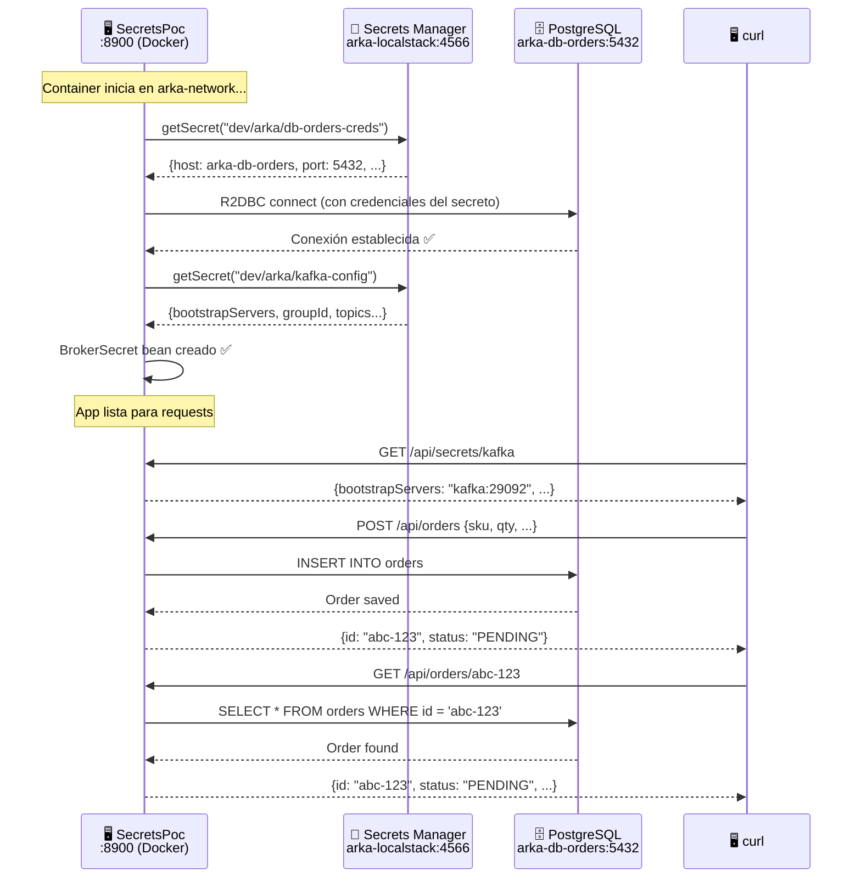

import Tabs from '@theme/Tabs';
import TabItem from '@theme/TabItem';

# Módulo 4: Seguridad — Prueba de Concepto con AWS Secrets Manager

:::tip Tiempo estimado
~1 hora
:::

## Objetivo

Validar la integración con **AWS Secrets Manager** antes de construir los microservicios reales. En esta POC vamos a:

1. **Leer credenciales de BD** desde Secrets Manager → conectar a `db_orders` vía R2DBC
2. **Leer configuración de Kafka** desde Secrets Manager → exponerla vía endpoint REST
3. **Crear y consultar órdenes** en la tabla `orders` para validar la conexión completa

:::note ¿Por qué una POC separada?
Al igual que en el Módulo 2 (Kafka POC), validamos la integración con un proyecto desechable **antes** de incorporarla en los microservicios reales. Esto reduce el riesgo y nos permite iterar rápido.
:::

## 4.1 Prerequisitos

1. ✅ La infraestructura del **Módulo 1** está corriendo (`docker compose ps`)
2. ✅ El **stack de CloudFormation** del **Módulo 3** fue desplegado (los secretos existen en LocalStack)
3. ✅ Tienes **Java 21+** y **Gradle 9.2+** instalados

```bash
# Verificar que los secretos existen
awslocal secretsmanager list-secrets --region us-east-1 --query 'SecretList[].Name' --output table
```

Deberías ver `dev/arka/db-orders-creds` y `dev/arka/kafka-config` en la lista.

## 4.2 Crear el proyecto con el Scaffold

Desde la raíz de `arka-lab`, creamos un nuevo proyecto de prueba:

```bash
# Dentro de arka-lab/
mkdir secrets-poc
cd secrets-poc
```

### Paso 1: Configurar el plugin

Crea el archivo `build.gradle` con el plugin de Bancolombia:

```groovy title="secrets-poc/build.gradle"
plugins {
    id 'co.com.bancolombia.cleanArchitecture' version '4.1.0'
}
```

### Paso 2: Generar el wrapper de Gradle

```bash
gradle wrapper
```

### Paso 3: Generar la estructura del proyecto

```bash
./gradlew ca \
  --package=co.com.arka.secretpoc \
  --type=reactive \
  --name=SecretsPoc \
  --lombok=true \
  --java-version=21
```

### Paso 4: Generar el Entry Point WebFlux (REST API)

```bash
./gradlew gep --type webflux
```

### Paso 5: Generar el Driven Adapter de Secrets Manager

El scaffold tiene un tipo dedicado para **Secrets Manager**:

```bash
./gradlew gda --type secrets --secrets-backend aws_secrets_manager
```

Esto genera automáticamente la configuración de AWS Secrets Manager con la librería de Bancolombia (`GenericManagerAsync`), que incluye cache, reintentos y lectura asíncrona de secretos.

### Paso 6: Generar el Driven Adapter R2DBC (PostgreSQL)

```bash
./gradlew gda --type r2dbc
```

Esto genera el módulo de conexión reactiva a PostgreSQL con R2DBC, incluyendo `PostgresqlConnectionProperties` y `PostgreSQLConnectionPool` pre-configurados.

:::caution Eliminar los tests autogenerados
El scaffold genera tests automáticos que **fallarán** con los cambios que haremos. Elimínalos para evitar problemas:

```bash
find . -path "*/src/test/*" -name "*.java" -delete
```
:::

:::info Scaffold lo hace por ti
El scaffold genera **todo** el código de infraestructura para Secrets Manager y R2DBC — incluyendo las dependencias, los clientes, y las clases de configuración. Solo necesitamos conectar las piezas.
:::

## 4.3 Crear los modelos de dominio

### 4.3.1 Modelo de Order

Este modelo mapea directamente a la tabla `orders` que creamos con el script SQL en el Módulo 1:

```java title="domain/model/src/main/java/co/com/arka/secretpoc/model/order/Order.java"
package co.com.arka.secretpoc.model.order;
import lombok.*;

import java.math.BigDecimal;
import java.time.LocalDateTime;


@Data
@Builder(toBuilder = true)
@NoArgsConstructor
@AllArgsConstructor
public class Order {
    private String id;
    private String customerId;
    private String sku;
    private Integer quantity;
    private BigDecimal totalAmount;
    private String status;
    private LocalDateTime createdAt;
}
```

### 4.3.2 Gateway de Order (interfaz)

```java title="domain/model/src/main/java/co/com/arka/secretpoc/model/order/gateways/OrderRepository.java"
package co.com.arka.secretpoc.model.order.gateways;

import co.com.arka.secretpoc.model.order.Order;
import reactor.core.publisher.Mono;

public interface OrderRepository {
    // The contract for saving an order
    Mono<Order> save(Order order);

    // The contract for finding an order
    Mono<Order> findById(String id);
}
```

### 4.3.3 Modelo de secreto de Kafka

```java title="domain/model/src/main/java/co/com/arka/secretpoc/model/brokersecret/BrokerSecret.java"
package co.com.arka.secretpoc.model.brokersecret;
import lombok.*;


@Getter
@Setter
@NoArgsConstructor
@AllArgsConstructor
@Builder(toBuilder = true)
public class BrokerSecret {
    private String bootstrapServers;
    private String groupId;
    private String autoOffsetReset;
    private Topics topics;

    @Getter
    @Setter
    @NoArgsConstructor
    @AllArgsConstructor
    @Builder(toBuilder = true)
    public static class Topics {
        private String orderCreated;
        private String stockReserved;
        private String stockReleased;
        private String paymentProcessed;
        private String paymentFailed;
        private String orderConfirmed;
        private String orderCancelled;
    }
}
```

:::info ¿Por qué no usamos `record`?
Los `record` de Java son inmutables y no tienen setters. La librería de Bancolombia usa Jackson para deserializar los secretos, y necesita una clase con constructor vacío y setters para poder mapear el JSON. Por eso usamos Lombok `@Data` y `@Builder`.
:::

## 4.4 Configurar la lectura de secretos

El scaffold generó la clase `SecretsConfig` en `applications/app-service`. Modifícala para leer ambos secretos (BD y Kafka):

```java title="applications/app-service/src/main/java/co/com/arka/secretpoc/config/SecretsConfig.java"
package co.com.arka.secretpoc.config;

import co.com.arka.secretpoc.model.brokersecret.BrokerSecret;
import co.com.arka.secretpoc.r2dbc.config.PostgresqlConnectionProperties;
import co.com.bancolombia.secretsmanager.api.GenericManagerAsync;
import co.com.bancolombia.secretsmanager.api.exceptions.SecretException;
import co.com.bancolombia.secretsmanager.config.AWSSecretsManagerConfig;
import co.com.bancolombia.secretsmanager.connector.AWSSecretManagerConnectorAsync;
import lombok.extern.slf4j.Slf4j;
import reactor.core.publisher.Mono;
import software.amazon.awssdk.regions.Region;
import org.springframework.beans.factory.annotation.Value;
import org.springframework.context.annotation.Bean;
import org.springframework.context.annotation.Configuration;

@Slf4j
@Configuration
public class SecretsConfig {

  @Value("${aws.endpoint}")
  public String awsEndpoint;

  @Bean
  public GenericManagerAsync getSecretManager(@Value("${aws.region}") String region) {
    return new AWSSecretManagerConnectorAsync(getConfig(region));
  }

  private <T> Mono<T> getSecret(String secretName, Class<T> cls, GenericManagerAsync connector)
      throws SecretException {
    return connector.getSecret(secretName, cls)
            .doOnSuccess(e -> log.info("Secret was obtained successfully: {}", secretName))
            .doOnError(e -> log.error("Error getting secret: {}", e.getMessage()))
            .onErrorMap(e -> new RuntimeException("Error getting secret", e));
  }

  @Bean
  public PostgresqlConnectionProperties getSecretPostgres(
      GenericManagerAsync connector,
      @Value("${aws.secrets.db-name}") String dbSecretsName) throws SecretException {
    return getSecret(dbSecretsName, PostgresqlConnectionProperties.class, connector).block();
  }

  @Bean
  public BrokerSecret getBrokerSecret(
      GenericManagerAsync connector,
      @Value("${aws.secrets.kafka-name}") String brokerSecretName) throws SecretException {
    return getSecret(brokerSecretName, BrokerSecret.class, connector).block();
  }

  private AWSSecretsManagerConfig getConfig(String region) {
    return AWSSecretsManagerConfig.builder()
      .region(Region.of(region))
      .endpoint(awsEndpoint)
      .cacheSize(5)
      .cacheSeconds(3600)
      .build();
  }
}
```

:::info ¿Qué hace `GenericManagerAsync`?
Es la abstracción de Bancolombia para leer secretos. Internamente usa el AWS SDK v2, pero agrega:
- **Cache** con TTL configurable (`cacheSeconds`)
- **Reintentos** automáticos
- **Endpoint override** para apuntar a LocalStack

Los `.block()` son necesarios porque la configuración de Spring requiere los valores **de forma síncrona** durante el arranque, antes de que el contexto reactivo esté disponible.
:::

## 4.5 Entidad de datos R2DBC

El scaffold generó las clases de R2DBC. Crea la entidad que mapea a la tabla `orders`:

```java title="infrastructure/driven-adapters/r2dbc-postgresql/src/main/java/co/com/arka/secretpoc/r2dbc/entity/OrderData.java"
package co.com.arka.secretpoc.r2dbc.entity;


import lombok.Data;
import org.springframework.data.annotation.Id;
import org.springframework.data.relational.core.mapping.Table;

import java.math.BigDecimal;
import java.time.LocalDateTime;

@Data
@Table(name = "orders")
public class OrderData {
    @Id
    private String id;
    private String customerId;
    private String sku;
    private Integer quantity;
    private BigDecimal totalAmount;
    private String status;
    private LocalDateTime createdAt;
}
```

## 4.6 Repositorio reactivo y adaptador

### 4.6.1 Interfaz del repositorio

```java title="infrastructure/driven-adapters/r2dbc-postgresql/src/main/java/co/com/arka/secretpoc/r2dbc/OrderReactiveRepository.java"
package co.com.arka.secretpoc.r2dbc;

import co.com.arka.secretpoc.r2dbc.entity.OrderData;
import org.springframework.data.repository.query.ReactiveQueryByExampleExecutor;
import org.springframework.data.repository.reactive.ReactiveCrudRepository;

public interface OrderReactiveRepository extends ReactiveCrudRepository<OrderData, String>,
    ReactiveQueryByExampleExecutor<OrderData> {

}
```

### 4.6.2 Adaptador (implementación del Gateway)

```java title="infrastructure/driven-adapters/r2dbc-postgresql/src/main/java/co/com/arka/secretpoc/r2dbc/OrderReactiveRepositoryAdapter.java"
package co.com.arka.secretpoc.r2dbc;

import co.com.arka.secretpoc.model.order.Order;
import co.com.arka.secretpoc.model.order.gateways.OrderRepository;
import co.com.arka.secretpoc.r2dbc.entity.OrderData;
import co.com.arka.secretpoc.r2dbc.helper.ReactiveAdapterOperations;
import org.reactivecommons.utils.ObjectMapper;
import org.springframework.stereotype.Repository;

@Repository
public class OrderReactiveRepositoryAdapter extends ReactiveAdapterOperations<
    Order,
    OrderData,
    String,
    OrderReactiveRepository
> implements OrderRepository {
    public OrderReactiveRepositoryAdapter(OrderReactiveRepository repository, ObjectMapper mapper) {
        super(repository, mapper, d -> mapper.map(d, Order.class));
    }

}
```

:::info `ReactiveAdapterOperations`
Esta clase abstracta fue generada por el scaffold. Implementa automáticamente los métodos `save()` y `findById()` usando el `ObjectMapper` de Reactive Commons para convertir entre el modelo de dominio (`Order`) y la entidad de datos (`OrderData`). **No necesitas modificarla.**
:::

## 4.7 Crear los endpoints REST

### 4.7.1 Handler

```java title="infrastructure/entry-points/reactive-web/src/main/java/co/com/arka/secretpoc/api/Handler.java"
package co.com.arka.secretpoc.api;

import co.com.arka.secretpoc.model.brokersecret.BrokerSecret;
import co.com.arka.secretpoc.model.order.Order;
import co.com.arka.secretpoc.model.order.gateways.OrderRepository;
import lombok.RequiredArgsConstructor;
import org.springframework.stereotype.Component;
import org.springframework.web.reactive.function.server.ServerRequest;
import org.springframework.web.reactive.function.server.ServerResponse;
import reactor.core.publisher.Mono;

@Component
@RequiredArgsConstructor
public class Handler {
    private final OrderRepository orderRepository;
    private final BrokerSecret brokerSecret;

    public Mono<ServerResponse> secretsKafkaGet(ServerRequest serverRequest) {
        return ServerResponse.ok().bodyValue(brokerSecret);
    }

    public Mono<ServerResponse> saveOrder(ServerRequest serverRequest) {
        return serverRequest.bodyToMono(Order.class)
                .flatMap(orderRepository::save)
                .flatMap(savedOrder -> ServerResponse.ok().bodyValue(savedOrder));
    }

    public Mono<ServerResponse> getOrderById(ServerRequest serverRequest) {
        String orderId = serverRequest.pathVariable("id");
        return orderRepository.findById(orderId)
                .flatMap(order -> ServerResponse.ok().bodyValue(order))
                .switchIfEmpty(ServerResponse.notFound().build());
    }
}
```

### 4.7.2 Router

```java title="infrastructure/entry-points/reactive-web/src/main/java/co/com/arka/secretpoc/api/RouterRest.java"
package co.com.arka.secretpoc.api;

import org.springframework.context.annotation.Bean;
import org.springframework.context.annotation.Configuration;
import org.springframework.web.reactive.function.server.RouterFunction;
import org.springframework.web.reactive.function.server.ServerResponse;

import static org.springframework.web.reactive.function.server.RequestPredicates.GET;
import static org.springframework.web.reactive.function.server.RequestPredicates.POST;
import static org.springframework.web.reactive.function.server.RouterFunctions.route;

@Configuration
public class RouterRest {
    @Bean
    public RouterFunction<ServerResponse> routerFunction(Handler handler) {
        return route(GET("/api/secrets/kafka"), handler::secretsKafkaGet)
                .andRoute(POST("/api/orders"), handler::saveOrder)
                .andRoute(GET("/api/orders/{id}"), handler::getOrderById);
    }
}
```

**Endpoints disponibles:**

| Método | Ruta | Descripción |
|--------|------|-------------|
| `GET` | `/api/secrets/kafka` | Devuelve la configuración de Kafka leída desde Secrets Manager |
| `POST` | `/api/orders` | Crea una orden en `db_orders` |
| `GET` | `/api/orders/{id}` | Consulta una orden por ID |

## 4.8 Configurar `application.yaml`

```yaml title="applications/app-service/src/main/resources/application.yaml"
server:
  port: 8900
spring:
  application:
    name: "SecretsPoc"
  devtools:
    add-properties: false
  h2:
    console:
      enabled: true
      path: "/h2"
  profiles:
    include: null
management:
  endpoints:
    web:
      exposure:
        include: "health,prometheus"
  endpoint:
    health:
      probes:
        enabled: true
cors:
  allowed-origins: "http://localhost:4200,http://localhost:8080"
aws:
  endpoint: "http://${LOCALSTACK_HOST:localhost}:${LOCALSTACK_PORT:4566}"
  region: "${AWS_REGION:us-east-1}"
  secrets:
    db-name: "dev/arka/db-orders-creds"
    kafka-name: "dev/arka/kafka-config"
```

:::info Variables de entorno con valores por defecto
La configuración usa `${VARIABLE:default}` — esto permite que la app funcione tanto en Docker (donde las variables se inyectan) como en local (donde usa los valores por defecto). Cuando corre en Docker, `LOCALSTACK_HOST` será `arka-localstack`; en local, será `localhost`.
:::

## 4.9 Dockerizar la POC

Como esta POC corre **dentro de la red Docker** para acceder a LocalStack y PostgreSQL por sus hostnames internos, la dockerizamos con un **multi-stage build**.

### 4.9.1 Crear el Dockerfile

```dockerfile title="secrets-poc/deployment/Dockerfile"
# ── Stage 1: Build ──
FROM gradle:9.2-jdk21 AS builder
VOLUME /tmp
WORKDIR /myapp

COPY applications applications
COPY domain domain
COPY infrastructure infrastructure
COPY *.gradle .
COPY lombok.* .
COPY gradlew.* .
COPY gradle.* .

RUN gradle build -x test --no-daemon

# ── Stage 2: Run ──
FROM eclipse-temurin:21-jre-alpine
VOLUME /tmp
WORKDIR /myapprun
COPY --from=builder /myapp/applications/app-service/build/libs/*.jar SecretsPoc.jar
ENV JAVA_OPTS=" -XX:+UseContainerSupport -XX:MaxRAMPercentage=70 -Djava.security.egd=file:/dev/./urandom"
EXPOSE 8900
ENTRYPOINT ["/bin/sh", "-c", "/opt/java/openjdk/bin/java $JAVA_OPTS  -jar SecretsPoc.jar"]
```

:::info Multi-stage build
- **Stage 1**: Copia solo lo necesario (sin `.git`, sin `build/`) y compila con `gradle build -x test`
- **Stage 2**: Imagen Alpine ligera (~200MB) con solo el JRE y el JAR compilado
- `JAVA_OPTS`: Configura el contenedor para usar hasta 70% de la RAM disponible
:::

### 4.9.2 Crear el script `run-poc.sh`

Este script construye la imagen, limpia contenedores previos y levanta la POC en la **misma red Docker** que la infraestructura:

```bash title="secrets-poc/run-poc.sh"
#!/usr/bin/env bash
set -euo pipefail

IMAGE_NAME="arka-secrets-poc"
CONTAINER_NAME="arka-secrets-poc"
NETWORK_NAME="arka-lab_arka-network"
PORT=8900

echo "══════════════════════════════════════════="
echo "  Arka Lab — Secrets POC"
echo "══════════════════════════════════════════="

# 1. Construir la imagen
echo ""
echo "Construyendo imagen Docker..."
docker build --file deployment/Dockerfile -t "$IMAGE_NAME" .

# 2. Eliminar contenedor previo si existe
if docker ps -a --format '{{.Names}}' | grep -q "^${CONTAINER_NAME}$"; then
  echo "Eliminando contenedor previo..."
  docker rm -f "$CONTAINER_NAME"
fi

# 3. Ejecutar en la misma red de la infraestructura
echo ""
echo "══════════════════════════════════════════="
echo "Levantando contenedor '$CONTAINER_NAME'"
echo "   Puerto: http://localhost:$PORT"
echo "   Logs:   docker logs -f $CONTAINER_NAME"
echo "══════════════════════════════════════════="
echo ""

echo "Levantando contenedor en red '$NETWORK_NAME'..."
docker run -d \
  --name "$CONTAINER_NAME" \
  --network "$NETWORK_NAME" \
  -p "$PORT:$PORT" \
  -e AWS_ACCESS_KEY_ID="test" \
  -e AWS_SECRET_ACCESS_KEY="test" \
  -e AWS_REGION="us-east-1" \
  -e LOCALSTACK_PORT="4566" \
  -e LOCALSTACK_HOST="arka-localstack" \
  "$IMAGE_NAME"
```

:::warning Nombre de la red
El nombre de la red Docker depende del nombre del directorio donde está el `compose.yaml`. Si tu directorio se llama `arka-lab`, la red será `arka-lab_arka-network`. Verifica con:

```bash
docker network ls | grep arka
```
:::

## 4.10 Ejecutar y Probar

### Paso 1: Verificar que la infra está corriendo

```bash
# Desde la raíz de arka-lab/
docker compose ps
```

Todos los servicios deben estar `Up` o `healthy`.

### Paso 2: Dar permisos y ejecutar

```bash
cd secrets-poc
chmod +x run-poc.sh
./run-poc.sh
```

### Paso 3: Verificar los logs

```bash
docker logs -f arka-secrets-poc
```

Deberías ver:

```
Secret was obtained successfully: dev/arka/db-orders-creds
Creating connection pool configuration. Host: arka-db-orders, Port: 5432, Database: db_orders, Username: arka
Secret was obtained successfully: dev/arka/kafka-config
```

### Paso 4: Consultar el secreto de Kafka

```bash
curl http://localhost:8900/api/secrets/kafka | python3 -m json.tool
```

**Respuesta esperada:**

```json
{
  "bootstrapServers": "kafka:29092",
  "groupId": "arka-saga-group",
  "autoOffsetReset": "earliest",
  "topics": {
    "orderCreated": "order-created",
    "stockReserved": "stock-reserved",
    "stockReleased": "stock-released",
    "paymentProcessed": "payment-processed",
    "paymentFailed": "payment-failed",
    "orderConfirmed": "order-confirmed",
    "orderCancelled": "order-cancelled"
  }
}
```

### Paso 5: Crear una orden

```bash
curl -X POST http://localhost:8900/api/orders \
  -H "Content-Type: application/json" \
  -d '{
    "customerId": "CLI-001",
    "sku": "KB-MECH-001",
    "quantity": 2,
    "totalAmount": 378000.00,
    "status": "PENDING"
  }' | python3 -m json.tool
```

**Respuesta esperada:**

```json
{
  "id": "a1b2c3d4-...",
  "customerId": "CLI-001",
  "sku": "KB-MECH-001",
  "quantity": 2,
  "totalAmount": 378000.00,
  "status": "PENDING",
  "createdAt": "2026-03-01T..."
}
```

### Paso 6: Consultar la orden creada

Copia el `id` de la respuesta anterior y consúltala:

```bash
curl http://localhost:8900/api/orders/{id} | python3 -m json.tool
```

## 4.11 ¿Qué acabamos de construir?



:::info Checkpoint — ¿Todo funciona?

Verifica que puedas responder **SÍ** a todo:

- [ ] ¿`run-poc.sh` construye la imagen y levanta el contenedor?
- [ ] ¿Los logs muestran que ambos secretos se leyeron exitosamente?
- [ ] ¿`GET /api/secrets/kafka` devuelve la configuración de Kafka?
- [ ] ¿`POST /api/orders` crea una orden en `db_orders`?
- [ ] ¿`GET /api/orders/{id}` devuelve la orden creada?
- [ ] ¿La conexión a `db_orders` funciona vía R2DBC usando el hostname Docker?

Si todas las respuestas son SÍ, **la integración con AWS Secrets Manager está validada** y lista para los microservicios reales. 🚀
:::

## 4.12 Limpieza (Opcional)

Este proyecto de prueba **no se necesita para los siguientes módulos**. Puedes detener y eliminar el contenedor:

```bash
# Detener y eliminar el contenedor
docker rm -f arka-secrets-poc

# Opcional: eliminar la imagen
docker rmi arka-secrets-poc

# Opcional: eliminar el proyecto de prueba
cd ..
rm -rf secrets-poc
```

## ¿Qué aprendimos?

| Concepto | Lo que hicimos |
|----------|---------------|
| **Scaffold Bancolombia** | Generamos un proyecto reactivo con Clean Architecture + R2DBC + Secrets Manager |
| **AWS Secrets Manager** | Leímos secretos de LocalStack usando `GenericManagerAsync` de Bancolombia |
| **Conexión dinámica R2DBC** | Configuramos PostgreSQL con credenciales obtenidas del secreto al arrancar |
| **CRUD sobre `db_orders`** | Creamos y consultamos órdenes en la tabla `orders` vía R2DBC reactivo |
| **Secreto de Kafka** | Leímos y expusimos la configuración vía endpoint REST |
| **Docker Network** | La POC corre como contenedor en `arka-network`, resolviendo hostnames Docker |
| **Zero Trust** | Ninguna credencial aparece en `application.yaml` — todo viene de Secrets Manager |

:::tip ¿Qué sigue?
Ahora que validamos que Secrets Manager y R2DBC funcionan, pasamos a crear el **primer microservicio real** (`ms-orders`) y conectarlo al **API Gateway**.
:::

---

**Siguiente:** [Módulo 5: Microservicio Orders — Scaffold, Docker & API Gateway](./microservicio-orders)
