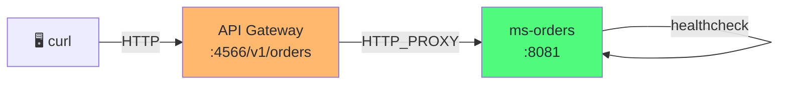
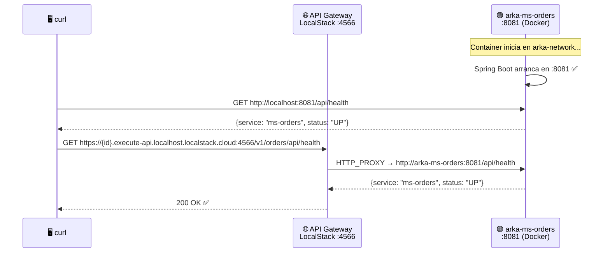

import Tabs from '@theme/Tabs';
import TabItem from '@theme/TabItem';

# Módulo 5: Microservicio Orders — Scaffold, Docker & API Gateway

:::tip Tiempo estimado
~1 hora
:::

## Objetivo

Crear el **primer microservicio real** (`ms-orders`) usando el Scaffold de Bancolombia, dockerizarlo, agregarlo al compose y validar la conectividad con el **API Gateway** creado en el Módulo 3.



:::note ¿Por qué este módulo?
Antes de agregar lógica de negocio (DDD, R2DBC, Kafka), necesitamos verificar que:
1. El microservicio **compila y arranca** dentro de Docker
2. Está **visible en la red** `arka-network`
3. El **API Gateway** puede enrutar tráfico hacia él
:::

## 5.1 Prerequisitos

1. ✅ La infraestructura del **Módulo 1** está corriendo (`docker compose ps`)
2. ✅ El **stack de CloudFormation** del **Módulo 3** fue desplegado (API Gateway existe)
3. ✅ Tienes **Java 21+** y **Gradle 9.2+** instalados

```bash
# Verificar que el API Gateway existe
awslocal apigateway get-rest-apis --region us-east-1 --query 'items[].{Name:name, Id:id}' --output table
```

## 5.2 Actualizar las variables de entorno

Antes de crear el microservicio, agrega las variables del servicio al `.env`:

```bash title=".env (agregar al final)"
MS_ORDERS_PORT=8081
MS_ORDERS_HOST=arka-ms-orders
```

## 5.3 Crear el proyecto con el Scaffold

Desde la raíz de `arka-lab`, creamos el microservicio:

```bash
# Dentro de arka-lab/
mkdir ms-orders
cd ms-orders
```

### Paso 1: Configurar el plugin

```groovy title="ms-orders/build.gradle"
plugins {
    id 'co.com.bancolombia.cleanArchitecture' version '4.1.0'
}
```

### Paso 2: Generar el wrapper de Gradle

```bash
gradle wrapper
```

### Paso 3: Generar la estructura del proyecto

```bash
./gradlew ca \
  --package=co.com.arka.orders \
  --type=reactive \
  --name=MsOrders \
  --lombok=true \
  --java-version=21
```

### Paso 4: Generar el Entry Point WebFlux

```bash
./gradlew gep --type webflux
```

:::caution Eliminar los tests autogenerados
Los tests del scaffold fallarán con nuestros cambios. Elimínalos:

```bash
find . -path "*/src/test/*" -name "*.java" -delete
```
:::

## 5.4 Crear el endpoint de Health Check

### 5.4.1 Handler

```java title="infrastructure/entry-points/reactive-web/src/main/java/co/com/arka/orders/api/Handler.java"
package co.com.arka.orders.api;

import lombok.RequiredArgsConstructor;
import org.springframework.stereotype.Component;
import org.springframework.web.reactive.function.server.ServerRequest;
import org.springframework.web.reactive.function.server.ServerResponse;
import reactor.core.publisher.Mono;

import java.time.LocalDateTime;
import java.util.Map;

@Component
@RequiredArgsConstructor
public class Handler {

    public Mono<ServerResponse> healthCheck(ServerRequest serverRequest) {
        return ServerResponse.ok().bodyValue(Map.of(
                "service", "ms-orders",
                "status", "UP",
                "timestamp", LocalDateTime.now().toString()
        ));
    }
}
```

### 5.4.2 Router

```java title="infrastructure/entry-points/reactive-web/src/main/java/co/com/arka/orders/api/RouterRest.java"
package co.com.arka.orders.api;

import org.springframework.context.annotation.Bean;
import org.springframework.context.annotation.Configuration;
import org.springframework.web.reactive.function.server.RouterFunction;
import org.springframework.web.reactive.function.server.ServerResponse;

import static org.springframework.web.reactive.function.server.RequestPredicates.GET;
import static org.springframework.web.reactive.function.server.RequestPredicates.POST;
import static org.springframework.web.reactive.function.server.RouterFunctions.route;

@Configuration
public class RouterRest {
    @Bean
    public RouterFunction<ServerResponse> routerFunction(Handler handler) {
        return route(GET("/api/health"), handler::healthCheck);
    }
}
```

## 5.5 Configurar `application.yaml`

```yaml title="applications/app-service/src/main/resources/application.yaml"
server:
  port: ${MS_ORDERS_PORT:8081}
spring:
  application:
    name: "MsOrders"
  devtools:
    add-properties: false
  h2:
    console:
      enabled: true
      path: "/h2"
  profiles:
    include: null
management:
  endpoints:
    web:
      exposure:
        include: "health,prometheus"
  endpoint:
    health:
      probes:
        enabled: true
cors:
  allowed-origins: "http://localhost:4200,http://localhost:8080"
```

:::info Puerto dinámico con `${MS_ORDERS_PORT:8081}`
El puerto se lee de la variable de entorno `MS_ORDERS_PORT`, con valor por defecto `8081`. Esto permite cambiarlo desde el `.env` sin modificar el código. En Docker, la variable se inyecta vía `env_file`.
:::

## 5.6 Dockerizar el microservicio

### 5.6.1 Dockerfile

```dockerfile title="ms-orders/deployment/Dockerfile"
# ── Stage 1: Build ──
FROM gradle:9.2-jdk21 AS builder
VOLUME /tmp
WORKDIR /myapp

COPY applications applications
COPY domain domain
COPY infrastructure infrastructure
COPY *.gradle .
COPY lombok.* .
COPY gradlew.* .
COPY gradle.* .

RUN gradle build -x test --no-daemon

# ── Stage 2: Run ──
FROM eclipse-temurin:21-jre-alpine
VOLUME /tmp
WORKDIR /myapprun
COPY --from=builder /myapp/applications/app-service/build/libs/*.jar MsOrders.jar

RUN apk update && apk add curl

ARG PORT=8081
ENV JAVA_OPTS=" -XX:+UseContainerSupport -XX:MaxRAMPercentage=70 -Djava.security.egd=file:/dev/./urandom"
ENV MS_ORDERS_PORT=${PORT}
EXPOSE ${MS_ORDERS_PORT}
ENTRYPOINT ["/bin/sh", "-c", "/opt/java/openjdk/bin/java $JAVA_OPTS -jar MsOrders.jar"]
```

:::warning `apk add curl`
La imagen `eclipse-temurin:21-jre-alpine` **no incluye `curl`** por defecto. Lo instalamos porque el healthcheck del compose usa `curl` para verificar que el servicio está listo.
:::

## 5.7 Agregar ms-orders al Docker Compose

Agrega el siguiente servicio al `compose.yaml` existente, **después del bloque de Traefik** y **antes de `networks:`**:

```yaml title="compose.yaml (agregar al final de services)"
  # ═══════════════════════════════════════════════════
  # MsOrders — Microservicio de Órdenes
  # ═══════════════════════════════════════════════════
  ms-orders:
    build:
      context: ./ms-orders
      dockerfile: deployment/Dockerfile
      args:
        - PORT=${MS_ORDERS_PORT}
    container_name: arka-ms-orders
    ports:
      - "${MS_ORDERS_PORT}:${MS_ORDERS_PORT}"
    env_file:
      - .env
    depends_on:
      postgres-orders:
        condition: service_healthy
      localstack:
        condition: service_healthy
      kafka:
        condition: service_healthy
    healthcheck:
      test: ["CMD", "curl", "-f", "http://localhost:${MS_ORDERS_PORT}/actuator/health"]
      interval: 15s
      timeout: 5s
      retries: 5
      start_period: 60s
    networks:
      - arka-network
```

:::info Detalles importantes del compose

| Configuración | Valor | ¿Por qué? |
|---------------|-------|-----------|
| `env_file: .env` | Inyecta **todas** las variables del `.env` | El microservicio lee `MS_ORDERS_PORT` desde ahí |
| `build.args.PORT` | `${MS_ORDERS_PORT}` | Se pasa al `ARG PORT` del Dockerfile para el `EXPOSE` |
| `container_name` | `arka-ms-orders` | Es el hostname que usa el API Gateway (`pOrdersServiceHost`) |
| `healthcheck` | `/actuator/health` | Endpoint de Spring Boot Actuator (se habilita automáticamente) |
| `start_period: 60s` | Espera antes de chequear | El microservicio necesita tiempo para compilar y arrancar |
| `depends_on kafka` | `service_healthy` | Garantiza que Kafka esté listo antes de iniciar |
:::

:::warning Healthcheck de Kafka
Para que `depends_on kafka: condition: service_healthy` funcione, Kafka necesita tener su propio healthcheck definido. Agrégalo al servicio `kafka` en tu compose si aún no lo tienes:

```yaml title="compose.yaml (agregar al servicio kafka)"
    healthcheck:
      test: ["CMD", "kafka-topics", "--bootstrap-server", "localhost:29092", "--list"]
      interval: 10s
      timeout: 5s
      retries: 10
      start_period: 60s
```
:::

## 5.8 Construir y Levantar

### Paso 1: Reconstruir el compose

```bash
# Desde la raíz de arka-lab/
docker compose up -d --build ms-orders
```

:::note Primera vez
La primera vez, Docker construirá la imagen desde cero descargando Gradle y las dependencias. Esto puede tomar varios minutos. Las siguientes ejecuciones serán más rápidas gracias al cache de capas.
:::

### Paso 2: Verificar que el servicio está corriendo

```bash
docker compose ps
```

Deberías ver `arka-ms-orders` en estado `Up (healthy)`:

```
NAME                  STATUS
arka-db-orders        Up (healthy)
arka-db-inventory     Up (healthy)
arka-db-payment       Up (healthy)
arka-kafka            Up (healthy)
arka-kafka-ui         Up
arka-localstack       Up (healthy)
arka-traefik          Up
arka-ms-orders        Up (healthy)    ← NUEVO
```

### Paso 3: Probar el healthcheck directamente

```bash
curl http://localhost:8081/api/health | python3 -m json.tool
```

**Respuesta esperada:**

```json
{
  "service": "ms-orders",
  "status": "UP",
  "timestamp": "2026-03-01T..."
}
```

## 5.9 Probar el API Gateway → ms-orders

El API Gateway (creado en el Módulo 3) ya tiene una ruta `/orders/{proxy+}` configurada como `HTTP_PROXY` hacia `http://arka-ms-orders:8081`. Vamos a verificar la conectividad.

### Paso 1: Obtener el ID del API Gateway

```bash
API_ID=$(awslocal apigateway get-rest-apis \
  --region us-east-1 \
  --query 'items[0].id' \
  --output text)

echo "API Gateway ID: $API_ID"
```

### Paso 2: Probar vía API Gateway

```bash
curl "https://${API_ID}.execute-api.localhost.localstack.cloud:4566/v1/orders/api/health" | python3 -m json.tool
```

**Respuesta esperada:**

```json
{
  "service": "ms-orders",
  "status": "UP",
  "timestamp": "2026-03-01T..."
}
```

:::tip ¿Qué acaba de pasar?
```
curl → https://<api-id>.execute-api.localhost.localstack.cloud:4566
     → API Gateway → HTTP_PROXY → arka-ms-orders:8081 → /api/health
```
El request viajó: **tu máquina → LocalStack (API Gateway) → red Docker → arka-ms-orders**. Esto valida que el enrutamiento funciona de extremo a extremo.
:::

## 5.10 ¿Qué acabamos de construir?



:::info Checkpoint — ¿Todo funciona?

Verifica que puedas responder **SÍ** a todo:

- [ ] ¿El proyecto compila sin errores? (`docker compose up -d --build ms-orders`)
- [ ] ¿`docker compose ps` muestra `arka-ms-orders` como `healthy`?
- [ ] ¿`curl http://localhost:8081/api/health` responde con `status: UP`?
- [ ] ¿La petición vía API Gateway también devuelve `status: UP`?

Si todas las respuestas son SÍ, **ms-orders está visible en la red Docker y accesible vía API Gateway**. En los siguientes módulos agregaremos la lógica de negocio con DDD y la persistencia con R2DBC. 🚀
:::

## ¿Qué aprendimos?

| Concepto | Lo que hicimos |
|----------|---------------|
| **Scaffold Bancolombia** | Generamos `ms-orders` reactivo con Clean Architecture |
| **WebFlux Entry Point** | Endpoint `/api/health` con handler funcional |
| **Multi-stage Dockerfile** | Build con Gradle + ejecución con JRE Alpine + `curl` para healthcheck |
| **Docker Compose** | Integración con `env_file`, `depends_on` (healthy), y `arka-network` |
| **API Gateway Proxy** | Verificamos el enrutamiento `HTTP_PROXY` vía `execute-api.localhost.localstack.cloud` |
| **Spring Boot Actuator** | Healthcheck del compose usa `/actuator/health` |

:::tip ¿Qué sigue?
Ahora que ms-orders está corriendo en Docker y accesible vía API Gateway, pasamos a modelar el **dominio** con **DDD y Arquitectura Hexagonal**.
:::

---

**Siguiente:** [Módulo 6: ms-orders — Implementación Completa](./ms-orders-implementacion)
