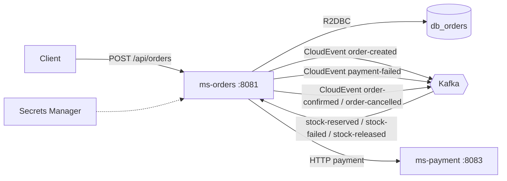

import Tabs from '@theme/Tabs';
import TabItem from '@theme/TabItem';

# Módulo 6: ms-orders — Implementación Completa (versión funcional)

:::tip Tiempo estimado
~2 horas
:::

## Objetivo

Completar `ms-orders` como microservicio real de la SAGA, exactamente con el patrón funcional del lab:

- Persistencia reactiva en PostgreSQL con R2DBC
- Lectura de secretos desde LocalStack Secrets Manager
- Publicación y consumo de eventos con Reactive Commons (`async-event-bus` y `async-event-handler`)
- Orquestación del pago vía HTTP (con Circuit Breaker)
- API REST para crear y consultar órdenes



:::note Importante
Este módulo queda alineado con el repo funcional de referencia (`arka-kafka-ddd-lab-1/ms-orders`).
:::

## 6.1 Prerequisitos

1. El Módulo 5 (`ms-orders` base) ya responde healthcheck.
2. Infra levantada (`docker compose ps`) con PostgreSQL, Kafka y LocalStack.
3. Secretos creados en LocalStack:

- `dev/arka/db-orders-creds`
- `dev/arka/kafka-config`

## 6.1.1 Recap rápido (Módulos 1 a 3)

Antes de continuar con la implementación de `ms-orders`, confirma que tu base técnica quedó así:

### `.env` mínimo esperado

```bash title=".env"
POSTGRES_USER=arka
POSTGRES_PASSWORD=arkaSecret2025
POSTGRES_ORDERS_PORT=5432
POSTGRES_ORDERS_DB=db_orders
POSTGRES_INVENTORY_PORT=5433
POSTGRES_INVENTORY_DB=db_inventory
POSTGRES_PAYMENT_PORT=5434
POSTGRES_PAYMENT_DB=db_payment
KAFKA_PORT=9092
KAFKA_BOOTSTRAP_SERVERS=kafka:29092
LOCALSTACK_PORT=4566
LOCALSTACK_HOST=arka-localstack
MS_ORDERS_PORT=8081
MS_ORDERS_HOST=arka-ms-orders
AWS_ACCESS_KEY_ID=test
AWS_SECRET_ACCESS_KEY=test
AWS_REGION=us-east-1
```

### `compose.yaml` (puntos críticos)

Usa este bloque mínimo (o verifica que el tuyo sea equivalente):

```yaml title="compose.yaml (fragmento necesario)"
services:
  kafka:
    image: confluentinc/cp-kafka:8.0.4
    container_name: arka-kafka
    healthcheck:
      test: ["CMD", "kafka-topics", "--bootstrap-server", "localhost:29092", "--list"]
      interval: 10s
      timeout: 5s
      retries: 10
      start_period: 60s

  kafka-init:
    image: confluentinc/cp-kafka:8.0.4
    container_name: arka-kafka-init
    depends_on:
      kafka:
        condition: service_healthy
    command: >
      bash -c "
      kafka-topics --bootstrap-server kafka:29092 --create --if-not-exists --topic order-created --partitions 3 --replication-factor 1 &&
      kafka-topics --bootstrap-server kafka:29092 --create --if-not-exists --topic stock-reserved --partitions 3 --replication-factor 1 &&
      kafka-topics --bootstrap-server kafka:29092 --create --if-not-exists --topic stock-released --partitions 3 --replication-factor 1 &&
      kafka-topics --bootstrap-server kafka:29092 --create --if-not-exists --topic payment-failed --partitions 3 --replication-factor 1 &&
      kafka-topics --bootstrap-server kafka:29092 --create --if-not-exists --topic order-confirmed --partitions 3 --replication-factor 1 &&
      kafka-topics --bootstrap-server kafka:29092 --create --if-not-exists --topic order-cancelled --partitions 3 --replication-factor 1 &&
      kafka-topics --bootstrap-server kafka:29092 --create --if-not-exists --topic stock-failed --partitions 3 --replication-factor 1
      "

  localstack:
    image: localstack/localstack:latest
    container_name: arka-localstack
    env_file:
      - .env
    volumes:
      - localstack-data:/var/lib/localstack
      - ./localstack/infra.yaml:/etc/localstack/init/ready.d/infra.yaml
      - ./localstack/bootstrap.sh:/etc/localstack/init/ready.d/bootstrap.sh
      - "/var/run/docker.sock:/var/run/docker.sock"

  ms-orders:
    build:
      context: ./ms-orders
      dockerfile: deployment/Dockerfile
      args:
        - PORT=${MS_ORDERS_PORT}
    container_name: arka-ms-orders
    env_file:
      - .env
    depends_on:
      postgres-orders:
        condition: service_healthy
      localstack:
        condition: service_healthy
      kafka:
        condition: service_healthy
    healthcheck:
      test: ["CMD", "curl", "-f", "http://localhost:${MS_ORDERS_PORT}/actuator/health"]
      interval: 15s
      timeout: 5s
      retries: 5
      start_period: 60s
```

### CloudFormation / secretos

En `localstack/infra.yaml`, el secreto `dev/arka/kafka-config` debe incluir `stockFailed` además de los otros topics:

```yaml title="localstack/infra.yaml (fragmento rKafkaSecret)"
rKafkaSecret:
  Type: AWS::SecretsManager::Secret
  Properties:
    Name: !Sub "${pEnvironment}/arka/kafka-config"
    SecretString: !Sub |
      {
        "bootstrapServers": "${pKafkaBootstrapServers}",
        "groupId": "arka-saga-group",
        "autoOffsetReset": "earliest",
        "topics": {
          "orderCreated": "order-created",
          "stockReserved": "stock-reserved",
          "stockReleased": "stock-released",
          "paymentFailed": "payment-failed",
          "orderConfirmed": "order-confirmed",
          "orderCancelled": "order-cancelled",
          "stockFailed": "stock-failed"
        }
      }
```

### Comandos de verificación express

```bash
docker compose up -d
docker compose ps

awslocal secretsmanager get-secret-value \
  --secret-id dev/arka/kafka-config \
  --region us-east-1 \
  --query SecretString --output text | python3 -m json.tool
```

Si todo eso está correcto, puedes continuar con este módulo sin fricción.

## 6.2 Estructura esperada en ms-orders

Además de `reactive-web` y `r2dbc-postgresql`, este módulo usa dos piezas de mensajería:

- `infrastructure/driven-adapters/async-event-bus` (publicar eventos)
- `infrastructure/entry-points/async-event-handler` (consumir eventos)

Si no las tienes en tu proyecto actual, puedes generarlas con el scaffold de EDA y luego ajustar paquetes/nombres para que coincidan con esta guía.

## 6.3 Eventos del dominio

Crea estos records en `domain/model/src/main/java/co/com/arka/orders/model/events/`:

```java title="OrderCreatedEvent.java"
package co.com.arka.orders.model.events;

public record OrderCreatedEvent(
        String orderId,
        String sku,
        Integer quantity,
        Double amount
) {
}
```

```java title="StockReserveFailedEvent.java"
package co.com.arka.orders.model.events;

public record StockReserveFailedEvent(String orderId, String reason) {
}
```

```java title="StockReleasedEvent.java"
package co.com.arka.orders.model.events;

public record StockReleasedEvent(String orderId, String reason) {
}
```

```java title="StockReservedEvent.java"
package co.com.arka.orders.model.events;

public record StockReservedEvent(
  String orderId,
  String sku,
  Integer quantity
) {
}
```

```java title="PaymentFailedEvent.java"
package co.com.arka.orders.model.events;

public record PaymentFailedEvent(
  String orderId,
  String sku,
  Integer quantity,
  String reason
) {
}
```

```java title="OrderConfirmedEvent.java"
package co.com.arka.orders.model.events;

public record OrderConfirmedEvent(String orderId) {
}
```

```java title="OrderCancelledEvent.java"
package co.com.arka.orders.model.events;

public record OrderCancelledEvent(String orderId, String reason) {}
```

## 6.4 Modelo de dominio y puertos

### 6.4.1 Entidad `Order`

```java title="domain/model/src/main/java/co/com/arka/orders/model/order/Order.java"
package co.com.arka.orders.model.order;

import lombok.*;

@Data
@NoArgsConstructor
@AllArgsConstructor
@Builder(toBuilder = true)
public class Order {
    private String id;
    private String customerId;
    private String sku;
    private Integer quantity;
    private Double unitPrice;
    private Double totalAmount;
    @Builder.Default
    private String status = "PENDING";
}
```

### 6.4.2 Repositorio

```java title="domain/model/src/main/java/co/com/arka/orders/model/order/gateways/OrderRepository.java"
package co.com.arka.orders.model.order.gateways;

import co.com.arka.orders.model.order.Order;
import reactor.core.publisher.Flux;
import reactor.core.publisher.Mono;

public interface OrderRepository {
    Mono<Order> save(Order order);
    Mono<Order> findById(String id);
    Flux<Order> findAll();
}
```

### 6.4.3 Gateway genérico de eventos

```java title="domain/model/src/main/java/co/com/arka/orders/model/events/gateways/EventsGateway.java"
package co.com.arka.orders.model.events.gateways;

import reactor.core.publisher.Mono;

public interface EventsGateway<T> {
    Mono<Void> emit(T event);
}
```

## 6.5 Caso de uso `OrderUseCase`

```java title="domain/usecase/src/main/java/co/com/arka/orders/usecase/order/OrderUseCase.java"
package co.com.arka.orders.usecase.order;

import co.com.arka.orders.model.events.OrderCancelledEvent;
import co.com.arka.orders.model.events.OrderConfirmedEvent;
import co.com.arka.orders.model.events.OrderCreatedEvent;
import co.com.arka.orders.model.events.PaymentFailedEvent;
import co.com.arka.orders.model.events.gateways.EventsGateway;
import co.com.arka.orders.model.order.Order;
import co.com.arka.orders.model.order.gateways.OrderRepository;
import co.com.arka.orders.model.payment.gateways.PaymentGateway;
import lombok.RequiredArgsConstructor;
import lombok.extern.slf4j.Slf4j;
import reactor.core.publisher.Flux;
import reactor.core.publisher.Mono;

@RequiredArgsConstructor
public class OrderUseCase {
    private final OrderRepository orderRepository;
    private final PaymentGateway paymentGateway;
    private final EventsGateway<OrderCreatedEvent> orderCreatedEventGateway;
    private final EventsGateway<OrderConfirmedEvent> orderConfirmedEventEventsGateway;
    private final EventsGateway<OrderCancelledEvent> orderCancelledEventEventsGateway;
    private final EventsGateway<PaymentFailedEvent> paymentFailedEventEventsGateway;

    public Mono<Order> createOrder(Order order) {
        order.setStatus("PENDING");
        order.setTotalAmount(order.getUnitPrice() * order.getQuantity());
        return orderRepository.save(order)
                .flatMap(orderSaved -> {
                    var orderCreatedEvent = new OrderCreatedEvent(
                        orderSaved.getId(),
                        orderSaved.getSku(),
                        orderSaved.getQuantity(),
                        orderSaved.getTotalAmount()
                    );
                    return orderCreatedEventGateway.emit(orderCreatedEvent)
                            .thenReturn(orderSaved);
                });
    }

    public Mono<Order> cancelOrder(String orderId, String reason) {
        return orderRepository.findById(orderId)
                .flatMap(order -> {
                    order.setStatus("CANCELLED");
                    return orderRepository.save(order)
                            .flatMap(orderCancelled -> {
                                var event = new OrderCancelledEvent(orderCancelled.getId(), reason);
                                return orderCancelledEventEventsGateway.emit(event)
                                        .thenReturn(orderCancelled);
                            });
                });
    }

    public Mono<Order> confirmOrder(String orderId) {
        return orderRepository.findById(orderId)
                .flatMap(order -> {
                    order.setStatus("CONFIRMED");
                    return orderRepository.save(order)
                            .flatMap(orderCancelled -> {
                                var event = new OrderConfirmedEvent(orderCancelled.getId());
                                return orderConfirmedEventEventsGateway.emit(event)
                                        .thenReturn(orderCancelled);
                            });
                });
    }


    public Mono<Void> processPaymentForOrder(String orderId) {
        return orderRepository.findById(orderId)
                .flatMap(order -> paymentGateway.processPayment(order.getId(), order.getTotalAmount())
                        .flatMap(approved -> approved
                                ? confirmOrder(order.getId()).then()
                                : publishPaymentFailed(order, "Payment rejected by provider"))
                        .onErrorResume(ex -> publishPaymentFailed(order, "Payment gateway error: " + ex.getMessage())));
    }

    private Mono<Void> publishPaymentFailed(Order order, String reason) {
        var failed = new PaymentFailedEvent(
                order.getId(),
                order.getSku(),
                order.getQuantity(),
                reason
        );
        return paymentFailedEventEventsGateway.emit(failed);
    }

    public Mono<Order> getOrder(String id) {
        return orderRepository.findById(id);
    }

    public Flux<Order> getAllOrders() {
        return orderRepository.findAll();
    }
}

```

## 6.5.1 Puerto y adapter HTTP de pagos

### Dependencias del adaptador HTTP

Si generaste este adaptador con el scaffold (`--type restconsumer`), asegúrate de agregar las dependencias de **Resilience4j** y **WebFlux**:

```groovy title="infrastructure/driven-adapters/rest-consumer/build.gradle"
dependencies {
    implementation project(':model')
    implementation 'org.springframework:spring-context'
    implementation 'org.springframework.boot:spring-boot-starter-webflux'
    implementation 'io.github.resilience4j:resilience4j-spring-boot3:2.3.0'
    implementation 'io.github.resilience4j:resilience4j-reactor:2.3.0'
    implementation 'io.micrometer:micrometer-core'
}
```

### Puerto de dominio

```java title="domain/model/src/main/java/co/com/arka/orders/model/payment/gateways/PaymentGateway.java"
package co.com.arka.orders.model.payment.gateways;

import reactor.core.publisher.Mono;

public interface PaymentGateway {
  Mono<Boolean> processPayment(String orderId, Double amount);
}
```

### Adapter HTTP + Circuit Breaker

```java title="infrastructure/driven-adapters/rest-consumer/src/main/java/co/com/arka/orders/consumer/RestConsumer.java"
package co.com.arka.orders.consumer;

import co.com.arka.orders.model.payment.gateways.PaymentGateway;
import io.github.resilience4j.circuitbreaker.annotation.CircuitBreaker;
import lombok.RequiredArgsConstructor;
import lombok.extern.slf4j.Slf4j;
import org.springframework.beans.factory.annotation.Value;
import org.springframework.stereotype.Service;
import org.springframework.web.reactive.function.client.WebClient;
import reactor.core.publisher.Mono;

import java.time.Duration;

@Slf4j
@Service
@RequiredArgsConstructor
public class RestConsumer implements PaymentGateway {

  private final WebClient paymentWebClient;

  @Value("${payment.process-path:/api/payments/process}")
  private String processPath;

  @Value("${payment.timeout-seconds:3}")
  private Long timeoutSeconds;

  @Override
  @CircuitBreaker(name = "payment")
  public Mono<Boolean> processPayment(String orderId, Double amount) {
    var request = new PaymentRequest(orderId, amount);

    return paymentWebClient.post()
        .uri(processPath)
        .bodyValue(request)
        .retrieve()
        .toBodilessEntity()
        .map(response -> true)
        .timeout(Duration.ofSeconds(timeoutSeconds))
        .doOnError(error -> log.warn("Payment request failed for order {}: {}", orderId, error.getMessage()))
        .onErrorReturn(false);
  }

  private record PaymentRequest(String orderId, Double amount) {
  }
}
```

```java title="infrastructure/driven-adapters/rest-consumer/src/main/java/co/com/arka/orders/consumer/config/RestConsumerConfig.java"
package co.com.arka.orders.consumer.config;

import io.netty.handler.timeout.ReadTimeoutHandler;
import io.netty.handler.timeout.WriteTimeoutHandler;
import org.springframework.beans.factory.annotation.Value;
import org.springframework.context.annotation.Bean;
import org.springframework.context.annotation.Configuration;
import org.springframework.http.HttpHeaders;
import org.springframework.http.MediaType;
import org.springframework.http.client.reactive.ClientHttpConnector;
import org.springframework.http.client.reactive.ReactorClientHttpConnector;
import org.springframework.web.reactive.function.client.WebClient;
import reactor.netty.http.client.HttpClient;

import static io.netty.channel.ChannelOption.CONNECT_TIMEOUT_MILLIS;
import static java.util.concurrent.TimeUnit.MILLISECONDS;

@Configuration
public class RestConsumerConfig {
    @Value("${payment.base-url:http://localhost:8083}")
    private String url;

    @Bean
    public WebClient getWebClient() {
        return WebClient.builder()
            .baseUrl(url)
            .defaultHeader(HttpHeaders.CONTENT_TYPE, MediaType.APPLICATION_JSON_VALUE)
            .clientConnector(getClientHttpConnector())
            .build();
    }

    private ClientHttpConnector getClientHttpConnector() {
        /*
        IF YO REQUIRE APPEND SSL CERTIFICATE SELF SIGNED: this should be in the default cacerts trustore
        */
        return new ReactorClientHttpConnector(HttpClient.create()
                .compress(true)
                .keepAlive(true));
    }
}
```

## 6.6 Secrets Manager (db + kafka)

### 6.6.1 Configuración de secretos

```java title="applications/app-service/src/main/java/co/com/arka/orders/config/SecretsConfig.java"
package co.com.arka.orders.config;

import co.com.arka.orders.events.config.KafkaBrokerSecretConsumer;
import co.com.arka.orders.events.config.KafkaBrokerSecretProducer;
import co.com.arka.orders.r2dbc.config.PostgresqlConnectionProperties;
import co.com.bancolombia.secretsmanager.api.GenericManagerAsync;
import co.com.bancolombia.secretsmanager.api.exceptions.SecretException;
import co.com.bancolombia.secretsmanager.config.AWSSecretsManagerConfig;
import co.com.bancolombia.secretsmanager.connector.AWSSecretManagerConnectorAsync;
import lombok.extern.slf4j.Slf4j;
import org.springframework.beans.factory.annotation.Value;
import org.springframework.context.annotation.Bean;
import org.springframework.context.annotation.Configuration;
import reactor.core.publisher.Mono;
import software.amazon.awssdk.regions.Region;

@Slf4j
@Configuration
public class SecretsConfig {

  @Value("${aws.secrets.db-name}")
  private String dbSecretName;
  @Value("${aws.secrets.kafka-name}")
  private String kafkaSecretName;

  @Bean
  public GenericManagerAsync getSecretManager(@Value("${aws.region}") String region,
                                              @Value("${aws.endpoint}") String endpoint) {
    return new AWSSecretManagerConnectorAsync(getConfig(region, endpoint));
  }

  private AWSSecretsManagerConfig getConfig(String region, String endpoint) {
    return AWSSecretsManagerConfig.builder()
      .region(Region.of(region))
      .endpoint(endpoint)
      .cacheSize(5)
      .cacheSeconds(3600)
      .build();
  }

  private <T> Mono<T> getSecret(String secretName, Class<T> cls, GenericManagerAsync connector) throws SecretException {
    return connector.getSecret(secretName, cls)
            .doOnSuccess(e -> log.info("Secret was obtained successfully: {}", secretName))
            .doOnError(e -> log.error("Error getting secret: {}", e.getMessage()))
            .onErrorMap(e -> new RuntimeException("Error getting secret", e));
  }

  @Bean
  public KafkaBrokerSecretProducer brokerSecretProducer(GenericManagerAsync connector) throws SecretException {
    return getSecret(kafkaSecretName, KafkaBrokerSecretProducer.class, connector).block();
  }

  @Bean
  public KafkaBrokerSecretConsumer brokerSecretConsumer(GenericManagerAsync connector) throws SecretException {
    return getSecret(kafkaSecretName, KafkaBrokerSecretConsumer.class, connector).block();
  }

  @Bean
  public PostgresqlConnectionProperties postgresqlSecret(GenericManagerAsync connector) throws SecretException {
    return getSecret(dbSecretName, PostgresqlConnectionProperties.class, connector).block();
  }
}
```

### 6.6.2 Secretos tipados para Kafka

```java title="infrastructure/driven-adapters/async-event-bus/src/main/java/co/com/arka/orders/events/config/KafkaBrokerSecretProducer.java"
package co.com.arka.orders.events.config;

import lombok.Builder;

@Builder(toBuilder = true)
public record KafkaBrokerSecretProducer(
        String bootstrapServers,
        String groupId,
        String autoOffsetReset,
        Topics topics) {
    @Builder(toBuilder = true)
    public record Topics(
            String orderCreated,
            String stockReserved,
            String stockReleased,
            String stockFailed,
            String paymentFailed,
            String orderConfirmed,
            String orderCancelled
    ) {}
}
```

```java title="infrastructure/entry-points/async-event-handler/src/main/java/co/com/arka/orders/events/config/KafkaBrokerSecretConsumer.java"
package co.com.arka.orders.events.config;

import lombok.Builder;

@Builder(toBuilder = true)
public record KafkaBrokerSecretConsumer(
        String bootstrapServers,
        String groupId,
        String autoOffsetReset,
        Topics topics) {
    @Builder(toBuilder = true)
    public record Topics(
            String orderCreated,
            String stockReserved,
            String stockReleased,
            String stockFailed,
            String paymentFailed,
            String orderConfirmed,
            String orderCancelled
    ) {}
}
```

## 6.7 Publicación de eventos (async-event-bus)

Dependencias del módulo:

```groovy title="infrastructure/driven-adapters/async-event-bus/build.gradle"
dependencies {
    implementation project(':model')
    implementation 'io.cloudevents:cloudevents-core:4.0.1'
    implementation 'org.reactivecommons:async-kafka-starter:7.0.3'
    implementation 'org.springframework:spring-context'
}
```

Implementa los 3 gateways:

### 6.7.1 `OrderCreatedEventGateway`

```java title=".../events/OrderCreatedEventGateway.java"
package co.com.arka.orders.events;

import co.com.arka.orders.events.config.KafkaBrokerSecretProducer;
import co.com.arka.orders.model.events.OrderCreatedEvent;
import co.com.arka.orders.model.events.gateways.EventsGateway;
import io.cloudevents.CloudEvent;
import io.cloudevents.core.builder.CloudEventBuilder;
import io.cloudevents.jackson.JsonCloudEventData;
import lombok.RequiredArgsConstructor;
import lombok.extern.java.Log;
import org.reactivecommons.api.domain.DomainEventBus;
import org.reactivecommons.async.impl.config.annotations.EnableDomainEventBus;
import reactor.core.publisher.Mono;
import tools.jackson.databind.ObjectMapper;

import java.net.URI;
import java.time.OffsetDateTime;
import java.util.UUID;
import java.util.logging.Level;

import static reactor.core.publisher.Mono.from;

@Log
@RequiredArgsConstructor
@EnableDomainEventBus
public class OrderCreatedEventGateway implements EventsGateway<OrderCreatedEvent> {
    private final KafkaBrokerSecretProducer brokerSecret;
    private final DomainEventBus domainEventBus;
    private final ObjectMapper om;

    @Override
    public Mono<Void> emit(OrderCreatedEvent event) {
        String eventName = brokerSecret.topics().orderCreated();
        log.log(Level.INFO, "Sending domain event: {0}: {1}", new String[]{eventName, event.toString()});
        CloudEvent eventCloudEvent = CloudEventBuilder.v1()
                .withId(UUID.randomUUID().toString())
                .withSource(URI.create("https://reactive-commons.org/foos"))
                .withType(eventName)
                .withTime(OffsetDateTime.now())
                .withData("application/json", JsonCloudEventData.wrap(om.valueToTree(event)))
                .build();

         return from(domainEventBus.emit(eventCloudEvent));
    }
}
```

### 6.7.2 `OrderConfirmedEventGateway`

```java title=".../events/OrderConfirmedEventGateway.java"
package co.com.arka.orders.events;

import co.com.arka.orders.events.config.KafkaBrokerSecretProducer;
import co.com.arka.orders.model.events.OrderConfirmedEvent;
import co.com.arka.orders.model.events.gateways.EventsGateway;
import io.cloudevents.CloudEvent;
import io.cloudevents.core.builder.CloudEventBuilder;
import io.cloudevents.jackson.JsonCloudEventData;
import lombok.RequiredArgsConstructor;
import lombok.extern.java.Log;
import org.reactivecommons.api.domain.DomainEventBus;
import org.reactivecommons.async.impl.config.annotations.EnableDomainEventBus;
import reactor.core.publisher.Mono;
import tools.jackson.databind.ObjectMapper;

import java.net.URI;
import java.time.OffsetDateTime;
import java.util.UUID;
import java.util.logging.Level;

import static reactor.core.publisher.Mono.from;

@Log
@RequiredArgsConstructor
@EnableDomainEventBus
public class OrderConfirmedEventGateway implements EventsGateway<OrderConfirmedEvent> {
    private final KafkaBrokerSecretProducer brokerSecret;
    private final DomainEventBus domainEventBus;
    private final ObjectMapper om;

    @Override
    public Mono<Void> emit(OrderConfirmedEvent event) {
        String eventName = brokerSecret.topics().orderConfirmed();
        log.log(Level.INFO, "Sending domain event: {0}: {1}", new String[]{eventName, event.toString()});
        CloudEvent eventCloudEvent = CloudEventBuilder.v1()
                .withId(UUID.randomUUID().toString())
                .withSource(URI.create("https://reactive-commons.org/foos"))
                .withType(eventName)
                .withTime(OffsetDateTime.now())
                .withData("application/json", JsonCloudEventData.wrap(om.valueToTree(event)))
                .build();

        return from(domainEventBus.emit(eventCloudEvent));
    }
}
```

### 6.7.3 `OrderCancelledEventGateway`

```java title=".../events/OrderCancelledEventGateway.java"
package co.com.arka.orders.events;

import co.com.arka.orders.events.config.KafkaBrokerSecretProducer;
import co.com.arka.orders.model.events.OrderCancelledEvent;
import co.com.arka.orders.model.events.gateways.EventsGateway;
import io.cloudevents.CloudEvent;
import io.cloudevents.core.builder.CloudEventBuilder;
import io.cloudevents.jackson.JsonCloudEventData;
import lombok.RequiredArgsConstructor;
import lombok.extern.java.Log;
import org.reactivecommons.api.domain.DomainEventBus;
import org.reactivecommons.async.impl.config.annotations.EnableDomainEventBus;
import reactor.core.publisher.Mono;
import tools.jackson.databind.ObjectMapper;

import java.net.URI;
import java.time.OffsetDateTime;
import java.util.UUID;
import java.util.logging.Level;

import static reactor.core.publisher.Mono.from;

@Log
@RequiredArgsConstructor
@EnableDomainEventBus
public class OrderCancelledEventGateway implements EventsGateway<OrderCancelledEvent> {
    private final KafkaBrokerSecretProducer brokerSecret;
    private final DomainEventBus domainEventBus;
    private final ObjectMapper om;

    @Override
    public Mono<Void> emit(OrderCancelledEvent event) {
        String eventName = brokerSecret.topics().orderCancelled();
        log.log(Level.INFO, "Sending domain event: {0}: {1}", new String[]{eventName, event.toString()});
        CloudEvent eventCloudEvent = CloudEventBuilder.v1()
                .withId(UUID.randomUUID().toString())
                .withSource(URI.create("https://reactive-commons.org/foos"))
                .withType(eventName)
                .withTime(OffsetDateTime.now())
                .withData("application/json", JsonCloudEventData.wrap(om.valueToTree(event)))
                .build();

        return from(domainEventBus.emit(eventCloudEvent));
    }
}
```

  ### 6.7.4 `PaymentFailedEventGateway`

  ```java title=".../events/PaymentFailedEventGateway.java"
  package co.com.arka.orders.events;

  import co.com.arka.orders.events.config.KafkaBrokerSecretProducer;
  import co.com.arka.orders.model.events.PaymentFailedEvent;
  import co.com.arka.orders.model.events.gateways.EventsGateway;
  import io.cloudevents.CloudEvent;
  import io.cloudevents.core.builder.CloudEventBuilder;
  import io.cloudevents.jackson.JsonCloudEventData;
  import lombok.RequiredArgsConstructor;
  import lombok.extern.java.Log;
  import org.reactivecommons.api.domain.DomainEventBus;
  import org.reactivecommons.async.impl.config.annotations.EnableDomainEventBus;
  import reactor.core.publisher.Mono;
  import tools.jackson.databind.ObjectMapper;

  import java.net.URI;
  import java.time.OffsetDateTime;
  import java.util.UUID;
  import java.util.logging.Level;

  import static reactor.core.publisher.Mono.from;

  @Log
  @RequiredArgsConstructor
  @EnableDomainEventBus
  public class PaymentFailedEventGateway implements EventsGateway<PaymentFailedEvent> {
    private final KafkaBrokerSecretProducer brokerSecret;
    private final DomainEventBus domainEventBus;
    private final ObjectMapper om;

    @Override
    public Mono<Void> emit(PaymentFailedEvent event) {
      String eventName = brokerSecret.topics().paymentFailed();
      log.log(Level.INFO, "Sending domain event: {0}: {1}", new String[]{eventName, event.toString()});
      CloudEvent eventCloudEvent = CloudEventBuilder.v1()
          .withId(UUID.randomUUID().toString())
          .withSource(URI.create("https://reactive-commons.org/foos"))
          .withType(eventName)
          .withTime(OffsetDateTime.now())
          .withData("application/json", JsonCloudEventData.wrap(om.valueToTree(event)))
          .build();

      return from(domainEventBus.emit(eventCloudEvent));
    }
  }
  ```

## 6.8 Consumo de eventos (async-event-handler)

Dependencias del módulo:

```groovy title="infrastructure/entry-points/async-event-handler/build.gradle"
dependencies {
    implementation project(':model')
    implementation project(':usecase')
    implementation 'io.cloudevents:cloudevents-core:4.0.1'
    implementation 'org.reactivecommons:async-kafka-starter:7.0.3'
    implementation 'org.reactivecommons.utils:object-mapper:0.1.0'
    implementation 'org.springframework:spring-context'
    implementation 'io.micrometer:micrometer-core'
}
```

### 6.8.1 Handler de eventos

```java title="infrastructure/entry-points/async-event-handler/src/main/java/co/com/arka/orders/events/handlers/EventsHandler.java"
package co.com.arka.orders.events.handlers;

import co.com.arka.orders.model.events.StockReservedEvent;
import co.com.arka.orders.model.events.StockReleasedEvent;
import co.com.arka.orders.model.events.StockReserveFailedEvent;
import co.com.arka.orders.usecase.order.OrderUseCase;
import io.cloudevents.CloudEvent;
import lombok.RequiredArgsConstructor;
import lombok.extern.java.Log;
import org.reactivecommons.async.impl.config.annotations.EnableEventListeners;
import reactor.core.publisher.Mono;
import tools.jackson.databind.ObjectMapper;

import java.util.Optional;
import java.util.logging.Level;

@Log
@RequiredArgsConstructor
@EnableEventListeners
public class EventsHandler {

    private final OrderUseCase orderUseCase;
    private final ObjectMapper objectMapper;

    public Mono<Void> handleStockFailedEvent(CloudEvent event) {
      Optional<StockReserveFailedEvent> stockFailedEvent = deserialize(event, StockReserveFailedEvent.class);

        return Mono.justOrEmpty(stockFailedEvent)
                .doOnNext(st -> log.log(Level.INFO, "Event received: {0} -> {1}", new Object[]{event.getType(), st}))
                .flatMap(st -> orderUseCase.cancelOrder(st.orderId(), "Out of stock: " + st.reason()))
                .doOnNext(order -> log.info("Order: " + order.getId() + " cancelled due to stock failure"))
                .then();
    }

    public Mono<Void> handleStockReleasedEvent(CloudEvent event) {
        Optional<StockReleasedEvent> stockReleasedEvent = deserialize(event, StockReleasedEvent.class);

        return Mono.justOrEmpty(stockReleasedEvent)
                .doOnNext(st -> log.log(Level.INFO, "Event received: {0} -> {1}", new Object[]{event.getType(), st}))
                .flatMap(st -> orderUseCase.cancelOrder(st.orderId(), "Failed: " + st.reason()))
                .doOnNext(order -> log.info("Order: " + order.getId() + " cancelled"))
                .then();
    }

    public Mono<Void> handleStockReservedEvent(CloudEvent event) {
        Optional<StockReservedEvent> stockReservedEvent = deserialize(event, StockReservedEvent.class);

        return Mono.justOrEmpty(stockReservedEvent)
            .doOnNext(st -> log.log(Level.INFO, "Event received: {0} -> {1}", new Object[]{event.getType(), st}))
            .flatMap(st -> orderUseCase.processPaymentForOrder(st.orderId()))
            .then();
    }

    private <T> Optional<T> deserialize(CloudEvent event, Class<T> clazz) {
        if (event == null || event.getData() == null) {
            log.warning("Received event with empty data");
            return Optional.empty();
        }

        try {
            return Optional.of(objectMapper.readValue(event.getData().toBytes(), clazz));
        } catch (Exception e) {
            log.log(Level.SEVERE, "Failed to deserialize event data to " + clazz.getSimpleName(), e);
            throw new RuntimeException("Failed to map event data", e);
        }
    }
}
```

### 6.8.2 Registro de listeners

```java title="infrastructure/entry-points/async-event-handler/src/main/java/co/com/arka/orders/events/HandlerRegistryConfiguration.java"
package co.com.arka.orders.events;

import co.com.arka.orders.events.config.KafkaBrokerSecretConsumer;
import co.com.arka.orders.events.handlers.EventsHandler;
import lombok.RequiredArgsConstructor;
import org.reactivecommons.async.api.HandlerRegistry;
import org.springframework.context.annotation.Bean;
import org.springframework.context.annotation.Configuration;

@Configuration
@RequiredArgsConstructor
public class HandlerRegistryConfiguration {

    private final KafkaBrokerSecretConsumer kafkaBrokerSecretConsumer;

    @Bean
    public HandlerRegistry handlerRegistry(EventsHandler events) {
        return HandlerRegistry.register()
          .listenCloudEvent(kafkaBrokerSecretConsumer.topics().stockReserved(), events::handleStockReservedEvent)
                .listenCloudEvent(kafkaBrokerSecretConsumer.topics().stockFailed(), events::handleStockFailedEvent)
          .listenCloudEvent(kafkaBrokerSecretConsumer.topics().stockReleased(), events::handleStockReleasedEvent);
    }
}
```

## 6.9 Persistencia R2DBC

### 6.9.1 Entidad

```java title="infrastructure/driven-adapters/r2dbc-postgresql/src/main/java/co/com/arka/orders/r2dbc/entity/OrderData.java"
package co.com.arka.orders.r2dbc.entity;

import lombok.AllArgsConstructor;
import lombok.Builder;
import lombok.Data;
import lombok.NoArgsConstructor;
import org.springframework.data.annotation.Id;
import org.springframework.data.relational.core.mapping.Table;

@Data
@Builder
@NoArgsConstructor
@AllArgsConstructor
@Table("orders")
public class OrderData {
    @Id
    private String id;
    private String customerId;
    private String sku;
    private Integer quantity;
    private Double totalAmount;
    private String status;
}
```

### 6.9.2 Repository reactivo

```java title="infrastructure/driven-adapters/r2dbc-postgresql/src/main/java/co/com/arka/orders/r2dbc/OrderReactiveRepository.java"
package co.com.arka.orders.r2dbc;

import co.com.arka.orders.r2dbc.entity.OrderData;
import org.springframework.data.repository.reactive.ReactiveCrudRepository;

public interface OrderReactiveRepository extends ReactiveCrudRepository<OrderData, String> {
}
```

### 6.9.3 Adapter

```java title="infrastructure/driven-adapters/r2dbc-postgresql/src/main/java/co/com/arka/orders/r2dbc/OrderReactiveRepositoryAdapter.java"
package co.com.arka.orders.r2dbc;

import co.com.arka.orders.model.order.Order;
import co.com.arka.orders.model.order.gateways.OrderRepository;
import co.com.arka.orders.r2dbc.entity.OrderData;
import co.com.arka.orders.r2dbc.helper.ReactiveAdapterOperations;
import org.reactivecommons.utils.ObjectMapper;
import org.springframework.stereotype.Repository;

@Repository
public class OrderReactiveRepositoryAdapter extends ReactiveAdapterOperations<
    Order,
    OrderData,
    String,
    OrderReactiveRepository
> implements OrderRepository {
    public OrderReactiveRepositoryAdapter(OrderReactiveRepository repository, ObjectMapper mapper) {
        super(repository,
                orderData -> mapper.map(orderData, Order.class),
                order -> OrderData.builder()
                        .id(order.getId())
                        .customerId(order.getCustomerId())
                        .sku(order.getSku())
                        .quantity(order.getQuantity())
                        .totalAmount(order.getTotalAmount())
                        .status(order.getStatus())
                        .build());
    }
}
```

### 6.9.4 Connection Pool con secreto

```java title="infrastructure/driven-adapters/r2dbc-postgresql/src/main/java/co/com/arka/orders/r2dbc/config/PostgresqlConnectionProperties.java"
package co.com.arka.orders.r2dbc.config;

public record PostgresqlConnectionProperties(
        String host,
        Integer port,
        String database,
        String username,
        String password) {
}
```

```java title="infrastructure/driven-adapters/r2dbc-postgresql/src/main/java/co/com/arka/orders/r2dbc/config/PostgreSQLConnectionPool.java"
package co.com.arka.orders.r2dbc.config;

import io.r2dbc.pool.ConnectionPool;
import io.r2dbc.pool.ConnectionPoolConfiguration;
import io.r2dbc.postgresql.PostgresqlConnectionConfiguration;
import io.r2dbc.postgresql.PostgresqlConnectionFactory;
import lombok.extern.slf4j.Slf4j;
import org.springframework.context.annotation.Bean;
import org.springframework.context.annotation.Configuration;

import java.time.Duration;

@Slf4j
@Configuration
public class PostgreSQLConnectionPool {
    public static final int INITIAL_SIZE = 12;
    public static final int MAX_SIZE = 15;
    public static final int MAX_IDLE_TIME = 30;

    @Bean
    public ConnectionPool getConnectionConfig(PostgresqlConnectionProperties properties) {
        log.info("Creating connection pool configuration. Host: {}, Port: {}, Database: {}, Username: {}",
                properties.host(),
                properties.port(),
                properties.database(),
                properties.username());

        PostgresqlConnectionConfiguration dbConfiguration = PostgresqlConnectionConfiguration.builder()
                .host(properties.host())
                .port(properties.port())
                .database(properties.database())
                .username(properties.username())
                .password(properties.password())
                .build();

        ConnectionPoolConfiguration poolConfiguration = ConnectionPoolConfiguration.builder()
                .connectionFactory(new PostgresqlConnectionFactory(dbConfiguration))
                .name("api-postgres-connection-pool")
                .initialSize(INITIAL_SIZE)
                .maxSize(MAX_SIZE)
                .maxIdleTime(Duration.ofMinutes(MAX_IDLE_TIME))
                .validationQuery("SELECT 1")
                .build();

        return new ConnectionPool(poolConfiguration);
    }
}
```

## 6.10 API REST (reactive-web)

### Handler

```java title="infrastructure/entry-points/reactive-web/src/main/java/co/com/arka/orders/api/Handler.java"
package co.com.arka.orders.api;

import co.com.arka.orders.model.order.Order;
import co.com.arka.orders.usecase.order.OrderUseCase;
import lombok.RequiredArgsConstructor;
import org.springframework.stereotype.Component;
import org.springframework.web.reactive.function.server.ServerRequest;
import org.springframework.web.reactive.function.server.ServerResponse;
import reactor.core.publisher.Mono;

import java.time.LocalDateTime;
import java.util.Map;

@Component
@RequiredArgsConstructor
public class Handler {
    private final OrderUseCase orderUseCase;

    public Mono<ServerResponse> healthCheck(ServerRequest serverRequest) {
        return ServerResponse.ok().bodyValue(
                Map.of(
                        "service", "ms-orders",
                        "status", "UP",
                        "timestamp", LocalDateTime.now().toString()
                )
        );
    }

    public Mono<ServerResponse> createOrder(ServerRequest serverRequest) {
        return serverRequest.bodyToMono(Order.class)
                .flatMap(orderUseCase::createOrder)
                .flatMap(order -> ServerResponse.ok().bodyValue(order));
    }

    public Mono<ServerResponse> getOrder(ServerRequest serverRequest) {
        String id = serverRequest.pathVariable("id");
        return orderUseCase.getOrder(id)
                .flatMap(order -> ServerResponse.ok().bodyValue(order))
                .switchIfEmpty(ServerResponse.notFound().build());
    }

    public Mono<ServerResponse> getAllOrders(ServerRequest serverRequest) {
        return ServerResponse.ok().body(orderUseCase.getAllOrders(), Order.class);
    }
}

```

### Router

```java title="infrastructure/entry-points/reactive-web/src/main/java/co/com/arka/orders/api/RouterRest.java"
package co.com.arka.orders.api;

import org.springframework.context.annotation.Bean;
import org.springframework.context.annotation.Configuration;
import org.springframework.web.reactive.function.server.RouterFunction;
import org.springframework.web.reactive.function.server.ServerResponse;

import static org.springframework.web.reactive.function.server.RequestPredicates.GET;
import static org.springframework.web.reactive.function.server.RequestPredicates.POST;
import static org.springframework.web.reactive.function.server.RouterFunctions.route;

@Configuration
public class RouterRest {
    @Bean
    public RouterFunction<ServerResponse> routerFunction(Handler handler) {
        return route(GET("/api/health"), handler::healthCheck)
                .andRoute(POST("/api/orders"), handler::createOrder)
                .andRoute(GET("/api/orders/{id}"), handler::getOrder)
                .andRoute(GET("/api/orders"), handler::getAllOrders);
    }
}

```

## 6.11 Beans de aplicación

### `UseCasesConfig`

```java title="applications/app-service/src/main/java/co/com/arka/orders/config/UseCasesConfig.java"
package co.com.arka.orders.config;

import org.springframework.context.annotation.ComponentScan;
import org.springframework.context.annotation.Configuration;
import org.springframework.context.annotation.FilterType;

@Configuration
@ComponentScan(basePackages = "co.com.arka.orders.usecase",
        includeFilters = {
                @ComponentScan.Filter(type = FilterType.REGEX, pattern = "^.+UseCase$")
        },
        useDefaultFilters = false)
public class UseCasesConfig {
}
```

### `ObjectMapperConfig`

```java title="applications/app-service/src/main/java/co/com/arka/orders/config/ObjectMapperConfig.java"
package co.com.arka.orders.config;

import org.reactivecommons.utils.ObjectMapper;
import org.reactivecommons.utils.ObjectMapperImp;
import org.springframework.context.annotation.Bean;
import org.springframework.context.annotation.Configuration;

@Configuration
public class ObjectMapperConfig {

    @Bean
    public ObjectMapper objectMapper() {
        return new ObjectMapperImp();
    }

}
```

## 6.12 application.yaml final

```yaml title="applications/app-service/src/main/resources/application.yaml"
server:
  port: "${MS_ORDERS_PORT:8081}"
spring:
  application:
    name: "MsOrders"
  devtools:
    add-properties: false
  h2:
    console:
      enabled: true
      path: "/h2"
  profiles:
    include: null
  kafka:
    bootstrap-servers: "${KAFKA_BOOTSTRAP_SERVERS:localhost:9092}"
management:
  endpoints:
    web:
      exposure:
        include: "health,prometheus"
  endpoint:
    health:
      probes:
        enabled: true
  health:
    circuitbreakers:
      enabled: true
reactive:
  commons:
    kafka:
      app:
        connectionProperties:
          bootstrap-servers: "${KAFKA_BOOTSTRAP_SERVERS:localhost:9092}"
cors:
  allowed-origins: "*"
aws:
  endpoint: "http://${LOCALSTACK_HOST:localhost}:${LOCALSTACK_PORT:4566}"
  region: "${AWS_REGION:us-east-1}"
  secrets:
    db-name: "${ORDERS_DB_SECRET_NAME:dev/arka/db-orders-creds}"
    kafka-name: "${KAFKA_CONFIG_SECRET_NAME:dev/arka/kafka-config}"
payment:
  base-url: "${MS_PAYMENT_BASE_URL:http://localhost:8083}"
  process-path: "${MS_PAYMENT_PROCESS_PATH:/api/payments/process}"
  timeout-milli: "${MS_PAYMENT_TIMEOUT_MILLI:3000}"
resilience4j:
  circuitbreaker:
    instances:
      payment:
        sliding-window-size: "${MS_PAYMENT_CB_SLIDING_WINDOW_SIZE:10}"
        minimum-number-of-calls: "${MS_PAYMENT_CB_MIN_CALLS:5}"
        failure-rate-threshold: "${MS_PAYMENT_CB_FAILURE_RATE:50}"
        wait-duration-in-open-state: "${MS_PAYMENT_CB_OPEN_WAIT_SECONDS:20s}"
```

## 6.13 Levantar y probar

```bash
# Desde la raíz del lab
docker compose up -d --build ms-orders
```

```bash
docker compose ps
docker logs arka-ms-orders --tail 80
```

### Health

```bash
curl http://localhost:8081/api/health | python3 -m json.tool
```

### Crear orden

```bash
curl -X POST http://localhost:8081/api/orders \
  -H "Content-Type: application/json" \
  -d '{
    "customerId": "cust-001",
    "sku": "GPU-RTX4090",
    "quantity": 1,
    "unitPrice": 1599.99
  }' | python3 -m json.tool
```

Respuesta esperada (mínima):

```json
{
  "id": "...",
  "customerId": "cust-001",
  "sku": "GPU-RTX4090",
  "quantity": 1,
  "totalAmount": 1599.99,
  "status": "PENDING"
}
```

### Verificar evento en KafkaUI

1. Abre `http://localhost:8080`
2. Revisa topic `order-created`
3. Confirma que se publicó un CloudEvent

### Consultar orden

```bash
curl http://localhost:8081/api/orders/{id} | python3 -m json.tool
```

## 6.14 Resultado esperado del módulo

Al terminar este módulo:

- `ms-orders` persiste órdenes en PostgreSQL por R2DBC
- Publica `order-created` al crear órdenes
- Consume resultados de saga (`stock-failed`, `stock-released`, `stock-reserved`)
- Actualiza estado (`PENDING` -> `CONFIRMED` o `CANCELLED`)
- Emite eventos de salida (`order-confirmed`, `order-cancelled`)

:::info Checkpoint
- [ ] `arka-ms-orders` está `healthy`
- [ ] `POST /api/orders` crea la orden y la deja `PENDING`
- [ ] KafkaUI muestra `order-created`
- [ ] `GET /api/orders/{id}` responde la orden
:::

---

**Siguiente:** [Módulo 7: ms-inventory — Reserva de Stock & Compensación](./ms-inventory-implementacion)
