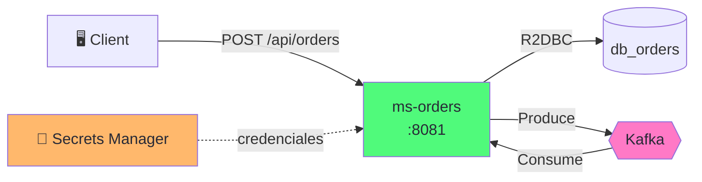
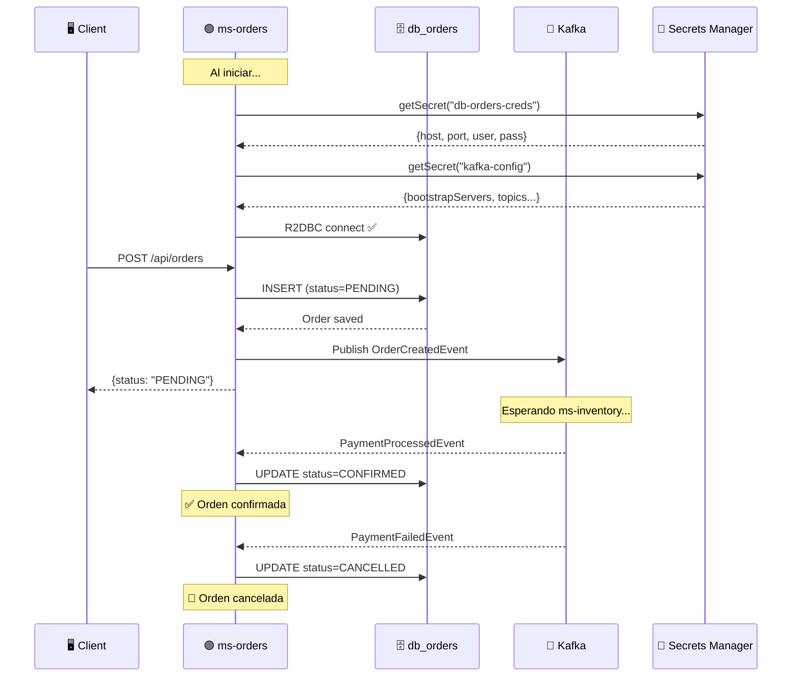

import Tabs from '@theme/Tabs';
import TabItem from '@theme/TabItem';

# Módulo 6: ms-orders — Implementación Completa

:::tip Tiempo estimado
~2 horas
:::

## Objetivo

Convertir el esqueleto de `ms-orders` (Módulo 5) en un microservicio funcional con **persistencia reactiva** (R2DBC), **gestión de secretos** (AWS Secrets Manager) y **mensajería** (Kafka). Este servicio será el **iniciador de la SAGA**.



:::note Rol en la SAGA
`ms-orders` actúa como el **iniciador**: crea la orden con estado `PENDING`, publica `OrderCreatedEvent`, y espera los eventos de resultado (`PaymentProcessedEvent` o `PaymentFailedEvent`) para confirmar o cancelar.
:::

## 6.1 Prerequisitos

1. ✅ El ms-orders del **Módulo 5** está funcionando con healthcheck
2. ✅ La infraestructura está corriendo (`docker compose ps`)
3. ✅ Los secretos del **Módulo 3** están creados en Secrets Manager

## 6.2 Agregar adaptadores con el Scaffold

Desde la carpeta `ms-orders/`:

```bash
# Adaptador de Secrets Manager (lee credenciales de AWS)
./gradlew gda --type secrets --secrets-backend aws_secrets_manager

# Adaptador R2DBC (persistencia reactiva con PostgreSQL)
./gradlew gda --type r2dbc
```

:::caution Eliminar los tests autogenerados
Cada `gda` genera tests que fallarán con nuestras personalizaciones:

```bash
find . -path "*/src/test/*" -name "*.java" -delete
```
:::

## 6.3 Definir los eventos de la SAGA

Estos records representan el **contrato de comunicación** entre todos los microservicios. Los definimos en el dominio de ms-orders y los duplicaremos en los otros servicios.

```java title="domain/model/src/main/java/co/com/arka/orders/model/events/OrderCreatedEvent.java"
package co.com.arka.orders.model.events;

public record OrderCreatedEvent(
    String orderId,
    String sku,
    Integer quantity,
    Double amount
) {}
```

```java title="domain/model/src/main/java/co/com/arka/orders/model/events/StockReservedEvent.java"
package co.com.arka.orders.model.events;

public record StockReservedEvent(String orderId, String sku) {}
```

```java title="domain/model/src/main/java/co/com/arka/orders/model/events/StockReserveFailedEvent.java"
package co.com.arka.orders.model.events;

public record StockReserveFailedEvent(String orderId, String reason) {}
```

```java title="domain/model/src/main/java/co/com/arka/orders/model/events/PaymentProcessedEvent.java"
package co.com.arka.orders.model.events;

public record PaymentProcessedEvent(String orderId) {}
```

```java title="domain/model/src/main/java/co/com/arka/orders/model/events/PaymentFailedEvent.java"
package co.com.arka.orders.model.events;

public record PaymentFailedEvent(String orderId, String reason) {}
```

```java title="domain/model/src/main/java/co/com/arka/orders/model/events/OrderConfirmedEvent.java"
package co.com.arka.orders.model.events;

public record OrderConfirmedEvent(String orderId) {}
```

```java title="domain/model/src/main/java/co/com/arka/orders/model/events/OrderCancelledEvent.java"
package co.com.arka.orders.model.events;

public record OrderCancelledEvent(String orderId, String reason) {}
```

## 6.4 Modelo de Dominio — Order

```java title="domain/model/src/main/java/co/com/arka/orders/model/order/Order.java"
package co.com.arka.orders.model.order;

import lombok.AllArgsConstructor;
import lombok.Builder;
import lombok.Data;
import lombok.NoArgsConstructor;

@Data
@Builder
@NoArgsConstructor
@AllArgsConstructor
public class Order {
    private String id;
    private String customerId;
    private String sku;
    private Integer quantity;
    private Double unitPrice;
    private Double totalAmount;
    @Builder.Default
    private String status = "PENDING";
}
```

### Puerto del Repositorio

```java title="domain/model/src/main/java/co/com/arka/orders/model/order/gateways/OrderRepository.java"
package co.com.arka.orders.model.order.gateways;

import co.com.arka.orders.model.order.Order;
import reactor.core.publisher.Flux;
import reactor.core.publisher.Mono;

public interface OrderRepository {
    Mono<Order> save(Order order);
    Mono<Order> findById(String id);
    Flux<Order> findAll();
}
```

### Puerto del Publicador de Eventos

```java title="domain/model/src/main/java/co/com/arka/orders/model/order/gateways/OrderEventPublisher.java"
package co.com.arka.orders.model.order.gateways;

import co.com.arka.orders.model.events.OrderCreatedEvent;
import reactor.core.publisher.Mono;

public interface OrderEventPublisher {
    Mono<Void> publishOrderCreated(OrderCreatedEvent event);
}
```

## 6.5 Modelo del secreto — BrokerSecret

Reutilizamos el mismo patrón del Módulo 4 para leer la configuración de Kafka:

```java title="domain/model/src/main/java/co/com/arka/orders/model/brokersecret/BrokerSecret.java"
package co.com.arka.orders.model.brokersecret;

import lombok.AllArgsConstructor;
import lombok.Builder;
import lombok.Data;
import lombok.NoArgsConstructor;

@Data
@Builder
@NoArgsConstructor
@AllArgsConstructor
public class BrokerSecret {
    private String bootstrapServers;
    private String groupId;
    private String autoOffsetReset;
    private Topics topics;
    
    @Data
    @NoArgsConstructor
    @AllArgsConstructor
    public static class Topics {
        private String orderCreated;
        private String stockReserved;
        private String stockReleased;
        private String stockFailed;
        private String paymentProcessed;
        private String paymentFailed;
        private String orderConfirmed;
        private String orderCancelled;
    }
}
```

## 6.6 Caso de Uso — OrderUseCase

```java title="domain/usecase/src/main/java/co/com/arka/orders/usecase/order/OrderUseCase.java"
package co.com.arka.orders.usecase.order;

import co.com.arka.orders.model.events.OrderCreatedEvent;
import co.com.arka.orders.model.order.Order;
import co.com.arka.orders.model.order.gateways.OrderEventPublisher;
import co.com.arka.orders.model.order.gateways.OrderRepository;
import lombok.RequiredArgsConstructor;
import reactor.core.publisher.Flux;
import reactor.core.publisher.Mono;

@RequiredArgsConstructor
public class OrderUseCase {

    private final OrderRepository orderRepository;
    private final OrderEventPublisher eventPublisher;

    // highlight-start
    public Mono<Order> createOrder(Order order) {
        order.setStatus("PENDING");
        order.setTotalAmount(order.getUnitPrice() * order.getQuantity());
        return orderRepository.save(order)
            .flatMap(saved -> {
                var event = new OrderCreatedEvent(
                    saved.getId(), saved.getSku(),
                    saved.getQuantity(), saved.getTotalAmount()
                );
                return eventPublisher.publishOrderCreated(event)
                    .thenReturn(saved);
            });
    }
    // highlight-end

    public Mono<Order> confirmOrder(String orderId) {
        return orderRepository.findById(orderId)
            .flatMap(order -> {
                order.setStatus("CONFIRMED");
                return orderRepository.save(order);
            });
    }

    public Mono<Order> cancelOrder(String orderId, String reason) {
        return orderRepository.findById(orderId)
            .flatMap(order -> {
                order.setStatus("CANCELLED");
                return orderRepository.save(order);
            });
    }

    public Mono<Order> getOrder(String id) {
        return orderRepository.findById(id);
    }

    public Flux<Order> getAllOrders() {
        return orderRepository.findAll();
    }
}
```

:::info Patrón Outbox Simplificado
`createOrder()` guarda en BD y publica a Kafka en secuencia. En producción usarías un **Transactional Outbox** para garantizar atomicidad. Para el lab, asumimos que la infraestructura es confiable.
:::

## 6.7 Infraestructura — Secrets Manager Config

Mismo patrón que la POC del Módulo 4:

```java title="applications/app-service/src/main/java/co/com/arka/orders/config/SecretsConfig.java"
package co.com.arka.orders.config;

import co.com.bancolombia.commons.secretsmanager.connector.clients.connector.AWSSecretManagerConnectorAsync;
import co.com.bancolombia.commons.secretsmanager.manager.GenericManagerAsync;
import co.com.arka.orders.model.brokersecret.BrokerSecret;
import co.com.arka.orders.r2dbc.config.PostgresqlConnectionProperties;
import org.springframework.beans.factory.annotation.Value;
import org.springframework.context.annotation.Bean;
import org.springframework.context.annotation.Configuration;
import org.springframework.context.annotation.Profile;
import software.amazon.awssdk.auth.credentials.DefaultCredentialsProvider;
import software.amazon.awssdk.regions.Region;

import java.net.URI;

@Configuration
public class SecretsConfig {

    @Value("${aws.endpoint}")
    private String awsEndpoint;

    @Value("${aws.region}")
    private String awsRegion;

    @Value("${aws.secrets.db-name}")
    private String dbSecretName;

    @Value("${aws.secrets.kafka-name}")
    private String kafkaSecretName;

    private GenericManagerAsync manager() {
        return new GenericManagerAsync(
            new AWSSecretManagerConnectorAsync(
                Region.of(awsRegion),
                URI.create(awsEndpoint),
                DefaultCredentialsProvider.create()
            )
        );
    }

    @Bean
    public PostgresqlConnectionProperties postgresqlConnectionProperties() {
        return manager().getSecret(dbSecretName, PostgresqlConnectionProperties.class).block();
    }

    @Bean
    public BrokerSecret brokerSecret() {
        return manager().getSecret(kafkaSecretName, BrokerSecret.class).block();
    }
}
```

## 6.8 Infraestructura — R2DBC (Persistencia)

### Entidad

```java title="infrastructure/driven-adapters/r2dbc-postgresql/src/main/java/co/com/arka/orders/r2dbc/entity/OrderData.java"
package co.com.arka.orders.r2dbc.entity;

import lombok.AllArgsConstructor;
import lombok.Builder;
import lombok.Data;
import lombok.NoArgsConstructor;
import org.springframework.data.annotation.Id;
import org.springframework.data.relational.core.mapping.Table;

@Data
@Builder
@NoArgsConstructor
@AllArgsConstructor
@Table("orders")
public class OrderData {
    @Id
    private String id;
    private String customerId;
    private String sku;
    private Integer quantity;
    private Double unitPrice;
    private Double totalAmount;
    private String status;
}
```

### Repository

```java title="infrastructure/driven-adapters/r2dbc-postgresql/src/main/java/co/com/arka/orders/r2dbc/OrderReactiveRepository.java"
package co.com.arka.orders.r2dbc;

import co.com.arka.orders.r2dbc.entity.OrderData;
import org.springframework.data.repository.reactive.ReactiveCrudRepository;

public interface OrderReactiveRepository extends ReactiveCrudRepository<OrderData, String> {
}
```

### Adapter

```java title="infrastructure/driven-adapters/r2dbc-postgresql/src/main/java/co/com/arka/orders/r2dbc/OrderReactiveRepositoryAdapter.java"
package co.com.arka.orders.r2dbc;

import co.com.arka.orders.model.order.Order;
import co.com.arka.orders.model.order.gateways.OrderRepository;
import co.com.arka.orders.r2dbc.entity.OrderData;
import co.com.arka.orders.r2dbc.helper.ReactiveAdapterOperations;
import org.reactivecommons.utils.ObjectMapper;
import org.springframework.stereotype.Repository;
import reactor.core.publisher.Flux;
import reactor.core.publisher.Mono;

@Repository
public class OrderReactiveRepositoryAdapter 
    extends ReactiveAdapterOperations<Order, OrderData, String, OrderReactiveRepository> 
    implements OrderRepository {

    public OrderReactiveRepositoryAdapter(
            OrderReactiveRepository repository, ObjectMapper mapper) {
        super(repository, mapper, d -> mapper.map(d, Order.class));
    }

    @Override
    public Mono<Order> save(Order order) {
        return super.save(order);
    }

    @Override
    public Mono<Order> findById(String id) {
        return super.findById(id);
    }

    @Override
    public Flux<Order> findAll() {
        return repository.findAll()
            .map(data -> mapper.map(data, Order.class));
    }
}
```

### Connection Pool (Secrets Manager → R2DBC)

```java title="infrastructure/driven-adapters/r2dbc-postgresql/src/main/java/co/com/arka/orders/r2dbc/config/PostgreSQLConnectionPool.java"
package co.com.arka.orders.r2dbc.config;

import io.r2dbc.pool.ConnectionPool;
import io.r2dbc.pool.ConnectionPoolConfiguration;
import io.r2dbc.postgresql.PostgresqlConnectionConfiguration;
import io.r2dbc.postgresql.PostgresqlConnectionFactory;
import org.springframework.context.annotation.Bean;
import org.springframework.context.annotation.Configuration;

@Configuration
public class PostgreSQLConnectionPool {

    @Bean
    public ConnectionPool connectionPool(PostgresqlConnectionProperties props) {
        PostgresqlConnectionConfiguration dbConfig = PostgresqlConnectionConfiguration.builder()
            .host(props.host())
            .port(props.port())
            .database(props.database())
            .username(props.username())
            .password(props.password())
            .build();

        ConnectionPoolConfiguration poolConfig = ConnectionPoolConfiguration.builder()
            .connectionFactory(new PostgresqlConnectionFactory(dbConfig))
            .build();

        return new ConnectionPool(poolConfig);
    }
}
```

:::info Las credenciales vienen de Secrets Manager
`PostgresqlConnectionProperties` se crea en `SecretsConfig` leyendo el secreto `dev/arka/db-orders-creds`. Las credenciales **nunca** aparecen en `application.yaml`.
:::

## 6.9 Infraestructura — Kafka Producer

Agregamos las dependencias de reactor-kafka y configuramos el producer:

### Dependencia

```groovy title="infrastructure/driven-adapters/r2dbc-postgresql/build.gradle (o un módulo nuevo)"
// Agregar en el build.gradle del módulo infrastructure/entry-points/reactive-web
dependencies {
    // ... existing deps
    implementation 'io.projectreactor.kafka:reactor-kafka:1.3.23'
    implementation 'org.apache.kafka:kafka-clients:3.9.0'
    implementation 'com.fasterxml.jackson.core:jackson-databind'
}
```

:::tip Simplificación
Para este lab, agregamos las dependencias de Kafka en el build.gradle del entry-point `reactive-web`. En producción, crearías un módulo driven-adapter separado para Kafka.
:::

### Configuración del Producer

```java title="applications/app-service/src/main/java/co/com/arka/orders/config/KafkaProducerConfig.java"
package co.com.arka.orders.config;

import co.com.arka.orders.model.brokersecret.BrokerSecret;
import org.apache.kafka.clients.producer.ProducerConfig;
import org.apache.kafka.common.serialization.StringSerializer;
import org.springframework.context.annotation.Bean;
import org.springframework.context.annotation.Configuration;
import reactor.kafka.sender.KafkaSender;
import reactor.kafka.sender.SenderOptions;

import java.util.HashMap;
import java.util.Map;

@Configuration
public class KafkaProducerConfig {

    @Bean
    public KafkaSender<String, String> kafkaSender(BrokerSecret brokerSecret) {
        Map<String, Object> props = new HashMap<>();
        props.put(ProducerConfig.BOOTSTRAP_SERVERS_CONFIG, brokerSecret.getBootstrapServers());
        props.put(ProducerConfig.KEY_SERIALIZER_CLASS_CONFIG, StringSerializer.class);
        props.put(ProducerConfig.VALUE_SERIALIZER_CLASS_CONFIG, StringSerializer.class);
        
        SenderOptions<String, String> senderOptions = SenderOptions.create(props);
        return KafkaSender.create(senderOptions);
    }
}
```

### Implementación del Publisher

```java title="infrastructure/entry-points/reactive-web/src/main/java/co/com/arka/orders/api/kafka/OrderKafkaPublisher.java"
package co.com.arka.orders.api.kafka;

import co.com.arka.orders.model.brokersecret.BrokerSecret;
import co.com.arka.orders.model.events.OrderCreatedEvent;
import co.com.arka.orders.model.order.gateways.OrderEventPublisher;
import com.fasterxml.jackson.core.JsonProcessingException;
import com.fasterxml.jackson.databind.ObjectMapper;
import lombok.RequiredArgsConstructor;
import lombok.extern.slf4j.Slf4j;
import org.apache.kafka.clients.producer.ProducerRecord;
import org.springframework.stereotype.Component;
import reactor.core.publisher.Mono;
import reactor.kafka.sender.KafkaSender;
import reactor.kafka.sender.SenderRecord;

@Slf4j
@Component
@RequiredArgsConstructor
public class OrderKafkaPublisher implements OrderEventPublisher {

    private final KafkaSender<String, String> kafkaSender;
    private final BrokerSecret brokerSecret;
    private final ObjectMapper objectMapper;

    @Override
    public Mono<Void> publishOrderCreated(OrderCreatedEvent event) {
        String topic = brokerSecret.getTopics().getOrderCreated();
        return sendEvent(topic, event.orderId(), event);
    }

    private <T> Mono<Void> sendEvent(String topic, String key, T event) {
        try {
            String json = objectMapper.writeValueAsString(event);
            ProducerRecord<String, String> record = new ProducerRecord<>(topic, key, json);
            return kafkaSender.send(Mono.just(SenderRecord.create(record, key)))
                .doOnNext(r -> log.info("✅ Evento publicado en [{}]: key={}", topic, key))
                .then();
        } catch (JsonProcessingException e) {
            return Mono.error(e);
        }
    }
}
```

## 6.10 Infraestructura — Kafka Consumer

El consumer escucha los eventos de resultado de la SAGA:

### Configuración del Consumer

```java title="applications/app-service/src/main/java/co/com/arka/orders/config/KafkaConsumerConfig.java"
package co.com.arka.orders.config;

import co.com.arka.orders.model.brokersecret.BrokerSecret;
import org.apache.kafka.clients.consumer.ConsumerConfig;
import org.apache.kafka.common.serialization.StringDeserializer;
import org.springframework.context.annotation.Bean;
import org.springframework.context.annotation.Configuration;
import reactor.kafka.receiver.KafkaReceiver;
import reactor.kafka.receiver.ReceiverOptions;

import java.util.HashMap;
import java.util.List;
import java.util.Map;

@Configuration
public class KafkaConsumerConfig {

    @Bean
    public KafkaReceiver<String, String> kafkaReceiver(BrokerSecret brokerSecret) {
        Map<String, Object> props = new HashMap<>();
        props.put(ConsumerConfig.BOOTSTRAP_SERVERS_CONFIG, brokerSecret.getBootstrapServers());
        props.put(ConsumerConfig.GROUP_ID_CONFIG, "orders-group");
        props.put(ConsumerConfig.AUTO_OFFSET_RESET_CONFIG, brokerSecret.getAutoOffsetReset());
        props.put(ConsumerConfig.KEY_DESERIALIZER_CLASS_CONFIG, StringDeserializer.class);
        props.put(ConsumerConfig.VALUE_DESERIALIZER_CLASS_CONFIG, StringDeserializer.class);

        ReceiverOptions<String, String> options = ReceiverOptions.<String, String>create(props)
            .subscription(List.of(
                brokerSecret.getTopics().getPaymentProcessed(),
                brokerSecret.getTopics().getPaymentFailed(),
                brokerSecret.getTopics().getStockFailed()
            ));

        return KafkaReceiver.create(options);
    }
}
```

### Listener de eventos

```java title="applications/app-service/src/main/java/co/com/arka/orders/config/OrderSagaListener.java"
package co.com.arka.orders.config;

import co.com.arka.orders.model.brokersecret.BrokerSecret;
import co.com.arka.orders.model.events.PaymentFailedEvent;
import co.com.arka.orders.model.events.PaymentProcessedEvent;
import co.com.arka.orders.model.events.StockReserveFailedEvent;
import co.com.arka.orders.usecase.order.OrderUseCase;
import com.fasterxml.jackson.databind.ObjectMapper;
import jakarta.annotation.PostConstruct;
import lombok.RequiredArgsConstructor;
import lombok.extern.slf4j.Slf4j;
import org.springframework.stereotype.Component;
import reactor.kafka.receiver.KafkaReceiver;

@Slf4j
@Component
@RequiredArgsConstructor
public class OrderSagaListener {

    private final KafkaReceiver<String, String> kafkaReceiver;
    private final OrderUseCase orderUseCase;
    private final BrokerSecret brokerSecret;
    private final ObjectMapper objectMapper;

    @PostConstruct
    public void startListening() {
        kafkaReceiver.receive()
            .doOnNext(record -> {
                String topic = record.topic();
                String value = record.value();
                log.info("📨 Evento recibido de [{}]: {}", topic, value);

                try {
                    if (topic.equals(brokerSecret.getTopics().getPaymentProcessed())) {
                        var event = objectMapper.readValue(value, PaymentProcessedEvent.class);
                        orderUseCase.confirmOrder(event.orderId())
                            .doOnSuccess(o -> log.info("✅ Orden {} CONFIRMADA", o.getId()))
                            .subscribe();
                    } else if (topic.equals(brokerSecret.getTopics().getPaymentFailed())) {
                        var event = objectMapper.readValue(value, PaymentFailedEvent.class);
                        orderUseCase.cancelOrder(event.orderId(), event.reason())
                            .doOnSuccess(o -> log.info("🚫 Orden {} CANCELADA: {}", o.getId(), event.reason()))
                            .subscribe();
                    } else if (topic.equals(brokerSecret.getTopics().getStockFailed())) {
                        var event = objectMapper.readValue(value, StockReserveFailedEvent.class);
                        orderUseCase.cancelOrder(event.orderId(), event.reason())
                            .doOnSuccess(o -> log.info("🚫 Orden {} CANCELADA (sin stock): {}", o.getId(), event.reason()))
                            .subscribe();
                    }
                } catch (Exception e) {
                    log.error("Error procesando evento: {}", e.getMessage());
                }

                record.receiverOffset().acknowledge();
            })
            .subscribe();
    }
}
```

## 6.11 Entry Point — REST API

Actualiza el handler y router del Módulo 5:

### Handler actualizado

```java title="infrastructure/entry-points/reactive-web/src/main/java/co/com/arka/orders/api/Handler.java"
package co.com.arka.orders.api;

import co.com.arka.orders.model.order.Order;
import co.com.arka.orders.usecase.order.OrderUseCase;
import lombok.RequiredArgsConstructor;
import org.springframework.stereotype.Component;
import org.springframework.web.reactive.function.server.ServerRequest;
import org.springframework.web.reactive.function.server.ServerResponse;
import reactor.core.publisher.Mono;

import java.time.LocalDateTime;
import java.util.Map;

@Component
@RequiredArgsConstructor
public class Handler {

    private final OrderUseCase orderUseCase;

    public Mono<ServerResponse> healthCheck(ServerRequest request) {
        return ServerResponse.ok().bodyValue(Map.of(
                "service", "ms-orders",
                "status", "UP",
                "timestamp", LocalDateTime.now().toString()
        ));
    }

    public Mono<ServerResponse> createOrder(ServerRequest request) {
        return request.bodyToMono(Order.class)
            .flatMap(orderUseCase::createOrder)
            .flatMap(order -> ServerResponse.ok().bodyValue(order));
    }

    public Mono<ServerResponse> getOrder(ServerRequest request) {
        String id = request.pathVariable("id");
        return orderUseCase.getOrder(id)
            .flatMap(order -> ServerResponse.ok().bodyValue(order))
            .switchIfEmpty(ServerResponse.notFound().build());
    }

    public Mono<ServerResponse> getAllOrders(ServerRequest request) {
        return ServerResponse.ok().body(orderUseCase.getAllOrders(), Order.class);
    }
}
```

### Router actualizado

```java title="infrastructure/entry-points/reactive-web/src/main/java/co/com/arka/orders/api/RouterRest.java"
package co.com.arka.orders.api;

import org.springframework.context.annotation.Bean;
import org.springframework.context.annotation.Configuration;
import org.springframework.web.reactive.function.server.RouterFunction;
import org.springframework.web.reactive.function.server.ServerResponse;

import static org.springframework.web.reactive.function.server.RequestPredicates.*;
import static org.springframework.web.reactive.function.server.RouterFunctions.route;

@Configuration
public class RouterRest {
    @Bean
    public RouterFunction<ServerResponse> routerFunction(Handler handler) {
        return route(GET("/api/health"), handler::healthCheck)
            .andRoute(POST("/api/orders"), handler::createOrder)
            .andRoute(GET("/api/orders/{id}"), handler::getOrder)
            .andRoute(GET("/api/orders"), handler::getAllOrders);
    }
}
```

## 6.12 Configurar los beans — UseCasesConfig

```java title="applications/app-service/src/main/java/co/com/arka/orders/config/UseCasesConfig.java"
package co.com.arka.orders.config;

import co.com.arka.orders.model.order.gateways.OrderEventPublisher;
import co.com.arka.orders.model.order.gateways.OrderRepository;
import co.com.arka.orders.usecase.order.OrderUseCase;
import org.springframework.context.annotation.Bean;
import org.springframework.context.annotation.Configuration;

@Configuration
public class UseCasesConfig {

    @Bean
    public OrderUseCase orderUseCase(OrderRepository repository, OrderEventPublisher publisher) {
        return new OrderUseCase(repository, publisher);
    }
}
```

## 6.13 Configurar `application.yaml`

```yaml title="applications/app-service/src/main/resources/application.yaml"
server:
  port: ${MS_ORDERS_PORT:8081}

spring:
  application:
    name: "MsOrders"
  devtools:
    add-properties: false

# ── AWS / LocalStack ──
aws:
  endpoint: "http://${LOCALSTACK_HOST:localhost}:${LOCALSTACK_PORT:4566}"
  region: "${AWS_REGION:us-east-1}"
  secrets:
    db-name: "dev/arka/db-orders-creds"
    kafka-name: "dev/arka/kafka-config"

management:
  endpoints:
    web:
      exposure:
        include: "health,prometheus"
  endpoint:
    health:
      probes:
        enabled: true

cors:
  allowed-origins: "http://localhost:4200,http://localhost:8080"
```

## 6.14 Reconstruir y Probar

```bash
# Desde la raíz de arka-lab/
docker compose up -d --build ms-orders
```

Espera a que esté `healthy`:

```bash
docker compose ps
docker logs arka-ms-orders --tail 50
```

### Probar el healthcheck

```bash
curl http://localhost:8081/api/health | python3 -m json.tool
```

### Crear una orden

```bash
curl -X POST http://localhost:8081/api/orders \
  -H "Content-Type: application/json" \
  -d '{
    "customerId": "cust-001",
    "sku": "GPU-RTX4090",
    "quantity": 1,
    "unitPrice": 1599.99
  }' | python3 -m json.tool
```

**Respuesta esperada:**

```json
{
  "id": "...",
  "customerId": "cust-001",
  "sku": "GPU-RTX4090",
  "quantity": 1,
  "unitPrice": 1599.99,
  "totalAmount": 1599.99,
  "status": "PENDING"
}
```

:::warning La orden queda en PENDING
Es **correcto** que la orden quede en `PENDING`. Aún no existe `ms-inventory` para procesar el evento `OrderCreatedEvent`. La orden será confirmada o cancelada cuando implementemos los otros microservicios en los módulos siguientes.
:::

### Verificar en KafkaUI

Abre [http://localhost:8080](http://localhost:8080) y busca el topic `order-created`. Deberías ver el mensaje publicado.

### Obtener la orden creada

```bash
curl http://localhost:8081/api/orders/{id} | python3 -m json.tool
```

## 6.15 ¿Qué acabamos de construir?



:::info Checkpoint — ¿Todo funciona?
- [ ] ¿`docker compose ps` muestra `arka-ms-orders` healthy?
- [ ] ¿`POST /api/orders` retorna status `PENDING`?
- [ ] ¿KafkaUI muestra el evento en el topic `order-created`?
- [ ] ¿`GET /api/orders/{id}` retorna la orden creada?
:::

---

**Siguiente:** [Módulo 7: ms-inventory — Stock Reservation & Compensación](./ms-inventory-implementacion)
