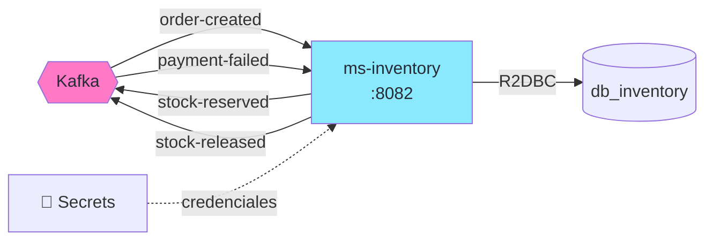
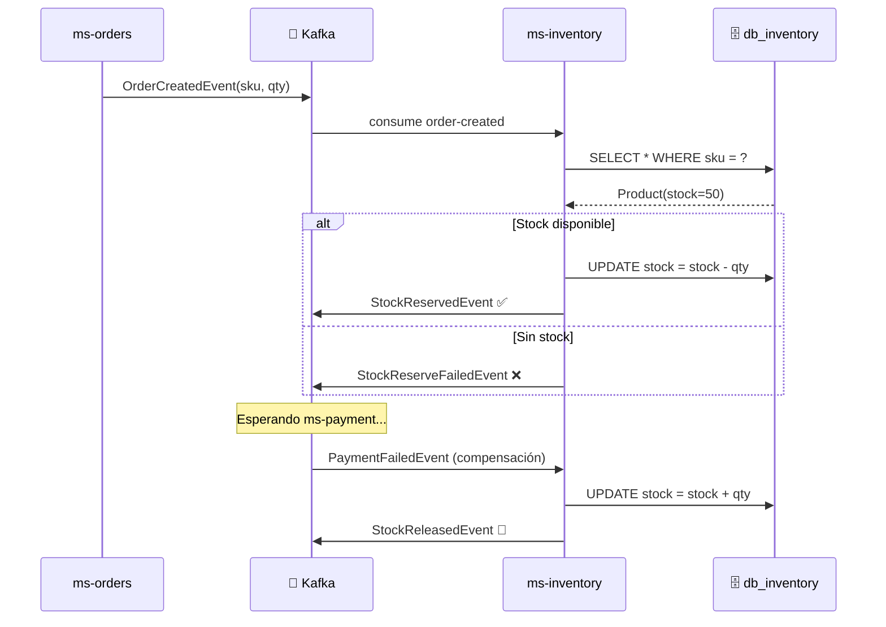

import Tabs from '@theme/Tabs';
import TabItem from '@theme/TabItem';

# Módulo 7: ms-inventory — Reserva de Stock & Compensación

:::tip Tiempo estimado
~2 horas
:::

## Objetivo

Crear `ms-inventory` desde cero — el **participante principal** de la SAGA. Este servicio escucha `OrderCreatedEvent`, **reserva stock**, y ejecuta la **compensación** si el pago falla.



:::note Rol en la SAGA
`ms-inventory` tiene **dos responsabilidades**:
1. **Happy path**: Recibir `OrderCreatedEvent` → reservar stock → publicar `StockReservedEvent`
2. **Compensación**: Recibir `PaymentFailedEvent` → devolver stock → publicar `StockReleasedEvent`
:::

## 7.1 Crear el proyecto con Scaffold

```bash
# Desde la raíz de arka-lab/
mkdir ms-inventory && cd ms-inventory
```

```groovy title="ms-inventory/build.gradle"
plugins {
    id 'co.com.bancolombia.cleanArchitecture' version '4.1.0'
}
```

```bash
gradle wrapper

./gradlew ca \
  --package=co.com.arka.inventory \
  --type=reactive \
  --name=MsInventory \
  --lombok=true \
  --java-version=21

# Entry point + Driven adapters
./gradlew gep --type webflux
./gradlew gda --type secrets --secrets-backend aws_secrets_manager
./gradlew gda --type r2dbc

# Eliminar tests autogenerados
find . -path "*/src/test/*" -name "*.java" -delete
```

## 7.2 Actualizar `.env`

Agrega las variables de ms-inventory al `.env`:

```bash title=".env (agregar)"
MS_INVENTORY_PORT=8082
MS_INVENTORY_HOST=arka-ms-inventory
```

## 7.3 Definir los eventos de la SAGA

Duplicamos los records necesarios en ms-inventory:

```java title="domain/model/src/main/java/co/com/arka/inventory/model/events/OrderCreatedEvent.java"
package co.com.arka.inventory.model.events;

public record OrderCreatedEvent(
    String orderId,
    String sku,
    Integer quantity,
    Double amount
) {}
```

```java title="domain/model/src/main/java/co/com/arka/inventory/model/events/StockReservedEvent.java"
package co.com.arka.inventory.model.events;

public record StockReservedEvent(String orderId, String sku, Integer quantity) {}
```

```java title="domain/model/src/main/java/co/com/arka/inventory/model/events/StockReserveFailedEvent.java"
package co.com.arka.inventory.model.events;

public record StockReserveFailedEvent(String orderId, String reason) {}
```

```java title="domain/model/src/main/java/co/com/arka/inventory/model/events/StockReleasedEvent.java"
package co.com.arka.inventory.model.events;

public record StockReleasedEvent(String orderId, String sku, Integer quantity) {}
```

```java title="domain/model/src/main/java/co/com/arka/inventory/model/events/PaymentFailedEvent.java"
package co.com.arka.inventory.model.events;

public record PaymentFailedEvent(String orderId, String reason) {}
```

## 7.4 Modelo de Dominio — Product

```java title="domain/model/src/main/java/co/com/arka/inventory/model/product/Product.java"
package co.com.arka.inventory.model.product;

import lombok.AllArgsConstructor;
import lombok.Builder;
import lombok.Data;
import lombok.NoArgsConstructor;

import java.math.BigDecimal;

@Data
@Builder
@NoArgsConstructor
@AllArgsConstructor
public class Product {
    private Long id;
    private String sku;
    private String name;
    private BigDecimal price;
    private Integer stock;
    private String category;

    // highlight-start
    public Product reserveStock(int quantity) {
        if (this.stock < quantity) {
            throw new IllegalStateException(
                String.format("Stock insuficiente para SKU %s: disponible=%d, solicitado=%d",
                    sku, stock, quantity));
        }
        this.stock -= quantity;
        return this;
    }
    // highlight-end

    public Product releaseStock(int quantity) {
        this.stock += quantity;
        return this;
    }

    public boolean hasAvailableStock(int quantity) {
        return this.stock >= quantity;
    }
}
```

:::warning Regla de Negocio Crítica
`reserveStock()` **nunca permite stock negativo**. La BD tiene `CHECK (stock >= 0)` como segunda línea de defensa.
:::

### Puerto del Repositorio

```java title="domain/model/src/main/java/co/com/arka/inventory/model/product/gateways/ProductRepository.java"
package co.com.arka.inventory.model.product.gateways;

import co.com.arka.inventory.model.product.Product;
import reactor.core.publisher.Flux;
import reactor.core.publisher.Mono;

public interface ProductRepository {
    Mono<Product> save(Product product);
    Mono<Product> findBySku(String sku);
    Mono<Product> findById(Long id);
    Flux<Product> findAll();
}
```

### BrokerSecret (mismo patrón)

```java title="domain/model/src/main/java/co/com/arka/inventory/model/brokersecret/BrokerSecret.java"
package co.com.arka.inventory.model.brokersecret;

import lombok.*;

@Data @Builder @NoArgsConstructor @AllArgsConstructor
public class BrokerSecret {
    private String bootstrapServers;
    private String groupId;
    private String autoOffsetReset;
    private Topics topics;

    @Data @NoArgsConstructor @AllArgsConstructor
    public static class Topics {
        private String orderCreated;
        private String stockReserved;
        private String stockReleased;
        private String stockFailed;
        private String paymentProcessed;
        private String paymentFailed;
        private String orderConfirmed;
        private String orderCancelled;
    }
}
```

## 7.5 Caso de Uso — InventoryUseCase

```java title="domain/usecase/src/main/java/co/com/arka/inventory/usecase/product/InventoryUseCase.java"
package co.com.arka.inventory.usecase.product;

import co.com.arka.inventory.model.product.Product;
import co.com.arka.inventory.model.product.gateways.ProductRepository;
import lombok.RequiredArgsConstructor;
import lombok.extern.slf4j.Slf4j;
import reactor.core.publisher.Flux;
import reactor.core.publisher.Mono;

@Slf4j
@RequiredArgsConstructor
public class InventoryUseCase {

    private final ProductRepository productRepository;

    // highlight-start
    public Mono<Product> reserveStock(String sku, int quantity) {
        return productRepository.findBySku(sku)
            .switchIfEmpty(Mono.error(
                new IllegalArgumentException("Producto no encontrado: " + sku)))
            .map(product -> product.reserveStock(quantity))
            .flatMap(productRepository::save)
            .doOnSuccess(p -> log.info("📦 Stock reservado: SKU={}, restante={}", sku, p.getStock()));
    }

    public Mono<Product> releaseStock(String sku, int quantity) {
        return productRepository.findBySku(sku)
            .switchIfEmpty(Mono.error(
                new IllegalArgumentException("Producto no encontrado: " + sku)))
            .map(product -> product.releaseStock(quantity))
            .flatMap(productRepository::save)
            .doOnSuccess(p -> log.info("🔄 Stock liberado: SKU={}, restante={}", sku, p.getStock()));
    }
    // highlight-end

    public Mono<Product> getProduct(String sku) {
        return productRepository.findBySku(sku);
    }

    public Flux<Product> getAllProducts() {
        return productRepository.findAll();
    }
}
```

## 7.6 Infraestructura — Secrets + R2DBC

Misma estructura que ms-orders:

### SecretsConfig

```java title="applications/app-service/src/main/java/co/com/arka/inventory/config/SecretsConfig.java"
package co.com.arka.inventory.config;

import co.com.bancolombia.commons.secretsmanager.connector.clients.connector.AWSSecretManagerConnectorAsync;
import co.com.bancolombia.commons.secretsmanager.manager.GenericManagerAsync;
import co.com.arka.inventory.model.brokersecret.BrokerSecret;
import co.com.arka.inventory.r2dbc.config.PostgresqlConnectionProperties;
import org.springframework.beans.factory.annotation.Value;
import org.springframework.context.annotation.Bean;
import org.springframework.context.annotation.Configuration;
import software.amazon.awssdk.auth.credentials.DefaultCredentialsProvider;
import software.amazon.awssdk.regions.Region;

import java.net.URI;

@Configuration
public class SecretsConfig {

    @Value("${aws.endpoint}") private String awsEndpoint;
    @Value("${aws.region}") private String awsRegion;
    @Value("${aws.secrets.db-name}") private String dbSecretName;
    @Value("${aws.secrets.kafka-name}") private String kafkaSecretName;

    private GenericManagerAsync manager() {
        return new GenericManagerAsync(
            new AWSSecretManagerConnectorAsync(
                Region.of(awsRegion),
                URI.create(awsEndpoint),
                DefaultCredentialsProvider.create()
            )
        );
    }

    @Bean
    public PostgresqlConnectionProperties postgresqlConnectionProperties() {
        return manager().getSecret(dbSecretName, PostgresqlConnectionProperties.class).block();
    }

    @Bean
    public BrokerSecret brokerSecret() {
        return manager().getSecret(kafkaSecretName, BrokerSecret.class).block();
    }
}
```

### Entidad R2DBC

```java title="infrastructure/driven-adapters/r2dbc-postgresql/src/main/java/co/com/arka/inventory/r2dbc/entity/ProductData.java"
package co.com.arka.inventory.r2dbc.entity;

import lombok.*;
import org.springframework.data.annotation.Id;
import org.springframework.data.relational.core.mapping.Table;
import java.math.BigDecimal;

@Data @Builder @NoArgsConstructor @AllArgsConstructor
@Table("products")
public class ProductData {
    @Id
    private Long id;
    private String sku;
    private String name;
    private BigDecimal price;
    private Integer stock;
    private String category;
}
```

### Repositorio + Adapter

```java title="infrastructure/driven-adapters/r2dbc-postgresql/src/main/java/co/com/arka/inventory/r2dbc/ProductReactiveRepository.java"
package co.com.arka.inventory.r2dbc;

import co.com.arka.inventory.r2dbc.entity.ProductData;
import org.springframework.data.repository.reactive.ReactiveCrudRepository;
import reactor.core.publisher.Mono;

public interface ProductReactiveRepository extends ReactiveCrudRepository<ProductData, Long> {
    Mono<ProductData> findBySku(String sku);
}
```

```java title="infrastructure/driven-adapters/r2dbc-postgresql/src/main/java/co/com/arka/inventory/r2dbc/ProductReactiveRepositoryAdapter.java"
package co.com.arka.inventory.r2dbc;

import co.com.arka.inventory.model.product.Product;
import co.com.arka.inventory.model.product.gateways.ProductRepository;
import co.com.arka.inventory.r2dbc.entity.ProductData;
import co.com.arka.inventory.r2dbc.helper.ReactiveAdapterOperations;
import org.reactivecommons.utils.ObjectMapper;
import org.springframework.stereotype.Repository;
import reactor.core.publisher.Flux;
import reactor.core.publisher.Mono;

@Repository
public class ProductReactiveRepositoryAdapter 
    extends ReactiveAdapterOperations<Product, ProductData, Long, ProductReactiveRepository>
    implements ProductRepository {

    public ProductReactiveRepositoryAdapter(
            ProductReactiveRepository repository, ObjectMapper mapper) {
        super(repository, mapper, d -> mapper.map(d, Product.class));
    }

    @Override
    public Mono<Product> findBySku(String sku) {
        return repository.findBySku(sku)
            .map(data -> mapper.map(data, Product.class));
    }

    @Override
    public Flux<Product> findAll() {
        return repository.findAll()
            .map(data -> mapper.map(data, Product.class));
    }
}
```

### PostgreSQL Connection Pool

```java title="infrastructure/driven-adapters/r2dbc-postgresql/src/main/java/co/com/arka/inventory/r2dbc/config/PostgreSQLConnectionPool.java"
package co.com.arka.inventory.r2dbc.config;

import io.r2dbc.pool.ConnectionPool;
import io.r2dbc.pool.ConnectionPoolConfiguration;
import io.r2dbc.postgresql.PostgresqlConnectionConfiguration;
import io.r2dbc.postgresql.PostgresqlConnectionFactory;
import org.springframework.context.annotation.Bean;
import org.springframework.context.annotation.Configuration;

@Configuration
public class PostgreSQLConnectionPool {

    @Bean
    public ConnectionPool connectionPool(PostgresqlConnectionProperties props) {
        PostgresqlConnectionConfiguration dbConfig = PostgresqlConnectionConfiguration.builder()
            .host(props.host())
            .port(props.port())
            .database(props.database())
            .username(props.username())
            .password(props.password())
            .build();

        return new ConnectionPool(
            ConnectionPoolConfiguration.builder()
                .connectionFactory(new PostgresqlConnectionFactory(dbConfig))
                .build()
        );
    }
}
```

## 7.7 Infraestructura — Kafka (Consumer + Producer)

### Kafka Producer Config

```java title="applications/app-service/src/main/java/co/com/arka/inventory/config/KafkaProducerConfig.java"
package co.com.arka.inventory.config;

import co.com.arka.inventory.model.brokersecret.BrokerSecret;
import org.apache.kafka.clients.producer.ProducerConfig;
import org.apache.kafka.common.serialization.StringSerializer;
import org.springframework.context.annotation.Bean;
import org.springframework.context.annotation.Configuration;
import reactor.kafka.sender.KafkaSender;
import reactor.kafka.sender.SenderOptions;

import java.util.HashMap;
import java.util.Map;

@Configuration
public class KafkaProducerConfig {

    @Bean
    public KafkaSender<String, String> kafkaSender(BrokerSecret brokerSecret) {
        Map<String, Object> props = new HashMap<>();
        props.put(ProducerConfig.BOOTSTRAP_SERVERS_CONFIG, brokerSecret.getBootstrapServers());
        props.put(ProducerConfig.KEY_SERIALIZER_CLASS_CONFIG, StringSerializer.class);
        props.put(ProducerConfig.VALUE_SERIALIZER_CLASS_CONFIG, StringSerializer.class);
        return KafkaSender.create(SenderOptions.create(props));
    }
}
```

### Kafka Consumer Config

```java title="applications/app-service/src/main/java/co/com/arka/inventory/config/KafkaConsumerConfig.java"
package co.com.arka.inventory.config;

import co.com.arka.inventory.model.brokersecret.BrokerSecret;
import org.apache.kafka.clients.consumer.ConsumerConfig;
import org.apache.kafka.common.serialization.StringDeserializer;
import org.springframework.context.annotation.Bean;
import org.springframework.context.annotation.Configuration;
import reactor.kafka.receiver.KafkaReceiver;
import reactor.kafka.receiver.ReceiverOptions;

import java.util.HashMap;
import java.util.List;
import java.util.Map;

@Configuration
public class KafkaConsumerConfig {

    @Bean
    public KafkaReceiver<String, String> kafkaReceiver(BrokerSecret brokerSecret) {
        Map<String, Object> props = new HashMap<>();
        props.put(ConsumerConfig.BOOTSTRAP_SERVERS_CONFIG, brokerSecret.getBootstrapServers());
        props.put(ConsumerConfig.GROUP_ID_CONFIG, "inventory-group");
        props.put(ConsumerConfig.AUTO_OFFSET_RESET_CONFIG, brokerSecret.getAutoOffsetReset());
        props.put(ConsumerConfig.KEY_DESERIALIZER_CLASS_CONFIG, StringDeserializer.class);
        props.put(ConsumerConfig.VALUE_DESERIALIZER_CLASS_CONFIG, StringDeserializer.class);

        ReceiverOptions<String, String> options = ReceiverOptions.<String, String>create(props)
            .subscription(List.of(
                brokerSecret.getTopics().getOrderCreated(),
                brokerSecret.getTopics().getPaymentFailed()
            ));

        return KafkaReceiver.create(options);
    }
}
```

### SAGA Listener — El corazón de la compensación

```java title="applications/app-service/src/main/java/co/com/arka/inventory/config/InventorySagaListener.java"
package co.com.arka.inventory.config;

import co.com.arka.inventory.model.brokersecret.BrokerSecret;
import co.com.arka.inventory.model.events.*;
import co.com.arka.inventory.usecase.product.InventoryUseCase;
import com.fasterxml.jackson.databind.ObjectMapper;
import jakarta.annotation.PostConstruct;
import lombok.RequiredArgsConstructor;
import lombok.extern.slf4j.Slf4j;
import org.apache.kafka.clients.producer.ProducerRecord;
import org.springframework.stereotype.Component;
import reactor.core.publisher.Mono;
import reactor.kafka.receiver.KafkaReceiver;
import reactor.kafka.sender.KafkaSender;
import reactor.kafka.sender.SenderRecord;

@Slf4j
@Component
@RequiredArgsConstructor
public class InventorySagaListener {

    private final KafkaReceiver<String, String> kafkaReceiver;
    private final KafkaSender<String, String> kafkaSender;
    private final InventoryUseCase inventoryUseCase;
    private final BrokerSecret brokerSecret;
    private final ObjectMapper objectMapper;

    @PostConstruct
    public void startListening() {
        kafkaReceiver.receive()
            .doOnNext(record -> {
                String topic = record.topic();
                String value = record.value();
                log.info("📨 Evento recibido de [{}]: {}", topic, value);

                try {
                    // highlight-start
                    if (topic.equals(brokerSecret.getTopics().getOrderCreated())) {
                        handleOrderCreated(value);
                    } else if (topic.equals(brokerSecret.getTopics().getPaymentFailed())) {
                        handlePaymentFailed(value);
                    }
                    // highlight-end
                } catch (Exception e) {
                    log.error("❌ Error procesando evento: {}", e.getMessage());
                }

                record.receiverOffset().acknowledge();
            })
            .subscribe();
    }

    // ── Happy Path: Reservar Stock ──
    private void handleOrderCreated(String json) throws Exception {
        var event = objectMapper.readValue(json, OrderCreatedEvent.class);

        inventoryUseCase.reserveStock(event.sku(), event.quantity())
            .flatMap(product -> {
                var reserved = new StockReservedEvent(event.orderId(), event.sku(), event.quantity());
                return sendEvent(brokerSecret.getTopics().getStockReserved(), event.orderId(), reserved);
            })
            .doOnSuccess(v -> log.info("✅ StockReserved publicado para orden {}", event.orderId()))
            .onErrorResume(e -> {
                log.error("❌ No se pudo reservar stock: {}", e.getMessage());
                var failed = new StockReserveFailedEvent(event.orderId(), e.getMessage());
                return sendEvent(brokerSecret.getTopics().getStockFailed(), event.orderId(), failed);
            })
            .subscribe();
    }

    // ── Compensación: Devolver Stock ──
    private void handlePaymentFailed(String json) throws Exception {
        var event = objectMapper.readValue(json, PaymentFailedEvent.class);
        log.info("🔄 Compensación: Devolviendo stock para orden {}", event.orderId());

        // NOTE: En producción, guardaríamos la reserva en una tabla para saber
        // el SKU y cantidad. Para el lab, leemos del OrderCreatedEvent original.
        // Por simplicidad, asumimos que el topic payment-failed incluye los datos.
        // En esta versión simplificada, el SKU y quantity se reconstruyen.
        // TODO: En módulos avanzados, usar tabla de reservas.
    }

    private <T> Mono<Void> sendEvent(String topic, String key, T event) {
        try {
            String jsonValue = objectMapper.writeValueAsString(event);
            var record = new ProducerRecord<>(topic, key, jsonValue);
            return kafkaSender.send(Mono.just(SenderRecord.create(record, key)))
                .doOnNext(r -> log.info("📤 Evento publicado en [{}]: key={}", topic, key))
                .then();
        } catch (Exception e) {
            return Mono.error(e);
        }
    }
}
```

:::info Compensación simplificada
En un sistema real, `ms-inventory` guardaría cada reserva en una tabla `stock_reservations` para saber exactamente qué devolver en la compensación. Para el lab, confiamos en que los eventos contienen la información necesaria.
:::

## 7.8 Entry Point — REST

```java title="infrastructure/entry-points/reactive-web/src/main/java/co/com/arka/inventory/api/Handler.java"
package co.com.arka.inventory.api;

import co.com.arka.inventory.model.product.Product;
import co.com.arka.inventory.usecase.product.InventoryUseCase;
import lombok.RequiredArgsConstructor;
import org.springframework.stereotype.Component;
import org.springframework.web.reactive.function.server.ServerRequest;
import org.springframework.web.reactive.function.server.ServerResponse;
import reactor.core.publisher.Mono;

import java.time.LocalDateTime;
import java.util.Map;

@Component
@RequiredArgsConstructor
public class Handler {

    private final InventoryUseCase inventoryUseCase;

    public Mono<ServerResponse> healthCheck(ServerRequest request) {
        return ServerResponse.ok().bodyValue(Map.of(
                "service", "ms-inventory",
                "status", "UP",
                "timestamp", LocalDateTime.now().toString()
        ));
    }

    public Mono<ServerResponse> getProduct(ServerRequest request) {
        String sku = request.pathVariable("sku");
        return inventoryUseCase.getProduct(sku)
            .flatMap(p -> ServerResponse.ok().bodyValue(p))
            .switchIfEmpty(ServerResponse.notFound().build());
    }

    public Mono<ServerResponse> getAllProducts(ServerRequest request) {
        return ServerResponse.ok().body(inventoryUseCase.getAllProducts(), Product.class);
    }
}
```

```java title="infrastructure/entry-points/reactive-web/src/main/java/co/com/arka/inventory/api/RouterRest.java"
package co.com.arka.inventory.api;

import org.springframework.context.annotation.Bean;
import org.springframework.context.annotation.Configuration;
import org.springframework.web.reactive.function.server.RouterFunction;
import org.springframework.web.reactive.function.server.ServerResponse;

import static org.springframework.web.reactive.function.server.RequestPredicates.GET;
import static org.springframework.web.reactive.function.server.RouterFunctions.route;

@Configuration
public class RouterRest {
    @Bean
    public RouterFunction<ServerResponse> routerFunction(Handler handler) {
        return route(GET("/api/health"), handler::healthCheck)
            .andRoute(GET("/api/products/{sku}"), handler::getProduct)
            .andRoute(GET("/api/products"), handler::getAllProducts);
    }
}
```

## 7.9 Configurar `application.yaml`

```yaml title="applications/app-service/src/main/resources/application.yaml"
server:
  port: ${MS_INVENTORY_PORT:8082}

spring:
  application:
    name: "MsInventory"
  devtools:
    add-properties: false

aws:
  endpoint: "http://${LOCALSTACK_HOST:localhost}:${LOCALSTACK_PORT:4566}"
  region: "${AWS_REGION:us-east-1}"
  secrets:
    db-name: "dev/arka/db-inventory-creds"
    kafka-name: "dev/arka/kafka-config"

management:
  endpoints:
    web:
      exposure:
        include: "health,prometheus"
  endpoint:
    health:
      probes:
        enabled: true
```

## 7.10 Dockerfile

```dockerfile title="ms-inventory/deployment/Dockerfile"
# ── Stage 1: Build ──
FROM gradle:9.2-jdk21 AS builder
VOLUME /tmp
WORKDIR /myapp

COPY applications applications
COPY domain domain
COPY infrastructure infrastructure
COPY *.gradle .
COPY lombok.* .
COPY gradlew.* .
COPY gradle.* .

RUN gradle build -x test --no-daemon

# ── Stage 2: Run ──
FROM eclipse-temurin:21-jre-alpine
VOLUME /tmp
WORKDIR /myapprun
COPY --from=builder /myapp/applications/app-service/build/libs/*.jar MsInventory.jar

RUN apk update && apk add curl

ARG PORT=8082
ENV JAVA_OPTS=" -XX:+UseContainerSupport -XX:MaxRAMPercentage=70 -Djava.security.egd=file:/dev/./urandom"
ENV MS_INVENTORY_PORT=${PORT}
EXPOSE ${MS_INVENTORY_PORT}
ENTRYPOINT ["/bin/sh", "-c", "/opt/java/openjdk/bin/java $JAVA_OPTS -jar MsInventory.jar"]
```

## 7.11 Agregar al Docker Compose

```yaml title="compose.yaml (agregar a services)"
  # ═══════════════════════════════════════════════════
  # MsInventory — Microservicio de Inventario
  # ═══════════════════════════════════════════════════
  ms-inventory:
    build:
      context: ./ms-inventory
      dockerfile: deployment/Dockerfile
      args:
        - PORT=${MS_INVENTORY_PORT}
    container_name: arka-ms-inventory
    ports:
      - "${MS_INVENTORY_PORT}:${MS_INVENTORY_PORT}"
    env_file:
      - .env
    depends_on:
      postgres-inventory:
        condition: service_healthy
      localstack:
        condition: service_healthy
      kafka:
        condition: service_healthy
    healthcheck:
      test: ["CMD", "curl", "-f", "http://localhost:${MS_INVENTORY_PORT}/actuator/health"]
      interval: 15s
      timeout: 5s
      retries: 5
      start_period: 60s
    labels:
      - "traefik.enable=true"
      - "traefik.http.routers.inventory.rule=PathPrefix(`/inventory`)"
      - "traefik.http.services.inventory.loadbalancer.server.port=${MS_INVENTORY_PORT}"
    networks:
      - arka-network
```

:::tip Traefik Labels
Las labels de Traefik permiten el **balanceo de carga automático** cuando escales con `--scale ms-inventory=3`. Traefik detecta las réplicas y distribuye el tráfico Round-Robin.
:::

## 7.12 Construir y Probar

```bash
# Construir
docker compose up -d --build ms-inventory

# Verificar
docker compose ps
docker logs arka-ms-inventory --tail 50
```

### Probar healthcheck

```bash
curl http://localhost:8082/api/health | python3 -m json.tool
```

### Ver productos del seed (del SQL init)

```bash
curl http://localhost:8082/api/products | python3 -m json.tool
```

### Probar el flujo SAGA parcial

Ahora que ms-orders y ms-inventory están corriendo:

```bash
# Crear una orden
curl -X POST http://localhost:8081/api/orders \
  -H "Content-Type: application/json" \
  -d '{
    "customerId": "cust-001",
    "sku": "GPU-RTX4090",
    "quantity": 1,
    "unitPrice": 1599.99
  }' | python3 -m json.tool
```

**Verificar los logs:**

```bash
# ms-orders: publicó OrderCreatedEvent
docker logs arka-ms-orders --tail 10

# ms-inventory: recibió OrderCreatedEvent, reservó stock, publicó StockReservedEvent
docker logs arka-ms-inventory --tail 10
```

**Verificar en KafkaUI** ([http://localhost:8080](http://localhost:8080)):
- Topic `order-created` → mensaje publicado por ms-orders
- Topic `stock-reserved` → mensaje publicado por ms-inventory

:::info La orden sigue en PENDING
Aún falta `ms-payment` para completar la SAGA. Lo implementaremos en el siguiente módulo.
:::

## 7.13 ¿Qué acabamos de construir?



:::info Checkpoint
- [ ] ¿`arka-ms-inventory` está `healthy`?
- [ ] ¿`GET /api/products` retorna los productos del seed?
- [ ] ¿Al crear una orden, KafkaUI muestra `stock-reserved`?
:::

---

**Siguiente:** [Módulo 8: ms-payment — Simulador & Circuit Breaker](./ms-payment-implementacion)
