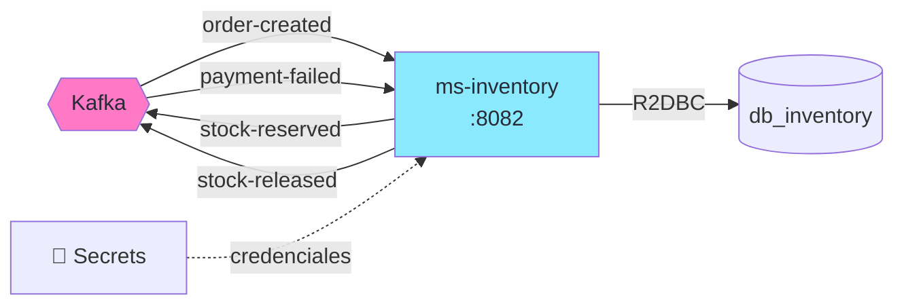

import Tabs from '@theme/Tabs';
import TabItem from '@theme/TabItem';

# Módulo 7: ms-inventory — Reserva de Stock & Compensación

:::tip Tiempo estimado
~2 horas
:::

## Objetivo

Crear `ms-inventory` desde cero — el **participante principal** de la SAGA. Este servicio escucha `OrderCreatedEvent`, **reserva stock**, y ejecuta la **compensación** si el pago falla.



:::note Rol en la SAGA
`ms-inventory` tiene **dos responsabilidades**:
1. **Happy path**: Recibir `OrderCreatedEvent` → reservar stock → publicar `StockReservedEvent`
2. **Compensación**: Recibir `PaymentFailedEvent` → devolver stock → publicar `StockReleasedEvent`
:::

## 7.1 Crear el proyecto con Scaffold

```bash
# Desde la raíz de arka-lab/
mkdir ms-inventory && cd ms-inventory
```

```groovy title="ms-inventory/build.gradle"
plugins {
    id 'co.com.bancolombia.cleanArchitecture' version '4.1.0'
}
```

```bash
gradle wrapper

./gradlew ca \
  --package=co.com.arka.inventory \
  --type=reactive \
  --name=MsInventory \
  --lombok=true \
    --java-version=17

# Entry point + Driven adapters
./gradlew gep --type webflux
./gradlew gda --type secrets --secrets-backend aws_secrets_manager
./gradlew gda --type r2dbc

# Eliminar tests autogenerados
find . -path "*/src/test/*" -name "*.java" -delete
```

## 7.2 Actualizar `.env`

Agrega las variables de ms-inventory al `.env`:

```bash title=".env (agregar)"
MS_INVENTORY_PORT=8082
MS_INVENTORY_HOST=arka-ms-inventory
```

## 7.3 Definir los eventos de la SAGA

Duplicamos los records necesarios en ms-inventory:

```java title="domain/model/src/main/java/co/com/arka/inventory/model/events/OrderCreatedEvent.java"
package co.com.arka.inventory.model.events;

public record OrderCreatedEvent(
        String orderId,
        String sku,
        Integer quantity,
        Double amount) {
}
```

```java title="domain/model/src/main/java/co/com/arka/inventory/model/events/StockReservedEvent.java"
package co.com.arka.inventory.model.events;

public record StockReservedEvent(
        String orderId,
        String sku,
        Integer quantity
) {
}
```

```java title="domain/model/src/main/java/co/com/arka/inventory/model/events/StockReserveFailedEvent.java"
package co.com.arka.inventory.model.events;

public record StockReserveFailedEvent(
        String orderId, String reason
) {
}
```

```java title="domain/model/src/main/java/co/com/arka/inventory/model/events/StockReleasedEvent.java"
package co.com.arka.inventory.model.events;

public record StockReleasedEvent(
        String orderId, String reason
) {
}
```

```java title="domain/model/src/main/java/co/com/arka/inventory/model/events/PaymentFailedEvent.java"
package co.com.arka.inventory.model.events;

public record PaymentFailedEvent(
        String orderId,
        String sku,
        Integer quantity,
        String reason) {
}
```

## 7.4 Modelo de Dominio — Product

```java title="domain/model/src/main/java/co/com/arka/inventory/model/product/Product.java"
package co.com.arka.inventory.model.product;

import lombok.AllArgsConstructor;
import lombok.Builder;
import lombok.Data;
import lombok.NoArgsConstructor;

@Data
@Builder
@NoArgsConstructor
@AllArgsConstructor
public class Product {
    private String id;
    private String sku;
    private String name;
    private Double price;
    private Integer stock;
    private String category;
}
```

:::warning Regla de Negocio Critica
No permitimos stock negativo. La verificacion se hace en el caso de uso y tambien existe un `CHECK (stock >= 0)` en la BD.
:::

### Puerto del Repositorio

```java title="domain/model/src/main/java/co/com/arka/inventory/model/product/gateways/ProductRepository.java"
package co.com.arka.inventory.model.product.gateways;

import co.com.arka.inventory.model.product.Product;
import reactor.core.publisher.Flux;
import reactor.core.publisher.Mono;

public interface ProductRepository {
    Mono<Product> save(Product product);
    Mono<Product> findById(String id);
    Mono<Product> findBySku(String sku);
    Flux<Product> findAll();
}
```

### BrokerSecret (mismo patrón)

```java title="domain/model/src/main/java/co/com/arka/inventory/model/brokersecret/BrokerSecret.java"
package co.com.arka.inventory.model.brokersecret;

import lombok.*;

@Data @Builder @NoArgsConstructor @AllArgsConstructor
public class BrokerSecret {
    private String bootstrapServers;
    private String groupId;
    private String autoOffsetReset;
    private Topics topics;

    @Data @NoArgsConstructor @AllArgsConstructor
    public static class Topics {
        private String orderCreated;
        private String stockReserved;
        private String stockReleased;
        private String stockFailed;
        private String paymentFailed;
        private String orderConfirmed;
        private String orderCancelled;
    }
}
```

## 7.5 Caso de Uso — InventoryUseCase

```java title="domain/usecase/src/main/java/co/com/arka/inventory/usecase/inventory/InventoryUseCase.java"
package co.com.arka.inventory.usecase.inventory;

import co.com.arka.inventory.model.events.OrderCreatedEvent;
import co.com.arka.inventory.model.events.StockReleasedEvent;
import co.com.arka.inventory.model.events.StockReserveFailedEvent;
import co.com.arka.inventory.model.events.StockReservedEvent;
import co.com.arka.inventory.model.events.gateways.EventsGateway;
import co.com.arka.inventory.model.product.Product;
import co.com.arka.inventory.model.product.gateways.ProductRepository;
import lombok.RequiredArgsConstructor;
import lombok.extern.java.Log;
import reactor.core.publisher.Flux;
import reactor.core.publisher.Mono;

import java.util.logging.Level;

@Log
@RequiredArgsConstructor
public class InventoryUseCase {
    private final ProductRepository productRepository;
    private final EventsGateway<StockReservedEvent> stockReservedEventsGateway;
    private final EventsGateway<StockReleasedEvent> stockReleasedEventsGateway;
    private final EventsGateway<StockReserveFailedEvent> stockReserveFailedEventsGateway;

    public Mono<Void> reserveStock(OrderCreatedEvent event) {
        log.log(Level.INFO, "Reserving stock for order: {0}, sku: {1}, qty: {2}",
                new Object[]{event.orderId(), event.sku(), event.quantity()});

        return productRepository.findBySku(event.sku())
                .flatMap(product -> {
                    if (product.getStock() >= event.quantity()) {
                        product.setStock(product.getStock() - event.quantity());
                        return productRepository.save(product)
                                .flatMap(saved -> {
                                    var reserved = new StockReservedEvent(event.orderId(), event.sku(), event.quantity());
                                    log.log(Level.INFO, "Stock reserved successfully for order: {0}", event.orderId());
                                    return stockReservedEventsGateway.emit(reserved);
                                });
                    } else {
                        var failed = new StockReserveFailedEvent(event.orderId(),
                                "Insufficient stock for SKU: " + event.sku()
                                        + ". Available: " + product.getStock()
                                        + ", Requested: " + event.quantity());
                        log.log(Level.WARNING, "Stock reservation failed for order: {0}", event.orderId());
                        return stockReserveFailedEventsGateway.emit(failed);
                    }
                })
                .switchIfEmpty(Mono.defer(() -> {
                    var failed = new StockReserveFailedEvent(event.orderId(),
                            "Product not found for SKU: " + event.sku());
                    log.log(Level.WARNING, "Product not found for SKU: {0}", event.sku());
                    return stockReserveFailedEventsGateway.emit(failed);
                }));
    }

    public Mono<Void> releaseStock(String orderId, String sku, Integer quantity, String reason) {
        if (sku == null || quantity == null || quantity <= 0) {
            log.log(Level.WARNING, "Cannot release stock for order {0}: invalid reservation data (sku={1}, quantity={2})",
                    new Object[]{orderId, sku, quantity});
            var released = new StockReleasedEvent(orderId, reason + " (invalid reservation data)");
            return stockReleasedEventsGateway.emit(released);
        }

        log.log(Level.INFO, "Releasing stock for order: {0}, sku: {1}, qty: {2}",
                new Object[]{orderId, sku, quantity});

        return productRepository.findBySku(sku)
                .flatMap(product -> {
                    product.setStock(product.getStock() + quantity);
                    return productRepository.save(product)
                            .flatMap(saved -> {
                                var released = new StockReleasedEvent(orderId, reason);
                                log.log(Level.INFO, "Stock released for order: {0}", orderId);
                                return stockReleasedEventsGateway.emit(released);
                            });
                })
                .switchIfEmpty(Mono.defer(() -> {
                    log.log(Level.WARNING, "Cannot release stock: product not found for SKU: {0}", sku);
                    var released = new StockReleasedEvent(orderId, reason + " (product not found)");
                    return stockReleasedEventsGateway.emit(released);
                }));
    }


    public Mono<Product> getProduct(String sku) {
        return productRepository.findBySku(sku);
    }

    public Flux<Product> getAllProducts() {
        return productRepository.findAll();
    }
}
```

## 7.6 Infraestructura — Secrets + R2DBC

Misma estructura que ms-orders:

### SecretsConfig

```java title="applications/app-service/src/main/java/co/com/arka/inventory/config/SecretsConfig.java"
package co.com.arka.inventory.config;

import co.com.bancolombia.commons.secretsmanager.connector.clients.connector.AWSSecretManagerConnectorAsync;
import co.com.bancolombia.commons.secretsmanager.manager.GenericManagerAsync;
import co.com.arka.inventory.model.brokersecret.BrokerSecret;
import co.com.arka.inventory.r2dbc.config.PostgresqlConnectionProperties;
import org.springframework.beans.factory.annotation.Value;
import org.springframework.context.annotation.Bean;
import org.springframework.context.annotation.Configuration;
import software.amazon.awssdk.auth.credentials.DefaultCredentialsProvider;
import software.amazon.awssdk.regions.Region;

import java.net.URI;

@Configuration
public class SecretsConfig {

    @Value("${aws.endpoint}") private String awsEndpoint;
    @Value("${aws.region}") private String awsRegion;
    @Value("${aws.secrets.db-name}") private String dbSecretName;
    @Value("${aws.secrets.kafka-name}") private String kafkaSecretName;

    private GenericManagerAsync manager() {
        return new GenericManagerAsync(
            new AWSSecretManagerConnectorAsync(
                Region.of(awsRegion),
                URI.create(awsEndpoint),
                DefaultCredentialsProvider.create()
            )
        );
    }

    @Bean
    public PostgresqlConnectionProperties postgresqlConnectionProperties() {
        return manager().getSecret(dbSecretName, PostgresqlConnectionProperties.class).block();
    }

    @Bean
    public BrokerSecret brokerSecret() {
        return manager().getSecret(kafkaSecretName, BrokerSecret.class).block();
    }
}
```

### Entidad R2DBC

```java title="infrastructure/driven-adapters/r2dbc-postgresql/src/main/java/co/com/arka/inventory/r2dbc/entity/ProductData.java"
package co.com.arka.inventory.r2dbc.entity;

import lombok.*;
import org.springframework.data.annotation.Id;
import org.springframework.data.relational.core.mapping.Table;

@Data @Builder @NoArgsConstructor @AllArgsConstructor
@Table("products")
public class ProductData {
    @Id
    private String id;
    private String sku;
    private String name;
    private Double price;
    private Integer stock;
    private String category;
}
```

### Repositorio + Adapter

```java title="infrastructure/driven-adapters/r2dbc-postgresql/src/main/java/co/com/arka/inventory/r2dbc/ProductReactiveRepository.java"
package co.com.arka.inventory.r2dbc;

import co.com.arka.inventory.r2dbc.entity.ProductData;
import org.springframework.data.repository.query.ReactiveQueryByExampleExecutor;
import org.springframework.data.repository.reactive.ReactiveCrudRepository;
import reactor.core.publisher.Mono;

public interface ProductReactiveRepository extends ReactiveCrudRepository<ProductData, String>, ReactiveQueryByExampleExecutor<ProductData> {
    Mono<ProductData> findBySku(String sku);
}
```

```java title="infrastructure/driven-adapters/r2dbc-postgresql/src/main/java/co/com/arka/inventory/r2dbc/ProductReactiveRepositoryAdapter.java"
package co.com.arka.inventory.r2dbc;

import co.com.arka.inventory.model.product.Product;
import co.com.arka.inventory.model.product.gateways.ProductRepository;
import co.com.arka.inventory.r2dbc.entity.ProductData;
import co.com.arka.inventory.r2dbc.helper.ReactiveAdapterOperations;
import org.reactivecommons.utils.ObjectMapper;
import org.springframework.stereotype.Repository;
import reactor.core.publisher.Mono;

@Repository
public class ProductReactiveRepositoryAdapter extends ReactiveAdapterOperations<
    Product,
    ProductData,
    String,
    ProductReactiveRepository
> implements ProductRepository {

    public ProductReactiveRepositoryAdapter(ProductReactiveRepository repository, ObjectMapper mapper) {
        /**
         *  Could be use mapper.mapBuilder if your domain model implement builder pattern
         *  super(repository, mapper, d -> mapper.mapBuilder(d,ObjectModel.ObjectModelBuilder.class).build());
         *  Or using mapper.map with the class of the object model
         */
        super(repository, mapper, d -> mapper.map(d, Product.class));
    }

    @Override
    public Mono<Product> findBySku(String sku) {
        return repository.findBySku(sku).map(this::toEntity);
    }
}
```

### PostgreSQL Connection Pool

```java title="infrastructure/driven-adapters/r2dbc-postgresql/src/main/java/co/com/arka/inventory/r2dbc/config/PostgreSQLConnectionPool.java"
package co.com.arka.inventory.r2dbc.config;

import io.r2dbc.pool.ConnectionPool;
import io.r2dbc.pool.ConnectionPoolConfiguration;
import io.r2dbc.postgresql.PostgresqlConnectionConfiguration;
import io.r2dbc.postgresql.PostgresqlConnectionFactory;
import org.springframework.context.annotation.Bean;
import org.springframework.context.annotation.Configuration;

import java.time.Duration;

@Configuration
public class PostgreSQLConnectionPool {
    public static final int INITIAL_SIZE = 12;
    public static final int MAX_SIZE = 15;
    public static final int MAX_IDLE_TIME = 30;

    @Bean
    public ConnectionPool connectionPool(PostgresqlConnectionProperties props) {
        PostgresqlConnectionConfiguration dbConfig = PostgresqlConnectionConfiguration.builder()
            .host(props.host())
            .port(props.port())
            .database(props.database())
            .username(props.username())
            .password(props.password())
            .build();

        ConnectionPoolConfiguration poolConfiguration = ConnectionPoolConfiguration.builder()
            .connectionFactory(new PostgresqlConnectionFactory(dbConfig))
            .name("api-postgres-connection-pool")
            .initialSize(INITIAL_SIZE)
            .maxSize(MAX_SIZE)
            .maxIdleTime(Duration.ofMinutes(MAX_IDLE_TIME))
            .validationQuery("SELECT 1")
            .build();

        return new ConnectionPool(poolConfiguration);
    }
}
```

## 7.7 Consumo de eventos (async-event-handler)

En este lab no configuramos consumers manuales. Usamos **Reactive Commons** para consumir eventos desde Kafka.

```java title="infrastructure/entry-points/async-event-handler/src/main/java/co/com/arka/inventory/events/handlers/EventsHandler.java"
package co.com.arka.inventory.events.handlers;

import co.com.arka.inventory.model.events.OrderCreatedEvent;
import co.com.arka.inventory.model.events.PaymentFailedEvent;
import co.com.arka.inventory.usecase.inventory.InventoryUseCase;
import lombok.RequiredArgsConstructor;
import org.reactivecommons.async.impl.config.annotations.EnableEventListeners;
import reactor.core.publisher.Mono;
import lombok.extern.java.Log;

import java.util.Optional;
import java.util.logging.Level;
import io.cloudevents.CloudEvent;
import tools.jackson.databind.ObjectMapper;

@Log
@RequiredArgsConstructor
@EnableEventListeners
public class EventsHandler {
    private final InventoryUseCase inventoryUseCase;
    private final ObjectMapper objectMapper;

    public Mono<Void> handleOrderCreatedEvent(CloudEvent event) {
        Optional<OrderCreatedEvent> orderCreatedEvent = deserialize(event, OrderCreatedEvent.class);

        return Mono.justOrEmpty(orderCreatedEvent)
                .doOnNext(e -> log.log(Level.INFO, "Event received: {0} -> {1}", new Object[]{event.getType(), e}))
                .flatMap(inventoryUseCase::reserveStock)
                .doOnSuccess(v -> log.info("Stock reservation processed for event: " + event.getId()))
                .then();
    }

    public Mono<Void> handlePaymentFailedEvent(CloudEvent event) {
        Optional<PaymentFailedEvent> paymentFailedEvent = deserialize(event, PaymentFailedEvent.class);

        return Mono.justOrEmpty(paymentFailedEvent)
                .doOnNext(e -> log.log(Level.INFO, "Event received: {0} -> {1}", new Object[]{event.getType(), e}))
                .flatMap(e -> inventoryUseCase.releaseStock(e.orderId(), e.sku(), e.quantity(), e.reason()))
                .then();
    }


    private <T> Optional<T> deserialize(CloudEvent event, Class<T> clazz) {
        if (event == null || event.getData() == null) {
            log.warning("Received event with empty data");
            return Optional.empty();
        }

        try {
            return Optional.of(objectMapper.readValue(event.getData().toBytes(), clazz));
        } catch (Exception e) {
            log.log(Level.SEVERE, "Failed to deserialize event data to " + clazz.getSimpleName(), e);
            throw new RuntimeException("Failed to map event data", e);
        }
    }
}
```

```java title="infrastructure/entry-points/async-event-handler/src/main/java/co/com/arka/inventory/events/HandlerRegistryConfiguration.java"
package co.com.arka.inventory.events;
import co.com.arka.inventory.events.config.KafkaBrokerSecretConsumer;
import co.com.arka.inventory.events.handlers.EventsHandler;
import lombok.RequiredArgsConstructor;
import org.reactivecommons.async.api.HandlerRegistry;
import org.springframework.context.annotation.Bean;
import org.springframework.context.annotation.Configuration;

@Configuration
@RequiredArgsConstructor
public class HandlerRegistryConfiguration {
    private final KafkaBrokerSecretConsumer kafkaBrokerSecretConsumer;

    // see more at: https://reactivecommons.org/reactive-commons-java/#_handlerregistry_2
    @Bean
    public HandlerRegistry handlerRegistry(EventsHandler events) {
         return HandlerRegistry.register()
                 .listenCloudEvent(kafkaBrokerSecretConsumer.topics().orderCreated(), events::handleOrderCreatedEvent)
                 .listenCloudEvent(kafkaBrokerSecretConsumer.topics().paymentFailed(), events::handlePaymentFailedEvent);
    }
}
```

## 7.8 Entry Point — REST

```java title="infrastructure/entry-points/reactive-web/src/main/java/co/com/arka/inventory/api/Handler.java"
package co.com.arka.inventory.api;

import co.com.arka.inventory.model.product.Product;
import co.com.arka.inventory.usecase.product.InventoryUseCase;
import lombok.RequiredArgsConstructor;
import org.springframework.stereotype.Component;
import org.springframework.web.reactive.function.server.ServerRequest;
import org.springframework.web.reactive.function.server.ServerResponse;
import reactor.core.publisher.Mono;

import java.time.LocalDateTime;
import java.util.Map;

@Component
@RequiredArgsConstructor
public class Handler {

    private final InventoryUseCase inventoryUseCase;

    public Mono<ServerResponse> healthCheck(ServerRequest request) {
        return ServerResponse.ok().bodyValue(Map.of(
                "service", "ms-inventory",
                "status", "UP",
                "timestamp", LocalDateTime.now().toString()
        ));
    }

    public Mono<ServerResponse> getProduct(ServerRequest request) {
        String sku = request.pathVariable("sku");
        return inventoryUseCase.getProduct(sku)
            .flatMap(p -> ServerResponse.ok().bodyValue(p))
            .switchIfEmpty(ServerResponse.notFound().build());
    }

    public Mono<ServerResponse> getAllProducts(ServerRequest request) {
        return ServerResponse.ok().body(inventoryUseCase.getAllProducts(), Product.class);
    }
}
```

```java title="infrastructure/entry-points/reactive-web/src/main/java/co/com/arka/inventory/api/RouterRest.java"
package co.com.arka.inventory.api;

import org.springframework.context.annotation.Bean;
import org.springframework.context.annotation.Configuration;
import org.springframework.web.reactive.function.server.RouterFunction;
import org.springframework.web.reactive.function.server.ServerResponse;

import static org.springframework.web.reactive.function.server.RequestPredicates.GET;
import static org.springframework.web.reactive.function.server.RouterFunctions.route;

@Configuration
public class RouterRest {
    @Bean
    public RouterFunction<ServerResponse> routerFunction(Handler handler) {
        return route(GET("/api/health"), handler::healthCheck)
            .andRoute(GET("/api/products/{sku}"), handler::getProduct)
            .andRoute(GET("/api/products"), handler::getAllProducts);
    }
}
```

## 7.9 Configurar `application.yaml`

```yaml title="applications/app-service/src/main/resources/application.yaml"
server:
  port: ${MS_INVENTORY_PORT:8082}
spring:
  application:
    name: "MsInventory"
  devtools:
    add-properties: false
  h2:
    console:
      enabled: true
      path: "/h2"
  profiles:
    include: null
  kafka:
    bootstrap-servers: "${KAFKA_BOOTSTRAP_SERVERS:localhost:9092}"
management:
  endpoints:
    web:
      exposure:
        include: "health,prometheus"
  endpoint:
    health:
      probes:
        enabled: true
cors:
  allowed-origins: "http://localhost:4200,http://localhost:8080"
aws:
  endpoint: "http://${LOCALSTACK_HOST:localhost}:${LOCALSTACK_PORT:4566}"
  region: "${AWS_REGION:us-east-1}"
  secrets:
    db-name: "dev/arka/db-inventory-creds"
    kafka-name: "dev/arka/kafka-config"
reactive:
  commons:
    kafka:
      app:
        connectionProperties:
          bootstrap-servers: "${KAFKA_BOOTSTRAP_SERVERS:localhost:9092}"
```

## 7.10 Dockerfile

```dockerfile title="ms-inventory/deployment/Dockerfile"
# ── Stage 1: Build ──
FROM gradle:9.2-jdk21 AS builder
VOLUME /tmp
WORKDIR /myapp

COPY applications applications
COPY domain domain
COPY infrastructure infrastructure
COPY *.gradle .
COPY lombok.* .
COPY gradlew.* .
COPY gradle.* .

RUN gradle build -x test --no-daemon

# ── Stage 2: Run ──
FROM eclipse-temurin:21-jre-alpine
VOLUME /tmp
WORKDIR /myapprun
COPY --from=builder /myapp/applications/app-service/build/libs/*.jar MsInventory.jar

RUN apk update && apk add curl

ARG PORT=8082
ENV JAVA_OPTS=" -XX:+UseContainerSupport -XX:MaxRAMPercentage=70 -Djava.security.egd=file:/dev/./urandom"
ENV MS_INVENTORY_PORT=${PORT}
EXPOSE ${MS_INVENTORY_PORT}
ENTRYPOINT ["/bin/sh", "-c", "/opt/java/openjdk/bin/java $JAVA_OPTS -jar MsInventory.jar"]
```

## 7.11 Agregar al Docker Compose

```yaml title="compose.yaml (agregar a services)"
  # ═══════════════════════════════════════════════════
  # MsInventory — Microservicio de Inventario
  # ═══════════════════════════════════════════════════
  ms-inventory:
    build:
      context: ./ms-inventory
      dockerfile: deployment/Dockerfile
      args:
        - PORT=${MS_INVENTORY_PORT}
    container_name: arka-ms-inventory
    ports:
      - "8082-8085:${MS_INVENTORY_PORT}"
    env_file:
      - .env
    depends_on:
      postgres-inventory:
        condition: service_healthy
      localstack:
        condition: service_healthy
      kafka:
        condition: service_healthy
    healthcheck:
      test: ["CMD", "curl", "-f", "http://localhost:${MS_INVENTORY_PORT}/actuator/health"]
      interval: 15s
      timeout: 5s
      retries: 5
      start_period: 60s
    labels:
      - "traefik.enable=true"
      - "traefik.http.routers.inventory.rule=PathPrefix(`/inventory`)"
      - "traefik.http.middlewares.inventory-stripprefix.stripprefix.prefixes=/inventory"
      - "traefik.http.routers.inventory.middlewares=inventory-stripprefix"
      - "traefik.http.services.inventory.loadbalancer.server.port=${MS_INVENTORY_PORT}"
    networks:
      - arka-network
```

:::tip Traefik Labels
Las labels de Traefik permiten el **balanceo de carga automático** cuando escales con `--scale ms-inventory=3`. Traefik detecta las réplicas y distribuye el tráfico Round-Robin.
:::

## 7.12 Construir y Probar

```bash
# Construir
docker compose up -d --build ms-inventory

# Verificar
docker compose ps
docker logs arka-ms-inventory --tail 50
```

### Probar healthcheck

```bash
curl http://localhost:8082/api/health | python3 -m json.tool
```

### Ver productos del seed (del SQL init)

```bash
curl http://localhost:8082/api/products | python3 -m json.tool
```

### Probar el flujo SAGA parcial

Ahora que ms-orders y ms-inventory están corriendo:

```bash
# Crear una orden
curl -X POST http://localhost:8081/api/orders \
  -H "Content-Type: application/json" \
  -d '{
    "customerId": "cust-001",
    "sku": "GPU-RTX4090",
    "quantity": 1,
    "unitPrice": 1599.99
  }' | python3 -m json.tool
```

**Verificar los logs:**

```bash
# ms-orders: publicó OrderCreatedEvent
docker logs arka-ms-orders --tail 10

# ms-inventory: recibió OrderCreatedEvent, reservó stock, publicó StockReservedEvent
docker logs arka-ms-inventory --tail 10
```

**Verificar en KafkaUI** ([http://localhost:8080](http://localhost:8080)):
- Topic `order-created` → mensaje publicado por ms-orders
- Topic `stock-reserved` → mensaje publicado por ms-inventory

:::info La orden sigue en PENDING
Aún falta `ms-payment` para completar la SAGA. Lo implementaremos en el siguiente módulo.
:::

## 7.13 ¿Qué acabamos de construir?


:::info Checkpoint
- [ ] ¿`arka-ms-inventory` está `healthy`?
- [ ] ¿`GET /api/products` retorna los productos del seed?
- [ ] ¿Al crear una orden, KafkaUI muestra `stock-reserved`?
:::

---

**Siguiente:** [Módulo 8: ms-payment — Simulador HTTP](./ms-payment-implementacion)
