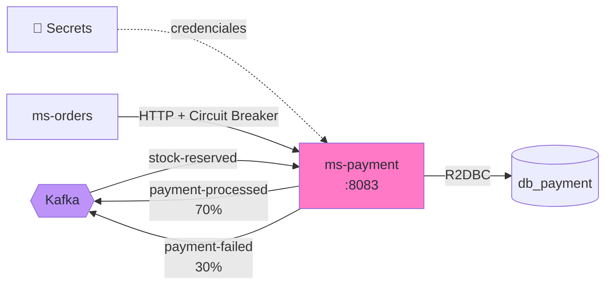
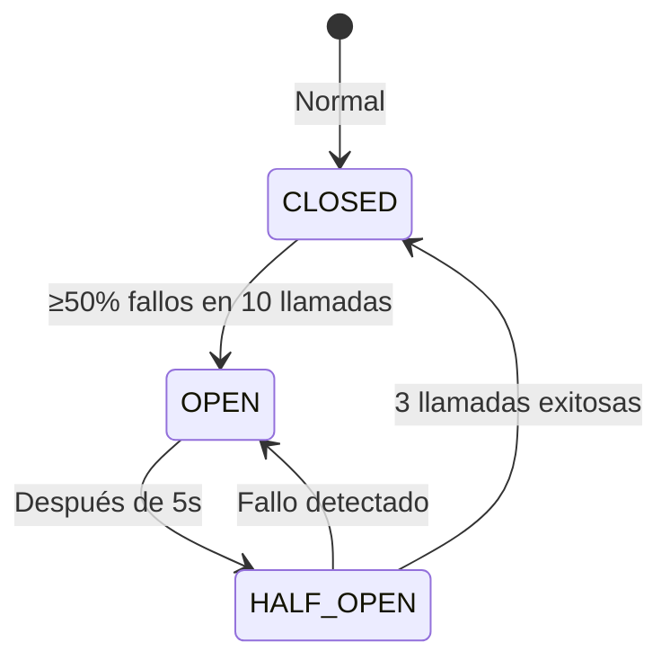
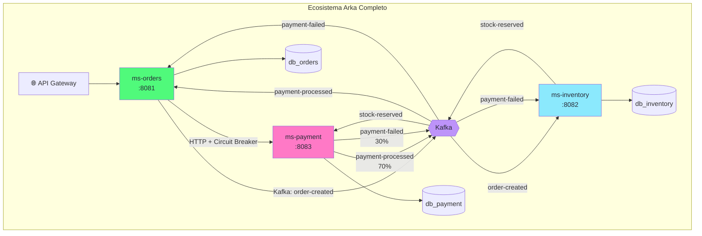

import Tabs from '@theme/Tabs';
import TabItem from '@theme/TabItem';

# Módulo 8: ms-payment — Simulador & Circuit Breaker

:::tip Tiempo estimado
~1.5 horas
:::

## Objetivo

Crear `ms-payment` — un **simulador** que aprueba el 70% de los pagos y rechaza el 30%, desencadenando la **compensación** de la SAGA. Además, implementaremos un **Circuit Breaker** (Resilience4j) en ms-orders para proteger llamadas HTTP síncronas.



## 8.1 Crear el proyecto con Scaffold

```bash
# Desde la raíz de arka-lab/
mkdir ms-payment && cd ms-payment
```

```groovy title="ms-payment/build.gradle"
plugins {
    id 'co.com.bancolombia.cleanArchitecture' version '4.1.0'
}
```

```bash
gradle wrapper

./gradlew ca \
  --package=co.com.arka.payment \
  --type=reactive \
  --name=MsPayment \
  --lombok=true \
  --java-version=21

./gradlew gep --type webflux
./gradlew gda --type secrets --secrets-backend aws_secrets_manager
./gradlew gda --type r2dbc

find . -path "*/src/test/*" -name "*.java" -delete
```

### Actualizar `.env`

```bash title=".env (agregar)"
MS_PAYMENT_PORT=8083
MS_PAYMENT_HOST=arka-ms-payment
```

## 8.2 Eventos duplicados

Solo necesitamos los eventos que ms-payment consume y publica:

```java title="domain/model/src/main/java/co/com/arka/payment/model/events/StockReservedEvent.java"
package co.com.arka.payment.model.events;

public record StockReservedEvent(String orderId, String sku, Integer quantity) {}
```

```java title="domain/model/src/main/java/co/com/arka/payment/model/events/PaymentProcessedEvent.java"
package co.com.arka.payment.model.events;

public record PaymentProcessedEvent(String orderId, Double amount) {}
```

```java title="domain/model/src/main/java/co/com/arka/payment/model/events/PaymentFailedEvent.java"
package co.com.arka.payment.model.events;

public record PaymentFailedEvent(String orderId, String reason) {}
```

## 8.3 Modelo de Dominio — Payment

```java title="domain/model/src/main/java/co/com/arka/payment/model/payment/Payment.java"
package co.com.arka.payment.model.payment;

import lombok.*;

@Data @Builder @NoArgsConstructor @AllArgsConstructor
public class Payment {
    private String id;
    private String orderId;
    private Double amount;
    private String status; // APPROVED, REJECTED
    private String reason;
}
```

### BrokerSecret

```java title="domain/model/src/main/java/co/com/arka/payment/model/brokersecret/BrokerSecret.java"
package co.com.arka.payment.model.brokersecret;

import lombok.*;

@Data @Builder @NoArgsConstructor @AllArgsConstructor
public class BrokerSecret {
    private String bootstrapServers;
    private String groupId;
    private String autoOffsetReset;
    private Topics topics;

    @Data @NoArgsConstructor @AllArgsConstructor
    public static class Topics {
        private String orderCreated;
        private String stockReserved;
        private String stockReleased;
        private String stockFailed;
        private String paymentProcessed;
        private String paymentFailed;
        private String orderConfirmed;
        private String orderCancelled;
    }
}
```

## 8.4 Infraestructura — Secrets + R2DBC

:::info Mismo patrón
La configuración de `SecretsConfig`, `PostgreSQLConnectionPool`, `OrderData` → `PaymentData`, y los adapters siguen exactamente el mismo patrón que ms-orders y ms-inventory. Solo cambiamos el package (`co.com.arka.payment`) y el secreto (`dev/arka/db-payment-creds`).
:::

### SecretsConfig

```java title="applications/app-service/src/main/java/co/com/arka/payment/config/SecretsConfig.java"
package co.com.arka.payment.config;

import co.com.bancolombia.commons.secretsmanager.connector.clients.connector.AWSSecretManagerConnectorAsync;
import co.com.bancolombia.commons.secretsmanager.manager.GenericManagerAsync;
import co.com.arka.payment.model.brokersecret.BrokerSecret;
import co.com.arka.payment.r2dbc.config.PostgresqlConnectionProperties;
import org.springframework.beans.factory.annotation.Value;
import org.springframework.context.annotation.Bean;
import org.springframework.context.annotation.Configuration;
import software.amazon.awssdk.auth.credentials.DefaultCredentialsProvider;
import software.amazon.awssdk.regions.Region;

import java.net.URI;

@Configuration
public class SecretsConfig {

    @Value("${aws.endpoint}") private String awsEndpoint;
    @Value("${aws.region}") private String awsRegion;
    @Value("${aws.secrets.db-name}") private String dbSecretName;
    @Value("${aws.secrets.kafka-name}") private String kafkaSecretName;

    private GenericManagerAsync manager() {
        return new GenericManagerAsync(
            new AWSSecretManagerConnectorAsync(
                Region.of(awsRegion),
                URI.create(awsEndpoint),
                DefaultCredentialsProvider.create()
            )
        );
    }

    @Bean
    public PostgresqlConnectionProperties postgresqlConnectionProperties() {
        return manager().getSecret(dbSecretName, PostgresqlConnectionProperties.class).block();
    }

    @Bean
    public BrokerSecret brokerSecret() {
        return manager().getSecret(kafkaSecretName, BrokerSecret.class).block();
    }
}
```

## 8.5 SAGA Listener — El Simulador

Este es el corazón del simulador: escucha `StockReservedEvent` y decide aleatoriamente si el pago se aprueba o se rechaza.

```java title="applications/app-service/src/main/java/co/com/arka/payment/config/PaymentSagaListener.java"
package co.com.arka.payment.config;

import co.com.arka.payment.model.brokersecret.BrokerSecret;
import co.com.arka.payment.model.events.*;
import com.fasterxml.jackson.databind.ObjectMapper;
import jakarta.annotation.PostConstruct;
import lombok.RequiredArgsConstructor;
import lombok.extern.slf4j.Slf4j;
import org.apache.kafka.clients.producer.ProducerRecord;
import org.springframework.stereotype.Component;
import reactor.core.publisher.Mono;
import reactor.kafka.receiver.KafkaReceiver;
import reactor.kafka.sender.KafkaSender;
import reactor.kafka.sender.SenderRecord;

import java.time.Duration;

@Slf4j
@Component
@RequiredArgsConstructor
public class PaymentSagaListener {

    private final KafkaReceiver<String, String> kafkaReceiver;
    private final KafkaSender<String, String> kafkaSender;
    private final BrokerSecret brokerSecret;
    private final ObjectMapper objectMapper;

    @PostConstruct
    public void startListening() {
        kafkaReceiver.receive()
            .doOnNext(record -> {
                try {
                    var event = objectMapper.readValue(record.value(), StockReservedEvent.class);
                    log.info("📨 StockReserved recibido para orden {}", event.orderId());

                    // highlight-start
                    // Simular latencia de procesamiento
                    Mono.delay(Duration.ofMillis(500))
                        .flatMap(i -> {
                            if (Math.random() > 0.3) {
                                // ✅ 70% Éxito
                                log.info("✅ Pago APROBADO para orden {}", event.orderId());
                                var processed = new PaymentProcessedEvent(event.orderId(), 0.0);
                                return sendEvent(
                                    brokerSecret.getTopics().getPaymentProcessed(),
                                    event.orderId(), processed
                                );
                            } else {
                                // ❌ 30% Fallo
                                log.info("❌ Pago RECHAZADO para orden {}", event.orderId());
                                var failed = new PaymentFailedEvent(
                                    event.orderId(), "Fondos insuficientes (simulado)"
                                );
                                return sendEvent(
                                    brokerSecret.getTopics().getPaymentFailed(),
                                    event.orderId(), failed
                                );
                            }
                        })
                        .subscribe();
                    // highlight-end
                } catch (Exception e) {
                    log.error("❌ Error procesando evento: {}", e.getMessage());
                }

                record.receiverOffset().acknowledge();
            })
            .subscribe();
    }

    private <T> Mono<Void> sendEvent(String topic, String key, T event) {
        try {
            String json = objectMapper.writeValueAsString(event);
            var record = new ProducerRecord<>(topic, key, json);
            return kafkaSender.send(Mono.just(SenderRecord.create(record, key)))
                .doOnNext(r -> log.info("📤 Evento publicado en [{}]", topic))
                .then();
        } catch (Exception e) {
            return Mono.error(e);
        }
    }
}
```

:::warning 70/30 Simulación
El `Math.random() > 0.3` hace que el 70% de los pagos sean exitosos y el 30% fallen. Esto permite probar tanto el **happy path** como la **compensación** haciendo múltiples requests.
:::

### Kafka Configs

```java title="applications/app-service/src/main/java/co/com/arka/payment/config/KafkaConsumerConfig.java"
package co.com.arka.payment.config;

import co.com.arka.payment.model.brokersecret.BrokerSecret;
import org.apache.kafka.clients.consumer.ConsumerConfig;
import org.apache.kafka.common.serialization.StringDeserializer;
import org.springframework.context.annotation.Bean;
import org.springframework.context.annotation.Configuration;
import reactor.kafka.receiver.KafkaReceiver;
import reactor.kafka.receiver.ReceiverOptions;

import java.util.*;

@Configuration
public class KafkaConsumerConfig {

    @Bean
    public KafkaReceiver<String, String> kafkaReceiver(BrokerSecret brokerSecret) {
        Map<String, Object> props = new HashMap<>();
        props.put(ConsumerConfig.BOOTSTRAP_SERVERS_CONFIG, brokerSecret.getBootstrapServers());
        props.put(ConsumerConfig.GROUP_ID_CONFIG, "payment-group");
        props.put(ConsumerConfig.AUTO_OFFSET_RESET_CONFIG, brokerSecret.getAutoOffsetReset());
        props.put(ConsumerConfig.KEY_DESERIALIZER_CLASS_CONFIG, StringDeserializer.class);
        props.put(ConsumerConfig.VALUE_DESERIALIZER_CLASS_CONFIG, StringDeserializer.class);

        ReceiverOptions<String, String> options = ReceiverOptions.<String, String>create(props)
            .subscription(List.of(brokerSecret.getTopics().getStockReserved()));

        return KafkaReceiver.create(options);
    }
}
```

```java title="applications/app-service/src/main/java/co/com/arka/payment/config/KafkaProducerConfig.java"
package co.com.arka.payment.config;

import co.com.arka.payment.model.brokersecret.BrokerSecret;
import org.apache.kafka.clients.producer.ProducerConfig;
import org.apache.kafka.common.serialization.StringSerializer;
import org.springframework.context.annotation.Bean;
import org.springframework.context.annotation.Configuration;
import reactor.kafka.sender.KafkaSender;
import reactor.kafka.sender.SenderOptions;

import java.util.*;

@Configuration
public class KafkaProducerConfig {

    @Bean
    public KafkaSender<String, String> kafkaSender(BrokerSecret brokerSecret) {
        Map<String, Object> props = new HashMap<>();
        props.put(ProducerConfig.BOOTSTRAP_SERVERS_CONFIG, brokerSecret.getBootstrapServers());
        props.put(ProducerConfig.KEY_SERIALIZER_CLASS_CONFIG, StringSerializer.class);
        props.put(ProducerConfig.VALUE_SERIALIZER_CLASS_CONFIG, StringSerializer.class);
        return KafkaSender.create(SenderOptions.create(props));
    }
}
```

## 8.6 REST — Health & Payments

```java title="infrastructure/entry-points/reactive-web/src/main/java/co/com/arka/payment/api/Handler.java"
package co.com.arka.payment.api;

import lombok.RequiredArgsConstructor;
import org.springframework.stereotype.Component;
import org.springframework.web.reactive.function.server.ServerRequest;
import org.springframework.web.reactive.function.server.ServerResponse;
import reactor.core.publisher.Mono;

import java.time.LocalDateTime;
import java.util.Map;

@Component
@RequiredArgsConstructor
public class Handler {

    public Mono<ServerResponse> healthCheck(ServerRequest request) {
        return ServerResponse.ok().bodyValue(Map.of(
                "service", "ms-payment",
                "status", "UP",
                "timestamp", LocalDateTime.now().toString()
        ));
    }

    // Endpoint para Fraud Check (usado por Circuit Breaker de ms-orders)
    public Mono<ServerResponse> fraudCheck(ServerRequest request) {
        String userId = request.pathVariable("userId");
        // Simulación: algunos users son "fraudulentos"
        boolean isFraud = userId.contains("fraud");
        return ServerResponse.ok().bodyValue(Map.of(
                "userId", userId,
                "isFraud", isFraud
        ));
    }
}
```

```java title="infrastructure/entry-points/reactive-web/src/main/java/co/com/arka/payment/api/RouterRest.java"
package co.com.arka.payment.api;

import org.springframework.context.annotation.Bean;
import org.springframework.context.annotation.Configuration;
import org.springframework.web.reactive.function.server.RouterFunction;
import org.springframework.web.reactive.function.server.ServerResponse;

import static org.springframework.web.reactive.function.server.RequestPredicates.GET;
import static org.springframework.web.reactive.function.server.RouterFunctions.route;

@Configuration
public class RouterRest {
    @Bean
    public RouterFunction<ServerResponse> routerFunction(Handler handler) {
        return route(GET("/api/health"), handler::healthCheck)
            .andRoute(GET("/api/fraud-check/{userId}"), handler::fraudCheck);
    }
}
```

## 8.7 `application.yaml`

```yaml title="applications/app-service/src/main/resources/application.yaml"
server:
  port: ${MS_PAYMENT_PORT:8083}

spring:
  application:
    name: "MsPayment"
  devtools:
    add-properties: false

aws:
  endpoint: "http://${LOCALSTACK_HOST:localhost}:${LOCALSTACK_PORT:4566}"
  region: "${AWS_REGION:us-east-1}"
  secrets:
    db-name: "dev/arka/db-payment-creds"
    kafka-name: "dev/arka/kafka-config"

management:
  endpoints:
    web:
      exposure:
        include: "health,prometheus"
  endpoint:
    health:
      probes:
        enabled: true
```

## 8.8 Dockerfile

```dockerfile title="ms-payment/deployment/Dockerfile"
# ── Stage 1: Build ──
FROM gradle:9.2-jdk21 AS builder
VOLUME /tmp
WORKDIR /myapp

COPY applications applications
COPY domain domain
COPY infrastructure infrastructure
COPY *.gradle .
COPY lombok.* .
COPY gradlew.* .
COPY gradle.* .

RUN gradle build -x test --no-daemon

# ── Stage 2: Run ──
FROM eclipse-temurin:21-jre-alpine
VOLUME /tmp
WORKDIR /myapprun
COPY --from=builder /myapp/applications/app-service/build/libs/*.jar MsPayment.jar

RUN apk update && apk add curl

ARG PORT=8083
ENV JAVA_OPTS=" -XX:+UseContainerSupport -XX:MaxRAMPercentage=70 -Djava.security.egd=file:/dev/./urandom"
ENV MS_PAYMENT_PORT=${PORT}
EXPOSE ${MS_PAYMENT_PORT}
ENTRYPOINT ["/bin/sh", "-c", "/opt/java/openjdk/bin/java $JAVA_OPTS -jar MsPayment.jar"]
```

## 8.9 Agregar al Docker Compose

```yaml title="compose.yaml (agregar a services)"
  # ═══════════════════════════════════════════════════
  # MsPayment — Simulador de Pagos
  # ═══════════════════════════════════════════════════
  ms-payment:
    build:
      context: ./ms-payment
      dockerfile: deployment/Dockerfile
      args:
        - PORT=${MS_PAYMENT_PORT}
    container_name: arka-ms-payment
    ports:
      - "${MS_PAYMENT_PORT}:${MS_PAYMENT_PORT}"
    env_file:
      - .env
    depends_on:
      postgres-payment:
        condition: service_healthy
      localstack:
        condition: service_healthy
      kafka:
        condition: service_healthy
    healthcheck:
      test: ["CMD", "curl", "-f", "http://localhost:${MS_PAYMENT_PORT}/actuator/health"]
      interval: 15s
      timeout: 5s
      retries: 5
      start_period: 60s
    networks:
      - arka-network
```

## 8.10 Circuit Breaker — Resilience4j en ms-orders

Ahora que ms-payment tiene un endpoint `/api/fraud-check/{userId}`, vamos a proteger la llamada HTTP desde ms-orders con un **Circuit Breaker**.

### Paso 1: Agregar dependencia en ms-orders

```groovy title="ms-orders/infrastructure/entry-points/reactive-web/build.gradle (agregar)"
dependencies {
    // ... existing
    implementation 'org.springframework.cloud:spring-cloud-starter-circuitbreaker-reactor-resilience4j:3.2.2'
}
```

### Paso 2: Configuración en application.yaml de ms-orders

```yaml title="ms-orders/applications/app-service/src/main/resources/application.yaml (agregar)"
# ── Circuit Breaker ──
resilience4j:
  circuitbreaker:
    instances:
      paymentClient:
        registerHealthIndicator: true
        slidingWindowSize: 10
        minimumNumberOfCalls: 5
        permittedNumberOfCallsInHalfOpenState: 3
        waitDurationInOpenState: 5s
        failureRateThreshold: 50
  timelimiter:
    instances:
      paymentClient:
        timeoutDuration: 2s

# URL de ms-payment (hostname Docker)
services:
  payment:
    url: "http://${MS_PAYMENT_HOST:arka-ms-payment}:${MS_PAYMENT_PORT:8083}"
```

### Paso 3: PaymentClient con Circuit Breaker

```java title="ms-orders/infrastructure/.../api/client/PaymentClient.java"
package co.com.arka.orders.api.client;

import lombok.extern.slf4j.Slf4j;
import org.springframework.beans.factory.annotation.Value;
import org.springframework.cloud.client.circuitbreaker.ReactiveCircuitBreaker;
import org.springframework.cloud.client.circuitbreaker.ReactiveCircuitBreakerFactory;
import org.springframework.stereotype.Component;
import org.springframework.web.reactive.function.client.WebClient;
import reactor.core.publisher.Mono;

import java.util.Map;

@Slf4j
@Component
public class PaymentClient {

    private final WebClient webClient;
    private final ReactiveCircuitBreaker circuitBreaker;

    public PaymentClient(
            WebClient.Builder builder,
            ReactiveCircuitBreakerFactory cbFactory,
            @Value("${services.payment.url}") String paymentUrl) {
        this.webClient = builder.baseUrl(paymentUrl).build();
        this.circuitBreaker = cbFactory.create("paymentClient");
    }

    // highlight-start
    @SuppressWarnings("unchecked")
    public Mono<Boolean> checkFraud(String userId) {
        return circuitBreaker.run(
            webClient.get()
                .uri("/api/fraud-check/{userId}", userId)
                .retrieve()
                .bodyToMono(Map.class)
                .map(response -> (Boolean) response.get("isFraud")),
            throwable -> {
                // Fallback: Si ms-payment está caído, asumimos NO fraude
                log.warn("⚡ Circuit Breaker activado: {}", throwable.getMessage());
                return Mono.just(false);
            }
        );
    }
    // highlight-end
}
```

:::tip Circuit Breaker States



| Estado | Comportamiento |
|--------|---------------|
| **CLOSED** | Todo funciona normal, las llamadas pasan |
| **OPEN** | Todas las llamadas son rechazadas → ejecuta fallback |
| **HALF_OPEN** | Permite 3 llamadas de prueba para verificar recuperación |
:::

## 8.11 Construir y Probar

```bash
# Construir todo el ecosistema
docker compose up -d --build ms-orders ms-inventory ms-payment

# Verificar
docker compose ps
```

Todos los servicios deberían estar `healthy`:

```
NAME                  STATUS
arka-db-orders        Up (healthy)
arka-db-inventory     Up (healthy)
arka-db-payment       Up (healthy)
arka-kafka            Up (healthy)
arka-ms-orders        Up (healthy)
arka-ms-inventory     Up (healthy)
arka-ms-payment       Up (healthy)     ← NUEVO
```

### Probar el Circuit Breaker

```bash
# Fraud check normal
curl http://localhost:8081/api/fraud-check/user-001 | python3 -m json.tool

# Apagar ms-payment y probar el fallback
docker compose stop ms-payment
curl http://localhost:8081/api/fraud-check/user-001 | python3 -m json.tool
# Debería responder con el fallback (isFraud: false)

# Ver los logs del circuit breaker
docker logs arka-ms-orders --tail 10
```

## 8.12 ¿Qué acabamos de construir?



:::info Checkpoint
- [ ] ¿Los 3 microservicios están `healthy`?
- [ ] ¿El Circuit Breaker funciona cuando ms-payment está caído?
- [ ] ¿Al crear una orden, se ve el flujo completo en KafkaUI?
:::

---

**Siguiente:** [Módulo 9: Pruebas E2E, Escalado y Demo Final](./pruebas-e2e)
