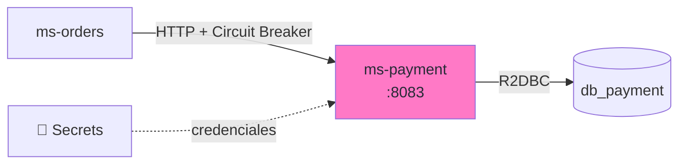
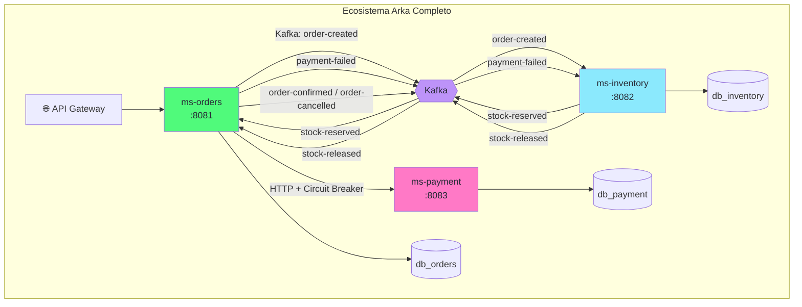

import Tabs from '@theme/Tabs';
import TabItem from '@theme/TabItem';

# Módulo 8: ms-payment — Simulador HTTP

:::tip Tiempo estimado
~1.5 horas
:::

## Objetivo

Crear `ms-payment` — un **simulador** que aprueba el 70% de los pagos y rechaza el 30%. El flujo es **HTTP sincrono**: `ms-orders` llama a `ms-payment` y decide si confirma la orden o publica `payment-failed` para compensar. El Circuit Breaker vive en `ms-orders`.



## 8.1 Crear el proyecto con Scaffold

```bash
# Desde la raíz de arka-lab/
mkdir ms-payment && cd ms-payment
```

```groovy title="ms-payment/build.gradle"
plugins {
    id 'co.com.bancolombia.cleanArchitecture' version '4.1.0'
}
```

```bash
gradle wrapper

./gradlew ca \
  --package=co.com.arka.payment \
  --type=reactive \
  --name=MsPayment \
  --lombok=true \
  --java-version=17

./gradlew gep --type webflux
./gradlew gda --type secrets --secrets-backend aws_secrets_manager
./gradlew gda --type r2dbc

find . -path "*/src/test/*" -name "*.java" -delete
```

### Actualizar `.env`

```bash title=".env (agregar)"
MS_PAYMENT_PORT=8083
MS_PAYMENT_HOST=arka-ms-payment
```

## 8.2 Modelo de Dominio — Payment

```java title="domain/model/src/main/java/co/com/arka/payment/model/payment/Payment.java"
package co.com.arka.payment.model.payment;

import lombok.*;

@Data @Builder @NoArgsConstructor @AllArgsConstructor
public class Payment {
    private String id;
    private String orderId;
    private Double amount;
    private String status; // PROCESSED, FAILED
    private String paymentMethod;
    private java.time.LocalDateTime processedAt;
}
```
## 8.3 Caso de uso — PaymentUseCase

```java title="domain/usecase/src/main/java/co/com/arka/payment/usecase/payment/PaymentUseCase.java"
package co.com.arka.payment.usecase.payment;

import co.com.arka.payment.model.payment.Payment;
import co.com.arka.payment.model.payment.gateways.PaymentRepository;
import lombok.RequiredArgsConstructor;
import reactor.core.publisher.Flux;
import reactor.core.publisher.Mono;

import java.time.LocalDateTime;
import java.util.concurrent.ThreadLocalRandom;

@RequiredArgsConstructor
public class PaymentUseCase {
    private static final double FAILURE_PROBABILITY = 0.30;

    private final PaymentRepository paymentRepository;

    public Mono<Payment> processPayment(String orderId, Double amount, String paymentMethod) {
        boolean approved = ThreadLocalRandom.current().nextDouble() >= FAILURE_PROBABILITY;
        String status = approved ? "PROCESSED" : "FAILED";

        Payment payment = Payment.builder()
                .orderId(orderId)
                .amount(amount)
                .status(status)
                .paymentMethod(paymentMethod)
                .processedAt(LocalDateTime.now())
                .build();

        return paymentRepository.save(payment);
    }

    public Mono<Payment> getPayment(String id) {
        return paymentRepository.findById(id);
    }

    public Flux<Payment> getAllPayments() {
        return paymentRepository.findAll();
    }
}
```

## 8.4 API HTTP

```java title="infrastructure/entry-points/reactive-web/src/main/java/co/com/arka/payment/api/ProcessPaymentRequest.java"
package co.com.arka.payment.api;

public record ProcessPaymentRequest(
        String orderId,
        Double amount,
        String paymentMethod
) {
}
```

```java title="infrastructure/entry-points/reactive-web/src/main/java/co/com/arka/payment/api/Handler.java"
package co.com.arka.payment.api;

import co.com.arka.payment.model.payment.Payment;
import co.com.arka.payment.usecase.payment.PaymentUseCase;
import lombok.RequiredArgsConstructor;
import org.springframework.stereotype.Component;
import org.springframework.web.reactive.function.server.ServerRequest;
import org.springframework.web.reactive.function.server.ServerResponse;
import reactor.core.publisher.Mono;

import java.time.LocalDateTime;
import java.util.Map;

@Component
@RequiredArgsConstructor
public class Handler {

    private final PaymentUseCase paymentUseCase;

    public Mono<ServerResponse> healthCheck(ServerRequest serverRequest) {
        return ServerResponse.ok().bodyValue(Map.of(
                "service", "ms-payment",
                "status", "UP",
                "timestamp", LocalDateTime.now().toString()
        ));
    }

    public Mono<ServerResponse> processPayment(ServerRequest serverRequest) {
        return serverRequest.bodyToMono(ProcessPaymentRequest.class)
                .flatMap(request -> paymentUseCase.processPayment(request.orderId(), request.amount(), request.paymentMethod()))
                .flatMap(payment -> {
                    if ("PROCESSED".equals(payment.getStatus())) {
                        return ServerResponse.ok().bodyValue(payment);
                    }
                    return ServerResponse.status(402).bodyValue(payment);
                });
    }

    public Mono<ServerResponse> getPayment(ServerRequest serverRequest) {
        String id = serverRequest.pathVariable("id");
        return paymentUseCase.getPayment(id)
                .flatMap(payment -> ServerResponse.ok().bodyValue(payment))
                .switchIfEmpty(ServerResponse.notFound().build());
    }

    public Mono<ServerResponse> getAllPayments(ServerRequest serverRequest) {
        return ServerResponse.ok().body(paymentUseCase.getAllPayments(), Payment.class);
    }
}
```

```java title="infrastructure/entry-points/reactive-web/src/main/java/co/com/arka/payment/api/RouterRest.java"
package co.com.arka.payment.api;

import org.springframework.context.annotation.Bean;
import org.springframework.context.annotation.Configuration;
import org.springframework.web.reactive.function.server.RouterFunction;
import org.springframework.web.reactive.function.server.ServerResponse;

import static org.springframework.web.reactive.function.server.RequestPredicates.GET;
import static org.springframework.web.reactive.function.server.RequestPredicates.POST;
import static org.springframework.web.reactive.function.server.RouterFunctions.route;

@Configuration
public class RouterRest {
    @Bean
    public RouterFunction<ServerResponse> routerFunction(Handler handler) {
        return route(GET("/api/health"), handler::healthCheck)
                .andRoute(POST("/api/payments/process"), handler::processPayment)
                .andRoute(GET("/api/payments/{id}"), handler::getPayment)
                .andRoute(GET("/api/payments"), handler::getAllPayments);
    }
}
```

:::info Respuestas HTTP
- `200 OK` cuando el pago es `PROCESSED`
- `402 Payment Required` cuando el pago es `FAILED`
:::

## 8.5 Infraestructura — Secrets + R2DBC

:::info Mismo patrón
La configuración de `SecretsConfig`, `PostgreSQLConnectionPool`, `OrderData` → `PaymentData`, y los adapters siguen exactamente el mismo patrón que ms-orders y ms-inventory. Solo cambiamos el package (`co.com.arka.payment`) y el secreto (`dev/arka/db-payment-creds`).
:::

### SecretsConfig

```java title="applications/app-service/src/main/java/co/com/arka/payment/config/SecretsConfig.java"
package co.com.arka.payment.config;

import co.com.arka.payment.events.config.KafkaBrokerSecretConsumer;
import co.com.arka.payment.events.config.KafkaBrokerSecretProducer;
import co.com.arka.payment.r2dbc.config.PostgresqlConnectionProperties;
import co.com.bancolombia.secretsmanager.api.GenericManagerAsync;
import co.com.bancolombia.secretsmanager.api.exceptions.SecretException;
import co.com.bancolombia.secretsmanager.config.AWSSecretsManagerConfig;
import co.com.bancolombia.secretsmanager.connector.AWSSecretManagerConnectorAsync;
import lombok.extern.slf4j.Slf4j;
import org.springframework.beans.factory.annotation.Value;
import org.springframework.context.annotation.Bean;
import org.springframework.context.annotation.Configuration;
import reactor.core.publisher.Mono;
import software.amazon.awssdk.regions.Region;

@Slf4j
@Configuration
public class SecretsConfig {

  @Value("${aws.secrets.db-name}")
  private String dbSecretName;
  @Value("${aws.secrets.kafka-name}")
  private String kafkaSecretName;

  @Bean
  public GenericManagerAsync getSecretManager(@Value("${aws.region}") String region,
                                              @Value("${aws.endpoint}") String endpoint) {
    return new AWSSecretManagerConnectorAsync(getConfig(region, endpoint));
  }

  private AWSSecretsManagerConfig getConfig(String region, String endpoint) {
    return AWSSecretsManagerConfig.builder()
      .region(Region.of(region))
      .endpoint(endpoint)
      .cacheSize(5)
      .cacheSeconds(3600)
      .build();
  }

  private <T> Mono<T> getSecret(String secretName, Class<T> cls, GenericManagerAsync connector) throws SecretException {
    return connector.getSecret(secretName, cls)
            .doOnSuccess(e -> log.info("Secret was obtained successfully: {}", secretName))
            .doOnError(e -> log.error("Error getting secret: {}", e.getMessage()))
            .onErrorMap(e -> new RuntimeException("Error getting secret", e));
  }

  @Bean
  public KafkaBrokerSecretProducer brokerSecretProducer(GenericManagerAsync connector) throws SecretException {
    return getSecret(kafkaSecretName, KafkaBrokerSecretProducer.class, connector).block();
  }

  @Bean
  public KafkaBrokerSecretConsumer brokerSecretConsumer(GenericManagerAsync connector) throws SecretException {
    return getSecret(kafkaSecretName, KafkaBrokerSecretConsumer.class, connector).block();
  }

  @Bean
  public PostgresqlConnectionProperties postgresqlSecret(GenericManagerAsync connector) throws SecretException {
    return getSecret(dbSecretName, PostgresqlConnectionProperties.class, connector).block();
  }
}
```
## 8.7 `application.yaml`

```yaml title="applications/app-service/src/main/resources/application.yaml"
server:
  port: ${MS_PAYMENT_PORT:8083}

spring:
  application:
    name: "MsPayment"
  devtools:
    add-properties: false
  h2:
    console:
      enabled: true
      path: "/h2"
  profiles:
    include: null
  kafka:
    bootstrap-servers: "${KAFKA_BOOTSTRAP_SERVERS:localhost:9092}"

aws:
  endpoint: "http://${LOCALSTACK_HOST:localhost}:${LOCALSTACK_PORT:4566}"
  region: "${AWS_REGION:us-east-1}"
  secrets:
    db-name: "${PAYMENT_DB_SECRET_NAME:dev/arka/db-payment-creds}"
    kafka-name: "${KAFKA_CONFIG_SECRET_NAME:dev/arka/kafka-config}"

management:
  endpoints:
    web:
      exposure:
        include: "health,prometheus"
  endpoint:
    health:
      probes:
        enabled: true
cors:
  allowed-origins: "http://localhost:4200,http://localhost:8080"
reactive:
  commons:
    kafka:
      app:
        connectionProperties:
          bootstrap-servers: "${KAFKA_BOOTSTRAP_SERVERS:localhost:9092}"
```

## 8.8 Dockerfile

```dockerfile title="ms-payment/deployment/Dockerfile"
# ── Stage 1: Build ──
FROM gradle:9.2-jdk21 AS builder
VOLUME /tmp
WORKDIR /myapp

COPY applications applications
COPY domain domain
COPY infrastructure infrastructure
COPY *.gradle .
COPY lombok.* .
COPY gradlew.* .
COPY gradle.* .

RUN gradle build -x test --no-daemon

# ── Stage 2: Run ──
FROM eclipse-temurin:21-jre-alpine
VOLUME /tmp
WORKDIR /myapprun
COPY --from=builder /myapp/applications/app-service/build/libs/*.jar MsPayment.jar

RUN apk update && apk add curl

ARG PORT=8083
ENV JAVA_OPTS=" -XX:+UseContainerSupport -XX:MaxRAMPercentage=70 -Djava.security.egd=file:/dev/./urandom"
ENV MS_PAYMENT_PORT=${PORT}
EXPOSE ${MS_PAYMENT_PORT}
ENTRYPOINT ["/bin/sh", "-c", "/opt/java/openjdk/bin/java $JAVA_OPTS -jar MsPayment.jar"]
```

## 8.9 Agregar al Docker Compose

```yaml title="compose.yaml (agregar a services)"
  # ═══════════════════════════════════════════════════
  # MsPayment — Simulador de Pagos
  # ═══════════════════════════════════════════════════
  ms-payment:
    build:
      context: ./ms-payment
      dockerfile: deployment/Dockerfile
      args:
        - PORT=${MS_PAYMENT_PORT}
    container_name: arka-ms-payment
    ports:
      - "${MS_PAYMENT_PORT}:${MS_PAYMENT_PORT}"
    env_file:
      - .env
    depends_on:
      postgres-payment:
        condition: service_healthy
      localstack:
        condition: service_healthy
      kafka:
        condition: service_healthy
    healthcheck:
      test: ["CMD", "curl", "-f", "http://localhost:${MS_PAYMENT_PORT}/actuator/health"]
      interval: 15s
      timeout: 5s
      retries: 5
      start_period: 60s
    networks:
      - arka-network
```

## 8.11 Construir y Probar

```bash
# Construir todo el ecosistema
docker compose up -d --build ms-orders ms-inventory ms-payment

# Verificar
docker compose ps
```

Todos los servicios deberían estar `healthy`:

```
NAME                  STATUS
arka-db-orders        Up (healthy)
arka-db-inventory     Up (healthy)
arka-db-payment       Up (healthy)
arka-kafka            Up (healthy)
arka-ms-orders        Up (healthy)
arka-ms-inventory     Up (healthy)
arka-ms-payment       Up (healthy)     ← NUEVO
```

## 8.12 ¿Qué acabamos de construir?



:::info Checkpoint
- [ ] ¿Los 3 microservicios están `healthy`?
- [ ] ¿Al crear una orden, se ve el flujo completo en KafkaUI?
:::

---

**Siguiente:** [Módulo 9: Pruebas E2E, Escalado y Demo Final](./pruebas-e2e)
