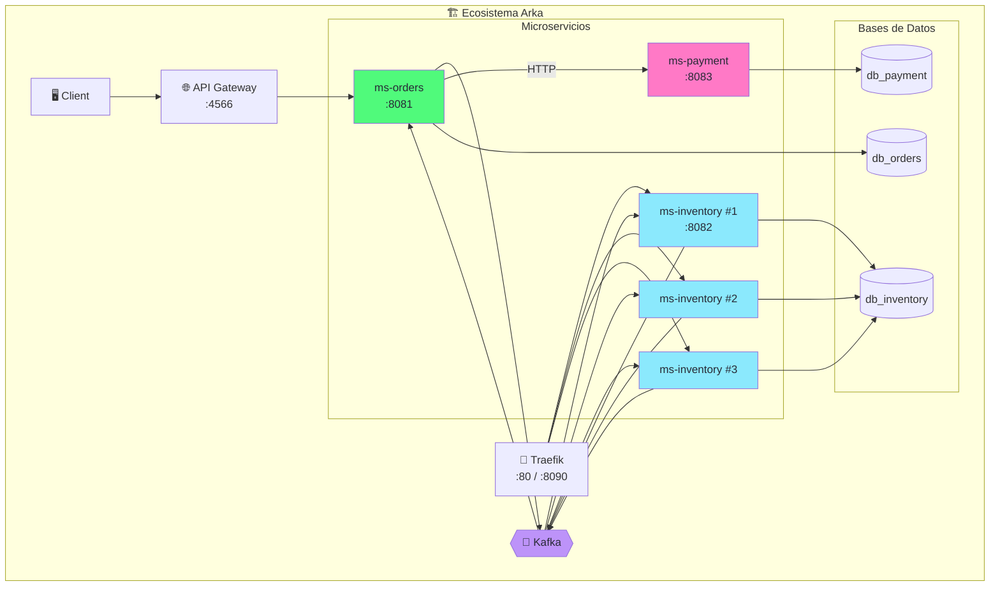
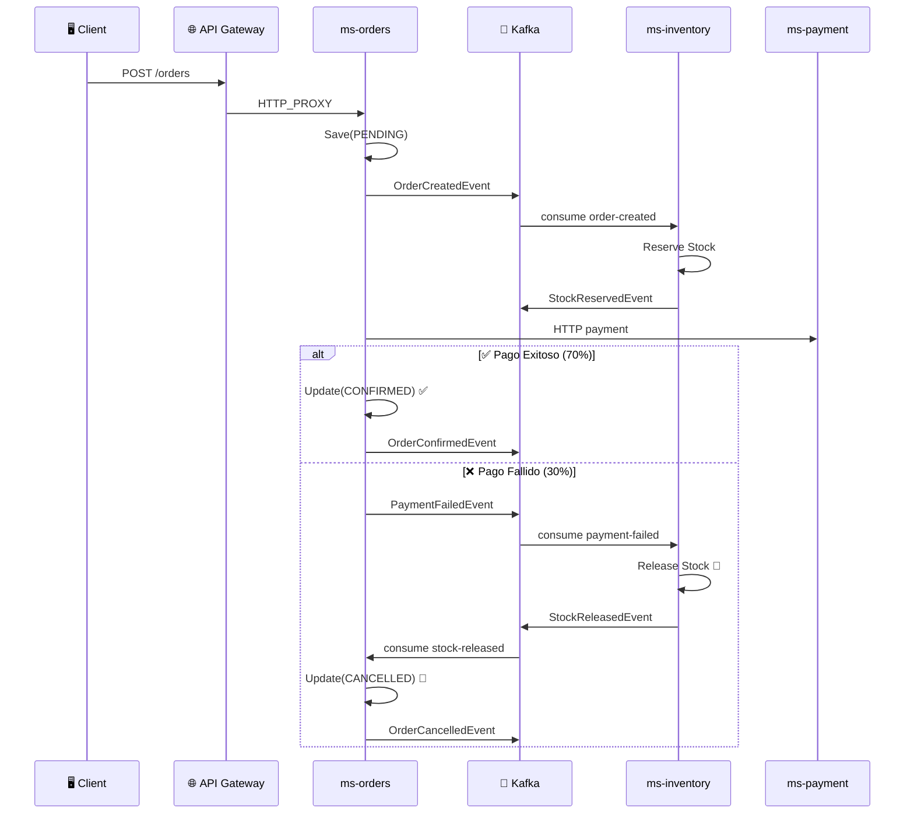
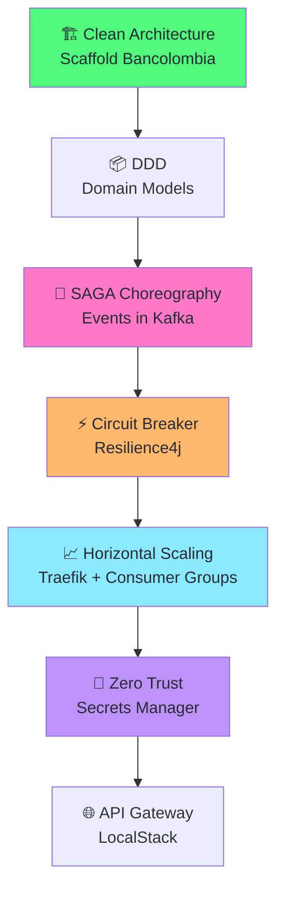

import Tabs from '@theme/Tabs';
import TabItem from '@theme/TabItem';

# Módulo 9: Pruebas E2E, Escalado y Demo Final

:::tip Tiempo estimado
~1 hora
:::

## Objetivo

Ejecutar la **SAGA completa** de extremo a extremo, verificar la **compensación**, demostrar el **escalado horizontal** con Traefik, y visualizar el flujo en **KafkaUI**.



## 9.1 Levantar Todo

```bash
# Desde la raíz de arka-lab/
docker compose up -d --build

# Verificar que TODO esté healthy
docker compose ps
```

Deberías ver:

```
NAME                  STATUS
arka-db-orders        Up (healthy)
arka-db-inventory     Up (healthy)
arka-db-payment       Up (healthy)
arka-kafka            Up (healthy)
arka-kafka-ui         Up
arka-localstack       Up (healthy)
arka-traefik          Up
arka-ms-orders        Up (healthy)
arka-ms-inventory     Up (healthy)
arka-ms-payment       Up (healthy)
```

## 9.2 Prueba 1: Happy Path (Orden Confirmada ✅)

### Crear la orden

```bash
curl -X POST http://localhost:8081/api/orders \
  -H "Content-Type: application/json" \
  -d '{
    "customerId": "cust-001",
    "sku": "GPU-RTX4090",
    "quantity": 1,
    "unitPrice": 1599.99
  }' | python3 -m json.tool
```

**Respuesta inmediata:**

```json
{
  "id": "abc-123",
  "status": "PENDING"
}
```

### Verificar logs (flujo SAGA)

```bash
# 1. ms-orders: Publicó OrderCreatedEvent
docker logs arka-ms-orders --tail 5

# 2. ms-inventory: Recibió OrderCreated, reservó stock, publicó StockReserved
docker logs arka-ms-inventory --tail 5

# 3. ms-orders: Recibió StockReserved y llamó a ms-payment (HTTP)
docker logs arka-ms-orders --tail 10

# 4. ms-payment: Procesó el pago
docker logs arka-ms-payment --tail 5

# 5. ms-orders: Confirmó orden
docker logs arka-ms-orders --tail 10
```

Si el pago fue exitoso (70% probabilidad), deberías ver:

```
ms-orders:     ✅ Evento publicado en [order-created]
ms-inventory:  📨 Evento recibido de [order-created]
ms-inventory:  📦 Stock reservado: SKU=GPU-RTX4090, restante=49
ms-inventory:  ✅ StockReserved publicado
ms-orders:     📨 Evento recibido de [stock-reserved]
ms-payment:    ✅ Pago PROCESSED para orden abc-123
ms-orders:     ✅ Orden abc-123 CONFIRMADA
```

### Verificar en las bases de datos

```bash
# Orden CONFIRMED
docker exec arka-db-orders psql -U arka -d db_orders \
  -c "SELECT id, sku, status FROM orders ORDER BY created_at DESC LIMIT 5;"

# Stock decrementado
docker exec arka-db-inventory psql -U arka -d db_inventory \
  -c "SELECT sku, stock FROM products WHERE sku = 'GPU-RTX4090';"
```

### Verifica la orden por API

```bash
curl http://localhost:8081/api/orders/{id} | python3 -m json.tool
```

El status debería ser `CONFIRMED`.

## 9.3 Prueba 2: Compensation Path (Orden Cancelada 🚫)

Crea varias órdenes hasta que una falle (30% probabilidad):

```bash
# Ejecutar múltiples veces
for i in {1..5}; do
  echo "--- Orden $i ---"
  curl -s -X POST http://localhost:8081/api/orders \
    -H "Content-Type: application/json" \
    -d "{
      \"customerId\": \"cust-00$i\",
      \"sku\": \"GPU-RTX4090\",
      \"quantity\": 1,
      \"unitPrice\": 1599.99
    }" | python3 -m json.tool
  sleep 2
done
```

### Verificar compensación en logs

Cuando el pago falla:

```
ms-payment:    ❌ Pago FAILED para orden xyz-789
ms-orders:     📤 Evento publicado en [payment-failed]
ms-inventory:  📨 Evento recibido de [payment-failed]
ms-inventory:  🔄 Stock liberado para orden xyz-789
ms-orders:     📨 Evento recibido de [stock-released]
ms-orders:     🚫 Orden xyz-789 CANCELADA
```

### Verificar consistencia

```bash
# Ver órdenes confirmadas vs canceladas
docker exec arka-db-orders psql -U arka -d db_orders \
  -c "SELECT status, COUNT(*) FROM orders GROUP BY status;"

# Verificar que el stock volvió a subir tras compensación
docker exec arka-db-inventory psql -U arka -d db_inventory \
  -c "SELECT sku, stock FROM products WHERE sku = 'GPU-RTX4090';"
```

:::warning Verificación de consistencia
El stock final debe ser: `stock_inicial - órdenes_confirmadas`. Las órdenes canceladas **no deben** afectar el stock (se restó y se devolvió).
:::

## 9.4 Visualización en KafkaUI

Abre [http://localhost:8080](http://localhost:8080) para ver el flujo de eventos:

| Topic | Productor | Consumidor |
|-------|-----------|------------|
| `order-created` | ms-orders | ms-inventory |
| `stock-reserved` | ms-inventory | ms-orders |
| `stock-failed` | ms-inventory | ms-orders |
| `payment-failed` | ms-orders | ms-inventory |
| `stock-released` | ms-inventory | ms-orders |
| `order-confirmed` | ms-orders | (solo auditoria) |
| `order-cancelled` | ms-orders | (solo auditoria) |

:::tip Navega a cada topic
En KafkaUI, haz clic en cada topic para ver los mensajes individuales con su key (orderId), value (JSON del evento), y timestamps.
:::

## 9.5 Prueba 3: API Gateway E2E

Prueba el flujo completo a través del API Gateway:

```bash
API_ID=$(awslocal apigateway get-rest-apis \
  --region us-east-1 --query 'items[0].id' --output text)

# Crear orden vía API Gateway
curl -X POST "https://${API_ID}.execute-api.localhost.localstack.cloud:4566/v1/orders/api/orders" \
  -H "Content-Type: application/json" \
  -d '{
    "customerId": "cust-gateway",
    "sku": "GPU-RTX4090",
    "quantity": 1,
    "unitPrice": 1599.99
  }' | python3 -m json.tool
```

## 9.6 Prueba 4: Circuit Breaker

### Paso 1: Apagar ms-payment

```bash
docker compose stop ms-payment
```

### Paso 2: Crear una orden (gatilla el pago HTTP)

```bash
curl -X POST http://localhost:8081/api/orders \
  -H "Content-Type: application/json" \
  -d '{
    "customerId": "cust-cb",
    "sku": "GPU-RTX4090",
    "quantity": 1,
    "unitPrice": 1599.99
  }' | python3 -m json.tool
```

### Paso 3: Ver el fallback en ms-orders

```bash
docker logs arka-ms-orders --tail 10
```

Deberias ver errores de pago y publicaciones de `payment-failed`, por ejemplo:

```
Payment request failed for order ...
Evento publicado en [payment-failed]
```

### Paso 4: Restaurar ms-payment

```bash
docker compose start ms-payment
```

Con ms-payment arriba, las siguientes ordenes deberian volver a confirmarse.

## 9.7 Escalado Horizontal con Traefik

### Escalar ms-inventory

```bash
docker compose up -d --scale ms-inventory=3
```

Traefik detecta automáticamente las 3 réplicas gracias a las labels configuradas en el Módulo 7.

### Verificar en Traefik Dashboard

Abre [http://localhost:8090](http://localhost:8090) y busca el servicio `inventory` en la sección **HTTP Services**. Deberías ver 3 servidores registrados con balanceo **Round-Robin**.

### Verificar balanceo de carga

```bash
for i in {1..6}; do
  curl -s http://localhost/inventory/api/health | python3 -c "import sys,json; print(json.load(sys.stdin)['timestamp'])"
done
```

### Verificar Consumer Groups en Kafka

Con 3 instancias de ms-inventory, Kafka distribuye las particiones del topic `order-created` entre las 3 réplicas del consumer group `inventory-group`.

```bash
# Crear varias órdenes
for i in {1..6}; do
  curl -s -X POST http://localhost:8081/api/orders \
    -H "Content-Type: application/json" \
    -d "{\"customerId\": \"cust-$i\", \"sku\": \"GPU-RTX4090\", \"quantity\": 1, \"unitPrice\": 1599.99}"
  sleep 1
done

# Ver los logs diferenciados por hostname
docker compose logs ms-inventory --tail 30 | grep "Stock reservado"
```

Deberías ver que diferentes instancias procesan diferentes órdenes.

### Volver a 1 réplica

```bash
docker compose up -d --scale ms-inventory=1
```

## 9.8 Resumen del Flujo SAGA Completo



## 9.9 Resumen Final

¡Felicidades! Has completado el **Lab Avanzado de Microservicios Reactivos de Arka**. 🎉

### Lo que construiste:

| Módulo | Tecnología | Lo que aprendiste |
|--------|-----------|-------------------|
| **01** | Docker Compose | Infraestructura completa con PostgreSQL, Kafka, LocalStack |
| **02** | Kafka POC | Productor y consumidor reactivo con reactor-kafka |
| **03** | CloudFormation | IaC con Secrets Manager + API Gateway en LocalStack |
| **04** | Secrets POC | Integración con AWS Secrets Manager via Bancolombia scaffold |
| **05** | Scaffold + Docker | Microservicio ms-orders con healthcheck y API Gateway |
| **06** | ms-orders | SAGA initiator, Kafka producer/consumer, R2DBC |
| **07** | ms-inventory | Stock reservation, compensación, Traefik labels |
| **08** | ms-payment + CB | Simulador 70/30, Resilience4j Circuit Breaker |
| **09** | E2E | Pruebas completas, escalado horizontal, KafkaUI |

### Patrones implementados:



:::tip Next Level
Para llevar esto a producción, considera:
- **Transactional Outbox** con Debezium para atomicidad eventos/BD
- **Event Sourcing** para trazabilidad completa
- **Distributed Tracing** con OpenTelemetry
- **Container Orchestration** con Kubernetes
- **Real AWS** en lugar de LocalStack
:::
